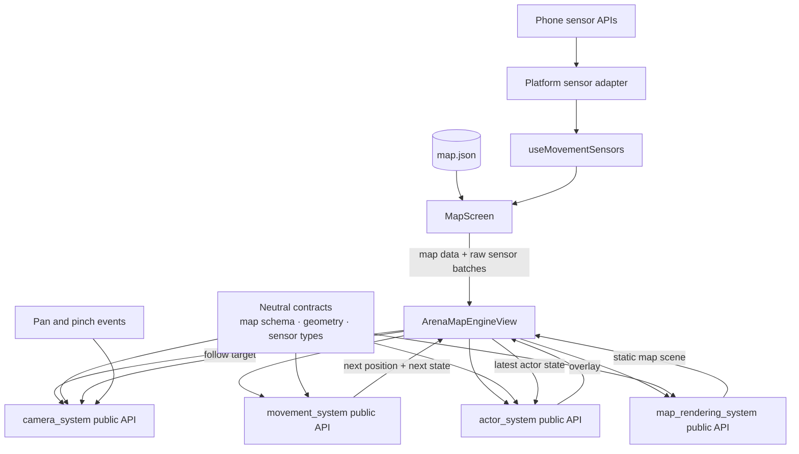

# Target Architecture Audit

## Scope

This audit compares the current indoor-navigation implementation with the proposed layered architecture. It is based on actual imports, exports, state ownership, function calls, gesture handlers, sensor subscriptions, map loading, tests, and documentation in the repository.

No runtime code was changed as part of this audit.

## Verdict

**Overall alignment: Partially aligned.**

The implemented runtime flow is stronger than the target diagram suggests:

- `MapScreen` owns external phone-sensor collection and loads `map.json`.
- `ArenaMapEngineView` coordinates rendering, movement, actors, and camera behavior.
- Movement state and the particle filter persist across accepted sensor batches.
- Actor rendering and camera following consume the latest actor position.
- Pan and pinch gestures remain isolated inside the camera subsystem.

The movement API, neutral shared contracts, coordinate validation, and page facade have now been implemented. The architecture is not fully aligned because some broader boundaries remain convention-based:

- Actor, camera, and rendering still use legacy public-entry filenames rather than consistent `index.ts` files.
- Component-level camera-follow and actor-propagation behavior is enforced partly through static architecture checks rather than a React Native renderer test.
- `ArenaMapEngineView` retains a fallback map in addition to the page-provided map.

## Corrected architecture summary

The target diagram should be corrected before implementation work:

1. Add `map_rendering_system` as a first-class subsystem.
2. Treat `MovementSystemState` as internal runtime state, not an external data source.
3. Show phone sensors behind a platform adapter and hook.
4. Show finger input as camera-owned gesture events, not data imported by `MapScreen`.
5. Show neutral map-schema, geometry, and sensor/movement contracts.

## Report index

- [Current versus target](current-vs-target.md)
- [Dependency audit](dependency-audit.md)
- [Runtime data flow](runtime-data-flow.md)
- [Gap analysis](gap-analysis.md)
- [Implementation plan](implementation-plan.md)

## Concise final verdict

- **Strongest current area:** Sensor-to-movement-state continuity, including bounded collection, cleanup, deduplication, and particle-filter persistence.
- **Largest remaining architectural gap:** Component-level orchestration behavior and the remaining subsystem entry conventions are not fully standardized.
- **First remaining implementation phase:** Add React Native component-level actor/camera flow tests, then standardize the remaining public-entry names.
- **Correct target diagram first:** Yes. It currently omits rendering and neutral contracts and incorrectly presents movement state as an external data source.
