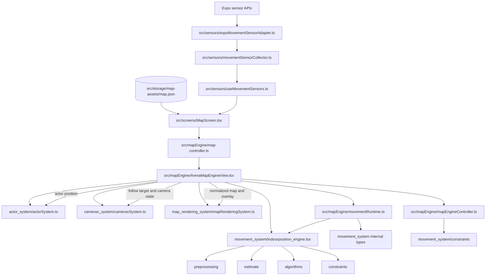
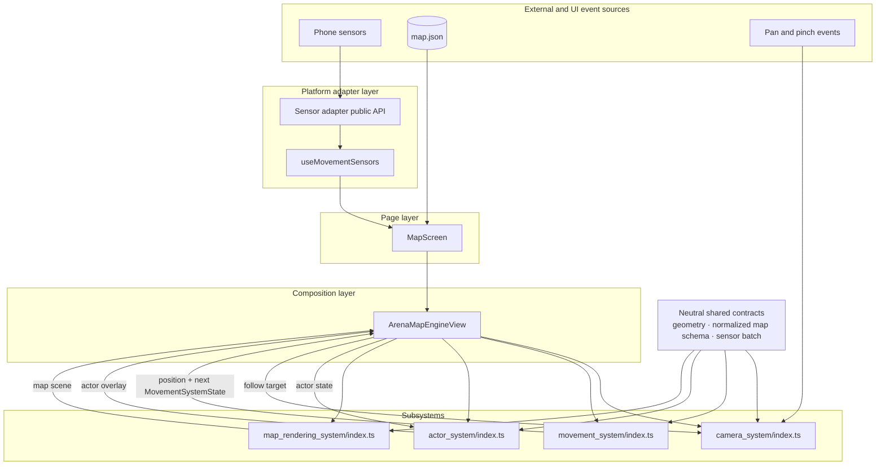

# Current Versus Target Architecture

## Current architecture

## Corrected target architecture

## Comparison

| Concern | Target | Current evidence | Result |
|---|---|---|---|
| Page ownership | `MapScreen` gathers external inputs | `MapScreen.tsx` calls `useMovementSensors`, loads `map.json`, and passes both into `ArenaMapEngineView` | Aligned |
| Page isolation | Page does not import subsystem internals | `MapScreen.tsx` imports `ArenaMapEngineView` through `map-controller.ts`; sensor access is through a hook | Aligned |
| Master orchestration | One composition component coordinates systems | `ArenaMapEngineView.tsx` imports actor, camera, rendering, movement, runtime, and map constraint extraction | Mostly aligned |
| Actor subsystem | Public entry hides internals | `actor_system/actorSystem.ts` is used by the orchestrator | Aligned by convention |
| Camera subsystem | Public entry hides internals | `cameran_system/cameranSystem.ts` is used by the orchestrator | Aligned by convention |
| Rendering subsystem | First-class system with public API | `map_rendering_system/mapRenderingSystem.ts` exists and is used | Target diagram incomplete |
| Movement subsystem | One public entry hides internals | `movement_system/index.ts` exports the required runtime API; an executable boundary test rejects external deep imports | Aligned |
| Sensor collection | Platform adapter separated from movement core | `src/sensors/` owns Expo APIs; movement system consumes platform-neutral samples | Aligned |
| Finger input | Camera owns gesture interpretation | `CameraViewport.tsx` owns `Gesture.Pan` and `Gesture.Pinch` | Aligned; diagram classification should change |
| Movement data | Internal continuous runtime state | `MovementRuntime` owns `MovementSystemState`; it is not external input | Target diagram misclassifies it |
| Shared contracts | Neutral types are independent of subsystems | `mapEngine/shared` owns geometry, coordinates, map contracts, sensor contracts, and movement input contracts | Aligned |
| Boundary enforcement | Tests/lint prevent deep imports | `architecture-boundaries.test.ts` enforces movement, shared, page, and cross-system rules; all tests run through the test glob | Aligned for the implemented rules |

## Parts that already match

| File | Evidence | Why it matches |
|---|---|---|
| `src/screens/MapScreen.tsx` | `useMovementSensors(true)` and `<ArenaMapEngineView mapData={rawMapData} sensorSamples={sensorSamples} />` | Page gathers external inputs and passes them downward. |
| `src/sensors/expoMovementSensorAdapter.ts` | Imports `expo-sensors`; converts readings into `RawSensorSample` | Platform dependencies are outside `movement_system`. |
| `src/sensors/movementSensorCollector.ts` | `capacity`, timed `flush`, `stop`, subscription removal | Collection is bounded and lifecycle-aware. |
| `src/mapEngine/ArenaMapEngineView.tsx` | Imports all four subsystem surfaces and coordinates their outputs | It is the runtime composition point. |
| `src/mapEngine/movementRuntime.ts` | Stores state, filters batches, invokes movement update with prior state | Movement state is continuous. |
| `src/mapEngine/actor_system/actorSystem.ts` | Re-exports actor model and renderer | Actor subsystem has a usable public entry. |
| `src/mapEngine/cameran_system/cameranSystem.ts` | Re-exports camera model and viewport | Camera subsystem has a usable public entry. |
| `src/mapEngine/map_rendering_system/mapRenderingSystem.ts` | Re-exports renderer and normalized map model | Rendering is already a distinct subsystem. |
| `src/mapEngine/cameran_system/CameraViewport.tsx` | `Gesture.Pan()` and `Gesture.Pinch()` | Finger input is handled by the camera subsystem. |

## Current files importing multiple subsystems

| File | Subsystems imported | Assessment |
|---|---|---|
| `src/mapEngine/ArenaMapEngineView.tsx` | actor, camera, movement, rendering | Expected master orchestrator. |
| `src/mapEngine/map-controller.ts` | movement types and rendering | Public facade, but it exposes bypass APIs and deep movement types. |
| `src/mapEngine/map-engine-contract.test.ts` | actor, camera, movement, rendering | Test-only bypass; acceptable for white-box tests only if explicitly separated, but it currently doubles as an ineffective architecture test. |

`MovementRuntime` imports only movement internals, so it is not a second cross-subsystem orchestrator. It is, however, an orchestration helper outside the movement subsystem that relies on private movement contracts.
