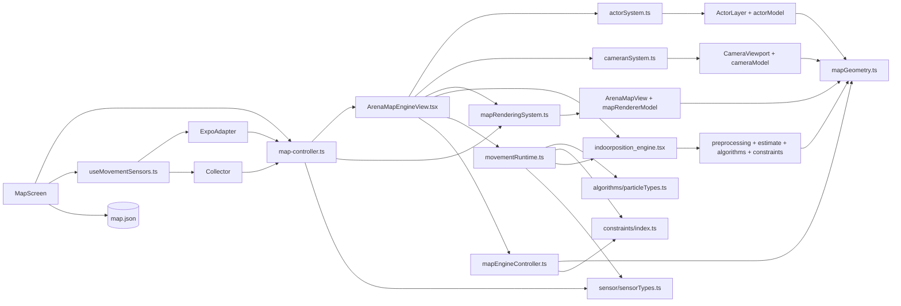

# Dependency Audit

## Public API table

| System | Public entry file | External users | Internal files imported externally? | Status |
|---|---|---|---|---|
| Actor | `src/mapEngine/actor_system/actorSystem.ts` | `ArenaMapEngineView.tsx`, `map-engine-contract.test.ts` | No runtime deep import found | Good |
| Camera | `src/mapEngine/cameran_system/cameranSystem.ts` | `ArenaMapEngineView.tsx`, `map-engine-contract.test.ts` | No runtime deep import found | Good |
| Map rendering | `src/mapEngine/map_rendering_system/mapRenderingSystem.ts` | `ArenaMapEngineView.tsx`, `map-controller.ts`, `map-engine-contract.test.ts` | No runtime deep import found | Good, but absent from target diagram |
| Movement | `src/mapEngine/movement_system/index.ts` | `ArenaMapEngineView.tsx`, movement tests, compatibility re-export | No external runtime deep imports | Good |
| Sensor platform layer | No barrel; `useMovementSensors.ts` is the page-facing entry | `MapScreen.tsx` | Tests and adapter import collector directly, which is appropriate internally | Acceptable, could be formalized |
| Whole map engine | `src/mapEngine/map-controller.ts` | `MapScreen.tsx` | Exposes only the orchestrator and page-safe sample type | Good |

## Actual import dependency diagram

## Confirmed dependency strengths

- No subsystem directly imports actor, camera, rendering, or movement behavior from another subsystem.
- Actor, camera, and rendering share only `mapGeometry.ts`.
- `MapScreen` does not import subsystem internals.
- Expo APIs remain outside `movement_system`.
- `ArenaMapEngineView` is the only runtime file importing actor, camera, and rendering together.

## Implemented dependency corrections

- Movement now has one public API and boundary tests reject external imports of its internals.
- The page facade no longer exports rendering or constraint-extraction helpers.
- `mapEngine/shared` owns cross-system geometry, coordinate, sensor, map, and movement input contracts.
- Sensor adapters import shared contracts directly rather than importing the map-engine facade.

### Naming obscures the intended API

- `cameran_system` and `cameranSystem.ts` contain a likely spelling error.
- Public files use three patterns: `actorSystem.ts`, `cameranSystem.ts`, `mapRenderingSystem.ts`.
- Movement has no corresponding public file.

This is Low severity behaviorally, but it raises navigation and enforcement costs.

## Circular dependencies

No runtime circular subsystem dependency was found in the inspected imports.

There is a conceptual ownership loop:

1. Sensor adapters import `RawSensorSample` from the whole-engine facade.
2. The whole-engine facade re-exports that type from movement internals.

This is not a TypeScript runtime cycle because the imports are type-only, but it indicates the sensor contract belongs in a neutral module rather than behind the map-engine facade.

## Test and enforcement status

- `npm test` runs only:
  - `src/mapEngine/movementRuntime.test.ts`
  - `src/sensors/movementSensorCollector.test.ts`
- `src/mapEngine/map-engine-contract.test.ts` is not executed by the test script.
- That file contains top-level expressions and `void` references, not test cases or assertions.
- It verifies compilation when `tsc` includes it, but does not enforce legal import paths.
- No ESLint import-boundary rule, dependency-cruiser rule, or custom architecture test was found.
