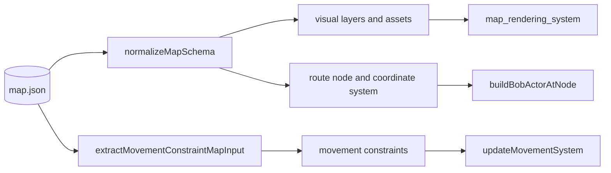

# Runtime Data Flow

## Actual flow

```mermaid
sequenceDiagram
  participant OS as Expo phone sensors
  participant Adapter as expoMovementSensorAdapter
  participant Collector as MovementSensorCollector
  participant Screen as MapScreen
  participant Engine as ArenaMapEngineView
  participant Runtime as MovementRuntime
  participant Move as updateMovementSystem
  participant Actor as ActorLayer
  participant Camera as CameraViewport/cameraModel
  participant Render as ArenaMapView

  Screen->>Collector: mount useMovementSensors
  Collector->>Adapter: subscribe
  Adapter->>OS: availability + permission + listeners
  OS-->>Adapter: sensor readings
  Adapter-->>Collector: RawSensorSample with stable ID/timestamp
  Collector-->>Screen: bounded chronological batch every 250 ms
  Screen->>Engine: mapData + sensorSamples
  Engine->>Runtime: process(batch, constraints)
  Runtime->>Runtime: remove invalid, duplicate, and stale samples
  Runtime->>Move: new samples + previous MovementSystemState
  Move->>Move: normalize + estimate + particle filter + constraints
  Move-->>Runtime: position + next MovementSystemState
  Runtime-->>Engine: MovementSystemResult
  Engine->>Actor: actors with latest position
  Engine->>Camera: follow latest actor point when enabled
  Engine->>Render: normalized static map + actor overlay
  Camera->>Camera: pan/pinch updates camera and disables follow
  Screen->>Collector: unmount cleanup
  Collector->>Adapter: remove all subscriptions
```

## Data-source ownership

### Phone sensor data

Confirmed real collection exists:

- `src/sensors/expoMovementSensorAdapter.ts` subscribes to Expo accelerometer, gyroscope, magnetometer, device motion, and pedometer APIs.
- Availability and permission failures return `null` subscriptions and do not prevent map rendering.
- `src/sensors/movementSensorCollector.ts` owns the native subscription handles.
- `stop()` clears the interval, removes all subscriptions, and clears buffered samples.
- The pending buffer is capped using `.slice(-this.capacity)`.
- `useMovementSensors.ts` configures capacity `128` and batch interval `250 ms`.

### Map data

- `src/screens/MapScreen.tsx` loads `src/storage/map-assets/map.json` and passes it to `ArenaMapEngineView`.
- `ArenaMapEngineView.tsx` also has a fallback `defaultMapData` require. This creates two possible owners, although the current page passes the map explicitly.
- The loaded file contains visual layers, movement bounds, walkable areas, walls, doors, corridors, and a route graph.

### Finger data

Finger input is not a stored page-level data source. It is an event stream owned by `CameraViewport.tsx`:

- `Gesture.Pan()` updates camera offsets.
- `Gesture.Pinch()` updates scale around the focal point.
- Both call `onGestureStart`, which causes `ArenaMapEngineView` to set `isFollowingBob` to `false`.

The corrected target should show finger events entering the camera subsystem directly.

### Movement data

“Movement data” is not external input in the current implementation. It is internal runtime state:

- `MovementRuntime.state` stores `MovementSystemState`.
- `MovementSystemState` contains position, heading, confidence, particle filter, and previous step count.
- Each accepted batch receives the exact state returned from the previous update.

The target should label this as **persistent movement runtime state**, not as a data-source box imported by the page.

## Map data fan-out



Confirmed behavior:

- Rendering normalization reads static map dimensions, assets, visual layers, and route graph.
- Actor initialization reads a route node through `buildBobActorAtNode`.
- Constraint extraction reads walkable areas, blocked areas, walls, doors, corridors, and movement-blocking assets.

## Movement-state continuity

`MovementRuntime.process`:

1. Returns `null` for an empty batch.
2. Removes non-finite timestamps.
3. Deduplicates by sample ID or `kind:timestamp`.
4. Sorts chronologically.
5. Rejects samples older than the cursor.
6. Calls the movement update with the stored prior state.
7. Replaces its stored state with `result.state`.

`updateMovementSystem`:

1. Normalizes samples.
2. Computes step and heading estimates.
3. Reuses `currentState.particleFilter` if present.
4. Creates a particle filter only when the state has none.
5. Applies map constraints.
6. Returns the next state, including the updated filter and step count.

Reset occurs in the `ArenaMapEngineView` reset effect when `mapData`, the starting actor position, or `startingNodeId` changes. The current batch is marked consumed at the reset boundary.

## Actor and camera integration

- `ArenaMapEngineView` stores the latest movement position in React state.
- It derives the Bob actor object with that position.
- `ActorLayer` converts the world position into pixels and renders the sprite.
- The same actor position becomes `bobPoint`.
- Camera follow centers on `bobPoint`.
- User pan or pinch disables follow; movement continues updating the actor without forcing the camera back.

## Unfinished or unverified runtime behavior

- Real-device sensor accuracy, coordinate orientation, and permission behavior require physical-device testing.
- Magnetometer and accelerometer samples are collected but the current movement engine primarily uses pedometer count and device-motion attitude.
- There is no app-state/background lifecycle handling beyond component mount/unmount.
- No component-level test proves the reset effect dependencies or camera-follow UI behavior.
- The fallback map in `ArenaMapEngineView` can hide a missing page-provided map and weakens single ownership.
