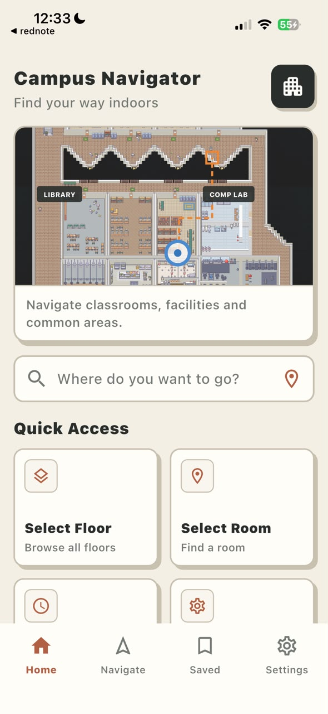
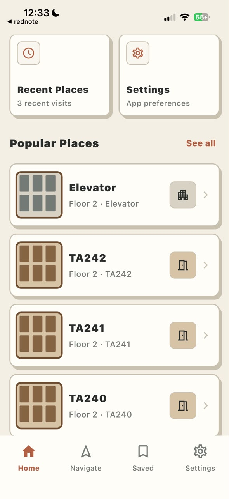
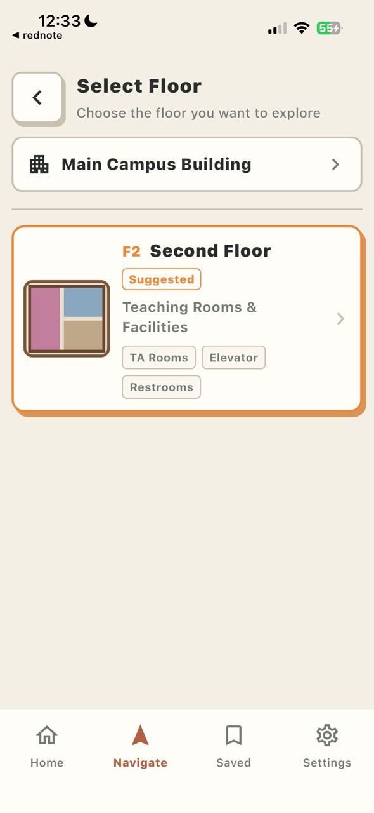
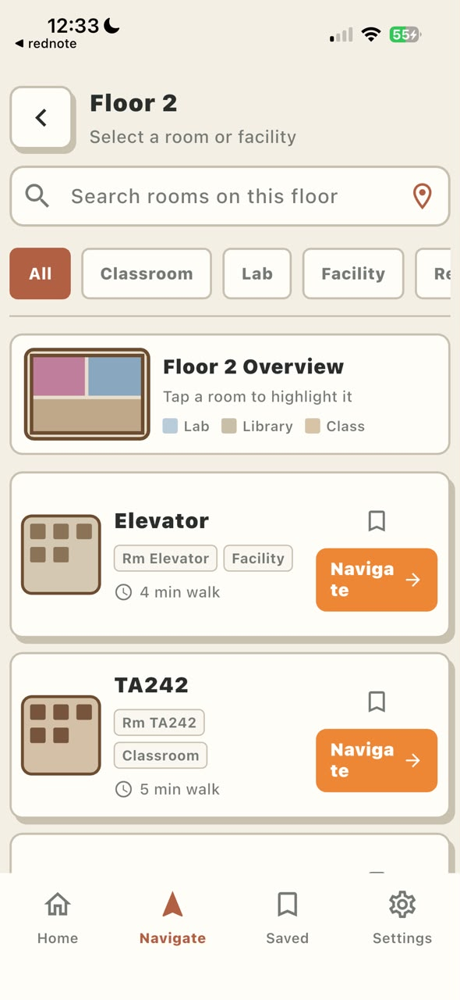

# Campus Navigator

Campus Navigator is a Flutter indoor-navigation application for browsing a
campus building, selecting a room, and following a map-based route to the
destination. It combines pedestrian dead reckoning (PDR) with optional Wi-Fi
RSSI positioning to limit accumulated drift during a navigation session.

The production app is in [`flutter_app/`](flutter_app/). The original
Expo + TypeScript implementation remains in [`expo-app/`](expo-app/) as a
migration and behavior-parity reference.

## App preview

<p align="center">
  
  
  
  
</p>

## Features

- Home, floor selection, room search, filters, saved places, and settings.
- Data-driven campus rooms, facilities, route nodes, and graph edges.
- Indoor map rendered from bundled Tiled/PNG assets.
- Shortest-route generation from the selected start and destination nodes.
- Animated Bob position marker, destination beacon, view cone, and arrival UI.
- Motion-based PDR using native Android sensors and Apple Core Motion.
- Wrong-way detection, heading correction, route snapping, and rerouting
  support.
- Android Wi-Fi scanning with a shared Flutter KNN API client.
- Wi-Fi/PDR fusion with smooth correction, confirmed teleport correction, and
  session-safe arrival handling.
- Manual RSSI Test Lab for exercising the real positioning API on iOS without
  native Wi-Fi scanning.
- MVVM architecture with platform services isolated behind application ports.

## Repository layout

```text
.
├── flutter_app/                 # Current Flutter application
│   ├── android/                 # Android motion and Wi-Fi native bridges
│   ├── ios/                     # Apple Core Motion bridge and Xcode project
│   ├── assets/
│   │   ├── actors/              # Bob animation frames
│   │   ├── campus/              # Editable room catalog
│   │   ├── maps/                # Map, nodes, edges, and Tiled data
│   │   └── positioning/         # Wi-Fi mapping and validation samples
│   ├── lib/                     # Dart application source
│   ├── integration_test/        # Device-level smoke tests
│   └── test/                    # Unit, widget, parity, and adapter tests
├── expo-app/                    # Legacy Expo migration reference
├── validation/                  # Source Wi-Fi RSSI validation captures
└── docs/images/                 # README screenshots
```

## Architecture

The Flutter application follows MVVM and keeps domain logic independent from
Flutter and native frameworks.

```text
UI widgets
    ↓ bind to immutable state and send user actions
ViewModels
    ↓ coordinate lifecycle and application use cases
Application engines + ports
    ↓ call pure navigation/PDR behavior and abstract capabilities
Domain models and algorithms
    ↑ implemented by
Infrastructure + Android/iOS native bridges
```

Key source boundaries:

- `lib/domain/` — pure models and navigation, PDR, routing, and fusion logic.
- `lib/application/view_models/` — UI-facing immutable state and actions.
- `lib/application/orchestration/` — lifecycle-safe application engines.
- `lib/application/ports/` — interfaces for sensors, time, storage, Wi-Fi, and
  logging.
- `lib/infrastructure/` — HTTP, assets, timers, sharing, and platform-channel
  adapters.
- `lib/ui/` — Flutter screens, navigation shell, map, actor, and effects.
- `lib/composition/` — production dependency assembly.

## Requirements

- Flutter 3.44.6 stable or a compatible newer stable release.
- Dart 3.12.2 or the version bundled with Flutter.
- macOS with Xcode for iOS development.
- Android Studio/Android SDK and Java 17 for Android development.
- A physical device for motion and native Wi-Fi validation.

Check the local toolchain before starting:

```sh
flutter doctor -v
flutter devices
```

## Setup

```sh
git clone <repository-url>
cd <repository-directory>/flutter_app
flutter pub get
```

For a physical iPhone, open `ios/Runner.xcworkspace` or `ios/Runner.xcodeproj`
in Xcode once, select your Apple Development team under **Signing &
Capabilities**, and confirm that the bundle identifier is valid for that team.

## Run the app

List the available device identifiers:

```sh
flutter devices
```

Run with the platform defaults:

```sh
cd flutter_app
flutter run -d <device-id>
```

The default Wi-Fi positioning behavior is:

| Platform | Default source | Behavior |
| --- | --- | --- |
| Android | `native` | Collects nearby Wi-Fi RSSI through the Android bridge and calls the positioning API. |
| iOS | `off` | Runs motion/PDR navigation without native Wi-Fi scanning. |

### Test Wi-Fi positioning on iOS

iOS does not expose the same general nearby Wi-Fi scan data used by the Android
implementation. Start the app in manual mode to show the removable Wi-Fi Test
Lab on the navigation map:

```sh
flutter run -d <ios-device-id> \
  --dart-define=WIFI_POSITIONING_SOURCE=manual
```

Tap a mapped node in the Test Lab to select a recorded RSSI sample and submit
it to the real KNN API. The map starts a positioning scan immediately. A large
correction or destination fix still requires two matching predictions inside
the confirmation window before the user marker moves.

### Positioning configuration

Supported Wi-Fi sources are `auto`, `native`, `manual`, and `off`:

```sh
flutter run -d <device-id> \
  --dart-define=WIFI_POSITIONING_SOURCE=off
```

The production KNN endpoint defaults to:

```text
https://uni-rssi-knn-api-server.onrender.com/findClosestNode
```

Override its HTTPS base URL when needed:

```sh
flutter run -d <device-id> \
  --dart-define=WIFI_POSITIONING_BASE_URL=https://example.com
```

## Editing rooms, maps, and Wi-Fi nodes

The app loads its campus and positioning content from version-controlled JSON
assets:

| Data | File |
| --- | --- |
| Rooms and facilities | `flutter_app/assets/campus/main_campus.rooms.json` |
| Route nodes | `flutter_app/assets/maps/demo_1.nodes.json` |
| Route graph edges and distances | `flutter_app/assets/maps/demo_1.edges.json` |
| Tiled map metadata | `flutter_app/assets/maps/demo_1.tmj.json` |
| Rendered map image | `flutter_app/assets/maps/demo_1.png` |
| Server-to-map Wi-Fi nodes | `flutter_app/assets/positioning/floor-2.wifi-node-mapping.json` |
| Bundled RSSI Test Lab samples | `flutter_app/assets/positioning/wifiscans-15Jul2026.validation.json` |

When adding a navigable room, its `nodeId` must exist in the local node graph.
When adding a Wi-Fi location, its server node ID must also be explicitly mapped
to a valid local map node before the app will use it for correction.

## Validation and builds

Run commands from `flutter_app/`:

```sh
flutter analyze
flutter test
flutter test integration_test/app_smoke_test.dart -d <device-id>
```

Build debug artifacts:

```sh
flutter build apk --debug
flutter build ios --simulator --debug
```

Physical-device testing is required for motion behavior, Android Wi-Fi
permissions/scanning, iOS signing, and real walking accuracy.

## Platform notes

- Android requires Wi-Fi, precise location permission, Location Services, and
  internet access for native RSSI positioning.
- iOS uses Core Motion for PDR. Use manual mode for repeatable Wi-Fi API and
  fusion testing.
- The Render-hosted positioning service may need extra time on its first
  request after inactivity.
- Test Lab samples are scoped to the current navigation session and are cleared
  after arrival so a new route cannot inherit the previous destination fix.
