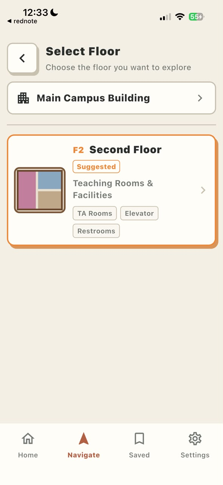
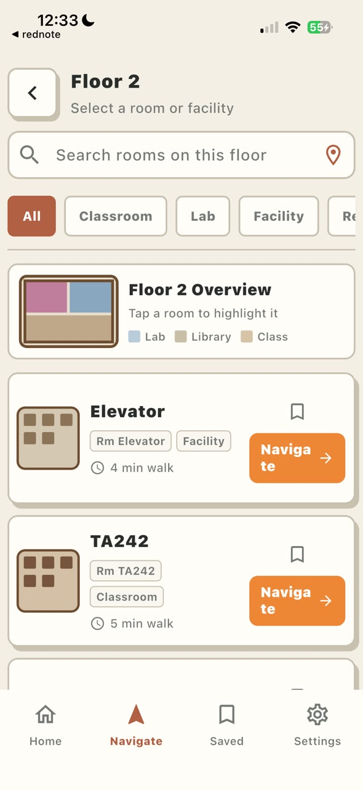

# TAR UMT Arena — Campus Navigator

An indoor-navigation project with a Flutter mobile app, an administration website,
realtime user presence, navigation analytics, and optional Wi-Fi positioning.
The app supports room search, indoor routes, motion-based pedestrian dead reckoning
(PDR), rerouting, and Wi-Fi corrections.

This guide takes you from a fresh clone to a working local system. Start with
Steps 1–4, then choose the device and optional services you need.

## Contents

- [1. Choose what to run](#1-choose-what-to-run)
- [2. Install the tools](#2-install-the-tools)
- [3. Clone the complete repository](#3-clone-the-complete-repository)
- [4. Start the backend and admin dashboard](#4-start-the-backend-and-admin-dashboard)
- [5. Run the Flutter mobile app](#5-run-the-flutter-mobile-app)
- [6. Connect the app to realtime presence](#6-connect-the-app-to-realtime-presence)
- [7. Configure Wi-Fi positioning](#7-configure-wi-fi-positioning)
- [8. Run your own Wi-Fi API and Supabase registry](#8-run-your-own-wi-fi-api-and-supabase-registry)
- [9. Develop the admin website](#9-develop-the-admin-website)
- [10. Edit maps and campus data](#10-edit-maps-and-campus-data)
- [11. Run checks and build the app](#11-run-checks-and-build-the-app)
- [12. Deploy to Google Cloud](#12-deploy-to-google-cloud)
- [13. Run the older applications](#13-run-the-older-applications)
- [Troubleshooting](#troubleshooting)
- [Architecture and further reading](#architecture-and-further-reading)

## 1. Choose what to run

| Your goal | What you need | Follow |
| --- | --- | --- |
| Try mobile navigation with bundled maps | Flutter and an Android/iOS device or simulator | Steps 2, 3, 5 |
| Try the admin dashboard with 100 simulated users | Node.js, Docker, Bash | Steps 2–4 |
| Connect mobile navigation to the backend | The local backend plus Flutter | Steps 2–6 |
| Use Wi-Fi positioning | Android scanning or manual samples, plus a reachable positioning API | Step 7 |
| Host your own positioning model | Python, Supabase, and a trained model bundle | Step 8 |
| Edit the admin website | Node.js and the local backend | Step 9 |
| Publish the backend and website | Google Cloud project, domain, deployment configuration | Step 12 |

**Supabase and the Python Wi-Fi API are separate from the Go presence/analytics
backend.** You do not need to configure them to try bundled navigation or the
Docker admin demo. Flutter uses mock presence by default.

### Repository layout

```text
Tarumt-arena-indoor-navigation-app/
├── README.md
├── tarumt-nav-app/
│   ├── flutter_app/                 # Current Android/iOS application
│   ├── admin-web/                   # Administration website
│   ├── services/
│   │   ├── presence-gateway/        # Sessions, WebSocket presence, maps
│   │   ├── trajectory-worker/       # Redis events → ClickHouse
│   │   └── analytics-api/           # Analytics queries
│   ├── contracts/maps/              # Shared map contracts and publisher input
│   ├── dev/                         # Local startup and APK helpers
│   ├── deploy/                      # Docker Compose and deployment guides
│   ├── docs/                        # Backend architecture and operations
│   └── expo-app/                    # Earlier Expo implementation
├── knn-api-server/                  # Python Wi-Fi API (Git submodule)
├── supabase/                        # Node registry migrations and scripts
├── android-app/                     # Earlier native Kotlin application
├── knn-dianogstics/                 # Recorded Wi-Fi diagnostic samples
└── docs/images/                     # App screenshots
```

### App preview

<p align="center">
  
  
  
  
</p>

## 2. Install the tools

Install only the tools for your chosen setup path.

| Tool | Project requirement / purpose | Check installation |
| --- | --- | --- |
| Git | Clone the project and its submodule | `git --version` |
| Node.js and npm | Node **22.13.0 or newer** for the admin website and local helpers | `node --version` and `npm --version` |
| Docker Desktop, or Docker Engine with Compose v2 | Run the local backend; Compose must support `up --wait` | `docker info` and `docker compose version` |
| Flutter | Existing project baseline: **3.44.6**; use an SDK providing Dart **3.12.2** or compatible Dart 3.x, as required by `pubspec.yaml` | `flutter --version` |
| Android Studio and Android SDK | Android SDK, emulator, platform tools, and Gradle JDK; use the IDE's compatible bundled JDK | `flutter doctor -v` |
| Xcode on macOS | iOS simulator, build tools, and signing | `flutter doctor -v` |
| Go | **1.24.0 or newer**, only for running Go services outside Docker | `go version` |
| OpenSSL | Generate temporary secrets for the phone-test helper | `openssl version` |
| Python | **3.11 or newer**, only for your own Wi-Fi API/registry tools | `python3 --version` |

For Flutter, add its `bin` directory to your shell's `PATH`. Open a new terminal,
then run:

```sh
flutter doctor -v
flutter doctor --android-licenses
flutter devices
```

Resolve the issues for your target platform. In Android Studio's SDK Manager,
install the required Android SDK and command-line tools. Create and start an
emulator in Device Manager, or connect a phone with USB debugging enabled.
For iOS, open Xcode once to finish installing its components, then start a simulator.
Install CocoaPods if Flutter doctor reports it is needed by your iOS toolchain.

**Shell convention:** commands below use Bash/POSIX syntax on macOS or Linux.
On Windows, use WSL2 with Docker integration for backend scripts. Run Flutter
from the Windows environment where your Android toolchain and device are available;
translate `export` and line continuations if using PowerShell. iOS builds require macOS.

**Checkpoint:** your selected tools respond, Docker is running if needed, and
`flutter devices` lists a target if you are setting up mobile development.

## 3. Clone the complete repository

```sh
git clone --recurse-submodules https://github.com/muliang0711/Tarumt-arena-indoor-navigation-app.git
cd Tarumt-arena-indoor-navigation-app
```

If you already cloned the repository, run this from its root instead:

```sh
git submodule update --init --recursive
git submodule status
```

This downloads `knn-api-server` at the revision recorded by this repository.
If Git asks you to authenticate, use an account with access to the repositories.

For the commands below, set this variable **in each new terminal**, after entering
the repository root:

```sh
export ARENA_ROOT="$PWD"
```

Every setup section uses it to avoid confusion between the repository root,
`tarumt-nav-app`, and `flutter_app`. Do not set it from a child folder.

**Checkpoint:** `tarumt-nav-app/flutter_app/pubspec.yaml` and
`knn-api-server/requirements.txt` both exist.

## 4. Start the backend and admin dashboard

### 4.1 Start Docker and check Node

```sh
cd "$ARENA_ROOT/tarumt-nav-app"
docker info
node --version
```

The startup script runs a Node map-data synchronization step, so Node must be
installed on your computer even though the website runs inside Docker.

### 4.2 Start the complete local demo

```sh
bash dev/admin-local.sh up
```

The first run downloads images and builds services, so allow time for it to
finish. The script starts Redis, ClickHouse, the Presence Gateway, Trajectory
Worker, Analytics API, admin website, and a simulator with **100 users**.
Compose provides the local configuration and initializes a fresh analytics
volume; no `.env` file or manual database setup is needed for this demo.

### 4.3 Open the website and check readiness

| Component | Local address |
| --- | --- |
| Dashboard | [http://localhost:3100/](http://localhost:3100/) |
| Live map | [http://localhost:3100/live](http://localhost:3100/live) |
| Presence Gateway | `http://127.0.0.1:18080` |
| Analytics API | `http://127.0.0.1:19092` |

```sh
bash dev/admin-local.sh status
curl -fsS http://127.0.0.1:18080/health/ready
curl -fsS http://127.0.0.1:19092/health/ready
node dev/verify-admin-local.mjs
```

**Checkpoint:** the pages load, the live map receives simulated users, and the
verifier succeeds. Give the simulator time to generate journeys before expecting
statistics. Historical dates are empty on a fresh installation. Dashboard counts
are navigation starts, and destination rankings require at least five starts.

The live map's **10 / 20 / 30 / All** selector controls displayed markers; it does
not change how many users the simulator creates. Overlapping markers can look
like fewer users.

### 4.4 Control the demo

Run from `tarumt-nav-app`:

```sh
# Change the actual simulated population (1–1000).
bash dev/admin-local.sh simulate 20

# Inspect recent simulator output.
bash dev/admin-local.sh logs

# Stop simulated users while keeping the backend and website running.
bash dev/admin-local.sh stop-simulation

# Stop the complete demo; keep stored ClickHouse analytics.
bash dev/admin-local.sh down

# Start it again, including simulated users.
bash dev/admin-local.sh up
```

The demo binds host ports to loopback. Its fixed credentials are for local use.
Do not use this Compose file for public hosting. Avoid `down --volumes` when you
want to preserve analytics.

## 5. Run the Flutter mobile app

### 5.1 Download Dart dependencies

```sh
cd "$ARENA_ROOT/tarumt-nav-app/flutter_app"
flutter pub get
flutter devices
```

### 5.2 Prepare your target

**Android phone:** enable Developer options and USB debugging, connect by USB,
and accept the device's debugging authorization prompt. For an emulator, start
it in Android Studio before running Flutter.

**iOS simulator:** start Simulator through Xcode and use the identifier shown by
`flutter devices`.

**Physical iPhone:** enable Developer Mode if prompted and trust the connected
computer. Open `ios/Runner.xcworkspace` if generated, otherwise open
`ios/Runner.xcodeproj` in Xcode. Select the Runner target, set your Apple
Development team under **Signing & Capabilities**, and use a bundle identifier
that team can sign. Resolve signing before deploying to the phone.

### 5.3 Make the first run independent of the Wi-Fi service

Replace `DEVICE_ID` with the identifier printed by `flutter devices`:

```sh
flutter run -d DEVICE_ID \
  --dart-define=PRESENCE_MODE=mock \
  --dart-define=WIFI_POSITIONING_SOURCE=off
```

**Checkpoint:** the home screen opens. Browse a floor, select a room, and start
a route. Bundled assets support navigation without setting up Supabase. Mock
Live Map actors are demo data and do not prove a backend connection.

Keep the Flutter terminal open. Press `r` for hot reload or `q` to stop. Changes
to `--dart-define` values require stopping and relaunching with the new command.
Use a physical device to validate real walking, heading, and Wi-Fi scanning;
a simulator is useful for UI and network checks.

## 6. Connect the app to realtime presence

Choose **one** of the following workflows. The Docker demo uses port **18080**;
the standalone phone-test server uses port **8080**.

### Option A: Connect an emulator or USB-connected Android phone to the Docker demo

Keep the Step 4 backend running. From the Flutter directory, use the address
appropriate to your target:

| Target | `PRESENCE_BASE_URL` for the Docker demo |
| --- | --- |
| iOS simulator on the same Mac | `http://127.0.0.1:18080` |
| Android emulator | `http://10.0.2.2:18080` |
| Android phone connected by USB | Run `adb reverse tcp:18080 tcp:18080`, then use `http://127.0.0.1:18080` |

Example for an Android emulator:

```sh
cd "$ARENA_ROOT/tarumt-nav-app/flutter_app"
flutter run -d DEVICE_ID \
  --dart-define=PRESENCE_MODE=realtime \
  --dart-define=PRESENCE_BASE_URL=http://10.0.2.2:18080 \
  --dart-define=WIFI_POSITIONING_SOURCE=off
```

Start a navigation journey to publish your position. The app connects while
foregrounded; observing the Live Map and publishing an active journey have
separate responsibilities. Check the admin live map for activity on the same floor.
If you want to distinguish your device from the demo users, stop the simulator
with `bash dev/admin-local.sh stop-simulation` from `tarumt-nav-app`.

### Option B: Test Android phones over the same Wi-Fi

This uses a separate, in-memory Go gateway. It supports multiple phones connected
to that process, but does not feed the Docker demo's analytics pipeline.

In terminal 1:

```sh
cd "$ARENA_ROOT/tarumt-nav-app"
sh dev/run-phone-test-server.sh
```

The helper creates temporary development secrets and listens on port 8080. Keep
this terminal open. In terminal 2, find your computer's LAN IPv4 address. On a
Mac using Wi-Fi interface `en0`:

```sh
ipconfig getifaddr en0
```

If that prints nothing, find the active interface's address in your network
settings. Replace `192.168.1.25` below with the actual address:

```sh
cd "$ARENA_ROOT/tarumt-nav-app"
sh dev/build-phone-test-apk.sh 192.168.1.25
adb install -r flutter_app/build/app/outputs/flutter-apk/app-debug.apk
```

You can also transfer the APK to the phone and install it manually. The phone
and computer must use the same reachable network; allow the Go process through
the computer's firewall. First open `http://192.168.1.25:8080/health/ready` in the
phone's browser. A guest network may isolate devices from each other.

**Checkpoint:** the health URL works from the phone, and two foregrounded devices
can exchange realtime activity when navigating on the same floor. Press Ctrl+C
in terminal 1 when finished. Temporary sessions and live state do not survive
this standalone server's restart.

### Option C: Connect any device to a deployed gateway

Use your actual HTTPS origin after completing Step 12:

```sh
cd "$ARENA_ROOT/tarumt-nav-app/flutter_app"
flutter run -d DEVICE_ID \
  --dart-define=PRESENCE_MODE=realtime \
  --dart-define=PRESENCE_BASE_URL=https://YOUR_NAME.duckdns.org
```

Release realtime configuration requires HTTPS. `localhost` on a physical phone
refers to the phone itself unless you explicitly configure a supported tunnel
such as Android's USB port reversal.

## 7. Configure Wi-Fi positioning

Presence and Wi-Fi positioning have **different base URLs**. The Presence Gateway
is not the Python `/findClosestNode` service.

| Flutter setting | Values / default | Purpose |
| --- | --- | --- |
| `PRESENCE_MODE` | `mock` (default), `realtime`, `hybrid`, `off` | Live Map connection mode |
| `PRESENCE_BASE_URL` | Default `http://127.0.0.1:8080` | Go gateway origin |
| `PRESENCE_REMOTE_VISIBLE_LIMIT` | Default `1` in hybrid mode | Remote representative limit for hybrid testing |
| `WIFI_POSITIONING_SOURCE` | `auto` (default), `native`, `manual`, `off` | RSSI input source |
| `WIFI_POSITIONING_BASE_URL` | Default `https://uni-rssi-knn-api-server.onrender.com` | HTTPS Wi-Fi API origin |

The hosted Wi-Fi address is a source-code default, not a guarantee of current
service availability. Flutter appends `/findClosestNode`; provide an origin,
not that endpoint path, when overriding the URL.

### Android scanning

```sh
cd "$ARENA_ROOT/tarumt-nav-app/flutter_app"
flutter run -d ANDROID_DEVICE_ID \
  --dart-define=WIFI_POSITIONING_SOURCE=native
```

Enable Wi-Fi and Location Services and grant the requested location permissions.
Use a physical Android phone at the mapped campus area for meaningful results:
the model needs access points represented in its training data. With `auto`,
Android selects native scanning; iOS defaults to Wi-Fi positioning off.

### iOS/manual sample testing

```sh
flutter run -d IOS_DEVICE_ID \
  --dart-define=WIFI_POSITIONING_SOURCE=manual
```

Open navigation and use the Wi-Fi Test Lab to select a recorded node sample.
It calls the real positioning API. iOS does not provide the Android-style nearby
Wi-Fi scans used by this project. Large corrections and destination fixes may
require two matching predictions before the marker moves.

To use your own API, add:

```sh
--dart-define=WIFI_POSITIONING_BASE_URL=https://YOUR_WIFI_API_DOMAIN
```

This is an additional argument to `flutter run` or `flutter build`, not a separate
shell command. The Wi-Fi client requires **HTTPS**, including for a custom server.
Combine these arguments with the Step 6 presence arguments when you need both.

## 8. Run your own Wi-Fi API and Supabase registry

Skip this section if you use the existing endpoint or keep Wi-Fi positioning off.
The server requires both a populated Supabase `public.nodes` table and a local
trained `bundle.pt`. The generated model is ignored by Git and is not supplied
by cloning the repository.

### 8.1 Prepare the Python environment

```sh
cd "$ARENA_ROOT/knn-api-server"
python3 -m venv .venv
source .venv/bin/activate
python -m pip install -r requirements.txt
python -m pip install -r "$ARENA_ROOT/supabase/requirements.txt"
```

Reactivate this environment in each terminal used for the API or registry scripts.

### 8.2 Create and migrate a Supabase project

Create a dedicated Supabase project and obtain its project reference, project URL,
and publishable key. From the **repository root**:

```sh
cd "$ARENA_ROOT"
npx supabase login
npx supabase link --project-ref YOUR_PROJECT_REF
npx supabase db push --linked --dry-run
npx supabase db push --linked
```

Review the dry run before applying migrations, especially for an existing database.
The checked-in migrations create the node registry and its bootstrap rows.
Older Supabase documentation calls the parent folder `fyp_backend`; in this
checkout, use `$ARENA_ROOT` instead.

For an optional **local disposable** Supabase instance, Docker must be running:

```sh
cd "$ARENA_ROOT"
npx supabase start
npx supabase db reset
npx supabase db lint --level error
```

`db reset` replaces the local database contents. Do not use it to troubleshoot
valuable data. If using local Supabase, use its printed local API URL and keys
in the next step instead of hosted credentials. Stop it with `npx supabase stop`
from the repository root when finished.

### 8.3 Set API credentials and export the registry

In your activated Python terminal, replace the placeholders:

```sh
export SUPABASE_URL=https://YOUR_PROJECT_REF.supabase.co
export SUPABASE_PUBLISHABLE_KEY=YOUR_PUBLISHABLE_KEY
cd "$ARENA_ROOT"
python supabase/scripts/sync_node_registry.py diff
python supabase/scripts/sync_node_registry.py download --apply
```

The download replaces `knn-api-server/resources/node-registry.json` with the
registry used for training. Keep credentials out of Git. A Supabase secret key
is needed only for administrative uploads; never put one into Flutter defines
or browser configuration. See the [registry administration guide](supabase/docs/04_node_registry_updates.md)
for uploads and schema-change rules.

### 8.4 Supply or train a model

If the project maintainer provides a reviewed model, place it at
`knn-api-server/wknn-triplet/artifacts/default/bundle.pt` or set an absolute custom
path in Step 8.5. Its reference nodes must exist in your Supabase registry.

To train from the configured dataset, use the CLI installed by `requirements.txt`:

```sh
cd "$ARENA_ROOT/knn-api-server/wknn-triplet"
wknn-triplet audit --config configs/default.json
wknn-triplet train --config configs/default.json
wknn-triplet evaluate --config configs/default.json --split validation
wknn-triplet evaluate --config configs/default.json --split test
```

Review the audit before training and the evaluations before deploying. If the
audit reports missing data, obtain the collection files and check the paths in
`configs/default.json`. See the [model training guide](knn-api-server/wknn-triplet/README.md)
and [model deployment guide](knn-api-server/documentation/06_model_deployment.md).

### 8.5 Start and verify the API

Keep the Supabase variables from Step 8.3 set in this terminal:

```sh
cd "$ARENA_ROOT/knn-api-server"
export MODEL_BUNDLE_PATH=wknn-triplet/artifacts/default/bundle.pt
export MODEL_DEVICE=cpu
export MODEL_VARIANT=baseline
export PORT=8000
python main.py
```

In another terminal:

```sh
curl -fsS http://127.0.0.1:8000/heartbeat
curl -fsS http://127.0.0.1:8000/nodes
```

**Checkpoint:** heartbeat returns `{"status":"ok"}` and `/nodes` returns the registry.
These verify startup; test actual positioning with the sample workflow in
[API operations and testing](knn-api-server/documentation/05_operations_and_testing.md).
The API refuses startup when credentials, node data, or the model are invalid.

To connect Flutter, expose this service through a reachable HTTPS endpoint and
set `WIFI_POSITIONING_BASE_URL` as shown in Step 7. The presence deployment in
Step 12 does not automatically deploy this Python service or its model.

## 9. Develop the admin website

First start the backend with Step 4. Stop only the Docker website to free port 3100:

```sh
cd "$ARENA_ROOT/tarumt-nav-app"
docker compose -f deploy/compose.admin-local.yaml --profile web stop admin-web
node admin-web/scripts/sync-campus.mjs
cd admin-web
npm ci
```

Create `tarumt-nav-app/admin-web/.dev.vars` with:

```dotenv
PRESENCE_API_BASE_URL=http://127.0.0.1:18080
ANALYTICS_API_BASE_URL=http://127.0.0.1:19092
```

This ignored file configures the local Worker preview. Then run:

```sh
npm run dev -- --port 3100
```

Open [the local dashboard](http://localhost:3100/). The website expects actual
backend responses; missing/unreachable services return 503. Docker supplies its
own internal service URLs, so do not replace Docker URLs with these loopback URLs.

To return to the Docker website, stop the development server with Ctrl+C and run
`bash dev/admin-local.sh up` from `tarumt-nav-app`.

## 10. Edit maps and campus data

Paths below are relative to `tarumt-nav-app`:

| Content | File |
| --- | --- |
| Rooms and facilities | `flutter_app/assets/campus/main_campus.rooms.json` |
| Route nodes | `flutter_app/assets/maps/demo_1.nodes.json` |
| Route edges | `flutter_app/assets/maps/demo_1.edges.json` |
| Tiled metadata | `flutter_app/assets/maps/demo_1.tmj.json` |
| Map image | `flutter_app/assets/maps/demo_1.png` |
| Wi-Fi server-to-local node mapping | `flutter_app/assets/positioning/floor-2.wifi-node-mapping.json` |
| Manual RSSI samples | `flutter_app/assets/positioning/wifiscans-15Jul2026.validation.json` |
| Canonical navigation graph | `contracts/maps/main-campus/map-graph-bundle.v1.json` |
| Map bundle publisher input | `contracts/maps/main-campus/map-bundle.source.json` |

1. Keep room node IDs, route edges, canonical graph, and Wi-Fi mappings consistent.
2. Follow the [map contract and revision rules](tarumt-nav-app/contracts/maps/README.md)
   when changing the canonical graph; do not invent revision hashes.
3. Publish the verified downloadable bundle and synchronize admin assets:

   ```sh
   cd "$ARENA_ROOT/tarumt-nav-app/services/presence-gateway"
   make publish-main-campus-map
   cd "$ARENA_ROOT/tarumt-nav-app"
   node admin-web/scripts/sync-campus.mjs
   ```

4. Configure the target gateway to serve the published map data using its
   [service guide](tarumt-nav-app/services/presence-gateway/README.md), or follow
   the deployment guide's map mount steps. Rebuild clients containing changed
   bundled assets and rebuild the Docker website if used.

A realtime app pins one verified bundle revision per launch. It may use a cached
last-known-good bundle when offline, so editing a local Flutter asset alone may
not change a map already supplied by the gateway. The current canonical bundle
contains `floor-2`; additional floors require matching data and contracts.

## 11. Run checks and build the app

Run the checks for the components you changed.

### Flutter

```sh
cd "$ARENA_ROOT/tarumt-nav-app/flutter_app"
flutter analyze
flutter test
flutter test integration_test/app_smoke_test.dart -d DEVICE_ID
flutter build apk --debug
```

Debug APK: `tarumt-nav-app/flutter_app/build/app/outputs/flutter-apk/app-debug.apk`.
Build flags matter: the plain build above uses default mock presence. For an APK
connected to your deployed backend:

```sh
flutter build apk --debug \
  --dart-define=PRESENCE_MODE=realtime \
  --dart-define=PRESENCE_BASE_URL=https://YOUR_NAME.duckdns.org
```

For an iOS simulator build on macOS:

```sh
flutter build ios --simulator --debug
```

Distribution builds additionally require platform signing and release configuration.
Use `PRESENCE_MODE=realtime` and a reachable HTTPS origin for connected releases.
For a hybrid test APK with one fixed-red local actor and one remote actor, see the
[Flutter guide](tarumt-nav-app/flutter_app/README.md).

### Admin website

```sh
cd "$ARENA_ROOT/tarumt-nav-app/admin-web"
npm ci
npm run lint
npm test
```

`npm test` includes a production build and the website's test suite.

### Go services

Run `go test ./...` separately inside each service you changed:

```sh
cd "$ARENA_ROOT/tarumt-nav-app/services/presence-gateway"
go test ./...
cd "$ARENA_ROOT/tarumt-nav-app/services/trajectory-worker"
go test ./...
cd "$ARENA_ROOT/tarumt-nav-app/services/analytics-api"
go test ./...
```

See each service README for optional Redis/integration checks.

### Python API and registry

With the Step 8 Python environment activated:

```sh
cd "$ARENA_ROOT/knn-api-server"
python -m pytest -q
cd "$ARENA_ROOT"
python -m unittest discover -s supabase/scripts/tests -v
```

## 12. Deploy to Google Cloud

Use the detailed [Google Cloud deployment guide](tarumt-nav-app/docs/operations/google-cloud-deployment.md)
in order. It covers:

1. Prepare a billing-enabled project, permissions, and a DuckDNS hostname.
2. Create a VM, reserve its IP, and configure the network/firewall.
3. Install Docker and clone a reviewed repository revision on the VM.
4. Create a private production environment file with unique secrets.
5. Publish map bundles, start the backend, and verify database permissions.
6. Deploy the admin website and shared Caddy HTTPS/WebSocket ingress.
7. Run external API checks and connect Flutter to the real HTTPS origin.

The cloud guide uses a separate production stack; the local-demo startup script
is not a deployment command. The admin endpoints currently have no administrator
authentication, so the documented public deployment is for synthetic demo data
until access control is implemented. Provisioning cloud resources may incur costs.

Continue with [frontend/API addresses](tarumt-nav-app/docs/operations/frontend-api-addresses.md)
and [operations, backups, and rollback](tarumt-nav-app/deploy/OPERATIONS.md).
Use the guide's supported `deploy/gcp/deploy-frontend.sh` workflow; the older
`bootstrap-vm.sh` and `scripts/deploy.sh` helpers have not been migrated to it.

## 13. Run the older applications

These applications are separate from the current Flutter app and are not required
for its setup.

### Original Expo application

```sh
cd "$ARENA_ROOT/tarumt-nav-app/expo-app"
npm ci
npm start
```

Follow the terminal's instructions to open a compatible Expo client or emulator.
The repository uses Expo SDK 54; the client must support that SDK. Additional
commands are `npm run android`, `npm run ios`, `npm run typecheck`, and `npm test`.
See the [Expo context](tarumt-nav-app/CONTEXT.md) and its feature-level READMEs.

### Original native Android application

1. Open `$ARENA_ROOT/android-app` as a project in Android Studio.
2. Install Android SDK 35 and let Gradle sync complete with a compatible Gradle JDK.
3. Select an Android device with API level 24 or newer.
4. Check the Wi-Fi API origin in
   `app/src/main/java/com/hyandlh/tarumtarenanavigation/config/GlobalConfig.kt`.
5. Run the `app` configuration and grant its requested permissions.

From a configured terminal, a debug build is also available:

```sh
cd "$ARENA_ROOT/android-app"
./gradlew assembleDebug
```

Output: `android-app/app/build/outputs/apk/debug/app-debug.apk`.
See the [native Android overview](android-app/documentation/01_system_overview.md).

## Troubleshooting

| Symptom | What to check |
| --- | --- |
| `cd` fails or a file cannot be found | Set `ARENA_ROOT` to the repository root in this terminal. Flutter is inside `tarumt-nav-app/flutter_app`. |
| `knn-api-server` is empty | Run `git submodule update --init --recursive` from the repository root. |
| `node: command not found` during Docker startup | Install Node 22.13.0+ on the host; the startup helper runs Node before Compose. |
| Docker cannot connect / `--wait` is unknown | Start Docker and check `docker info`; install a Compose v2 version supporting `up --wait`. |
| Port 3100 is already in use | Stop the Docker `admin-web` service before running the website development server, or stop the other server using that port. |
| A backend container fails startup | Run the Compose logs command below; inspect the failing service before restarting. |
| Dashboard has no historical statistics | New volumes only contain journeys generated since startup. Keep the simulator running and inspect its logs. |
| Dashboard/API returns 503 | Check Gateway/Analytics readiness and the website's `.dev.vars` or Docker runtime URLs. |
| Phone cannot connect | Check the correct port (18080 versus 8080), emulator/USB/LAN address, firewall, and network isolation. Docker demo ports are loopback-only. |
| Live Map only shows demo actors | Rebuild/relaunch with `PRESENCE_MODE=realtime` and the right base URL. |
| Android device is missing | Start an emulator, or enable USB debugging and accept the phone's authorization dialog; rerun `flutter devices`. |
| Flutter dependencies cannot resolve | Check the Dart version from `flutter --version` against `pubspec.yaml`, then run `flutter pub get`. |
| iOS signing fails | Open Runner in Xcode and fix the development team, bundle ID, and device provisioning. |
| Wi-Fi positioning does not correct the marker | Check permissions, Location Services, API availability, trained access-point coverage, and node mappings. Use manual samples to isolate the API path. |
| Custom Wi-Fi URL is rejected | The Flutter Wi-Fi client accepts HTTPS origins; an HTTP development URL is insufficient. |
| Python API fails before serving requests | Check Supabase credentials/connectivity, populated nodes, `MODEL_BUNDLE_PATH`, and model/registry node compatibility. |
| Map edits do not appear | Check published bundle revision, gateway map configuration, cached assets, and whether the client/site was rebuilt. |

Inspect local backend logs from `tarumt-nav-app`:

```sh
docker compose -f deploy/compose.admin-local.yaml \
  --profile web --profile simulation logs --tail 100
```

## Architecture and further reading

```text
Flutter ── HTTP/WebSocket ── Presence Gateway ── Redis streams
  │                              │                   │
  │                        Map bundles         Trajectory Worker
  │                                                  │
  │                                              ClickHouse
  │                                                  │
  │                                            Analytics API
  │                                                  │
  │                         Admin website ────────────┘
  │                              │
  │                              └── Presence Gateway (live map)
  │
  └── HTTPS ── Python Wi-Fi API ── local trained bundle + Supabase nodes
```

Flutter uses MVVM with domain algorithms, application ports/orchestration,
infrastructure adapters, and native Android/iOS sensor bridges.

- [Flutter application and realtime behavior](tarumt-nav-app/flutter_app/README.md)
- [Flutter source architecture](tarumt-nav-app/flutter_app/lib/README.md)
- [Backend documentation index](tarumt-nav-app/docs/backend/README.md)
- [Presence Gateway](tarumt-nav-app/services/presence-gateway/README.md)
- [Trajectory Worker](tarumt-nav-app/services/trajectory-worker/README.md)
- [Analytics API](tarumt-nav-app/services/analytics-api/README.md)
- [Admin website](tarumt-nav-app/admin-web/README.md)
- [Supabase registry](supabase/README.md)
- [Wi-Fi API contract](knn-api-server/documentation/02_api_contract.md)
