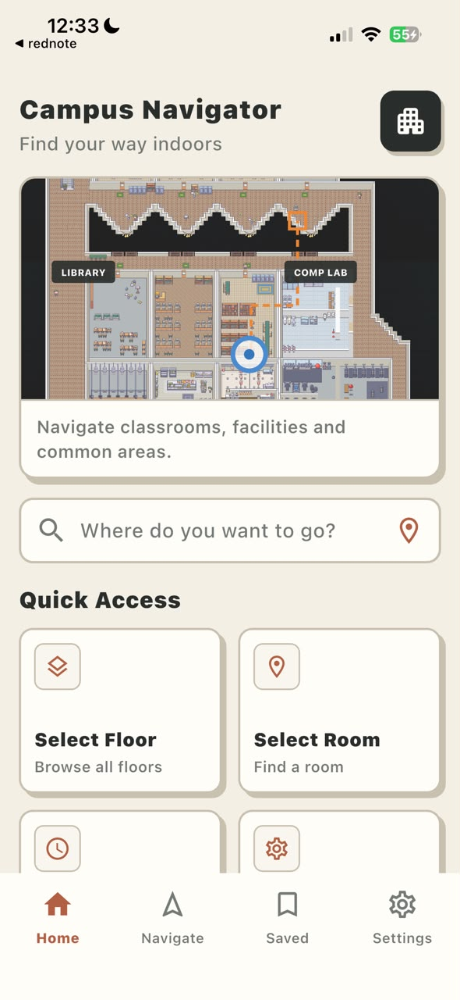
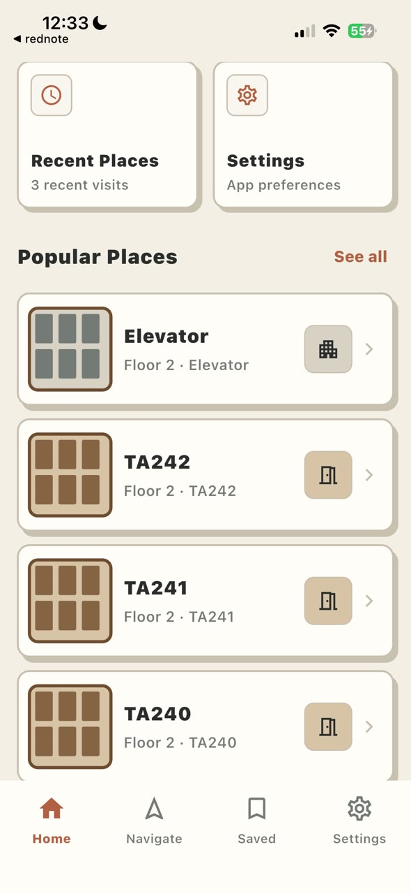

# Campus Navigator

Campus Navigator is a Flutter indoor-navigation application for browsing a
campus building, selecting a room, and following a map-based route to the
destination. It combines pedestrian dead reckoning (PDR) with optional Wi-Fi
RSSI positioning to limit accumulated drift during a navigation session.

The production app is in [`flutter_app/`](flutter_app/). The original
Expo + TypeScript implementation remains in [`expo-app/`](expo-app/) as a
migration and behavior-parity reference.

## App preview

<p align="center">
  
  
  
  
</p>

## Features

- Home, floor selection, room search, filters, saved places, and settings.
- Data-driven campus rooms, facilities, route nodes, and graph edges.
- Indoor map rendered from bundled Tiled/PNG assets.
- Shortest-route generation from the selected start and destination nodes.
- Animated Bob position marker, destination beacon, view cone, and arrival UI.
- Live campus map prototype with floor occupancy, representative anonymous
  actors, and a repository boundary ready for a real-time backend.
- Go presence gateway with privacy-preserving anonymous sessions, a versioned
  WebSocket protocol, canonical Journey lifecycle, and a shared Redis backend
  for multiple gateway instances.
- Independently deployable Go trajectory worker with Redis Consumer Groups,
  separate trajectory/Journey pipelines, crash recovery, dead-letter handling,
  and ClickHouse batch ingestion.
- Read-only aggregate Analytics API with cohort privacy suppression and
  evidence-producing ClickHouse query metrics.
- Motion-based PDR using native Android sensors and Apple Core Motion.
- Wrong-way detection, heading correction, route snapping, and rerouting
  support.
- Android Wi-Fi scanning with a shared Flutter KNN API client.
- Wi-Fi/PDR fusion with smooth correction, confirmed teleport correction, and
  session-safe arrival handling.
- Manual RSSI Test Lab for exercising the real positioning API on iOS without
  native Wi-Fi scanning.
- MVVM architecture with platform services isolated behind application ports.

## Repository layout

```text
.
├── flutter_app/                 # Current Flutter application
│   ├── android/                 # Android motion and Wi-Fi native bridges
│   ├── ios/                     # Apple Core Motion bridge and Xcode project
│   ├── assets/
│   │   ├── actors/              # Bob animation frames
│   │   ├── campus/              # Editable room catalog
│   │   ├── maps/                # Map, nodes, edges, and Tiled data
│   │   └── positioning/         # Wi-Fi mapping and validation samples
│   ├── lib/                     # Dart application source
│   ├── integration_test/        # Device-level smoke tests
│   └── test/                    # Unit, widget, parity, and adapter tests
├── expo-app/                    # Legacy Expo migration reference
├── contracts/                   # Versioned cross-service event contracts
├── services/
│   ├── presence-gateway/        # Anonymous session + WebSocket presence API
│   ├── trajectory-worker/       # Redis Stream to ClickHouse background worker
│   └── analytics-api/           # Privacy-safe aggregate ClickHouse queries
├── performance/                  # k6 + Prometheus/Grafana local load harness
├── validation/                  # Source Wi-Fi RSSI validation captures
└── docs/                        # Architecture, operations, baseline, screenshots
```

## Performance validation

The repository includes a local, non-production load environment for the full
realtime-to-analytics pipeline. It separates load generation from service
metrics and verifies Stream/ClickHouse correctness after each scenario.

```sh
cd performance
make up
make smoke
make baseline
make journey-stress
make recovery
make down
```

See [`performance/README.md`](performance/README.md), the reviewed
[`Stage 5.5 baseline`](docs/performance/stage-5.5-baseline.md),
[`Stage 6 Journey delivery report`](docs/performance/stage-6-journey-lifecycle-delivery-report.md),
and [`scaling playbook`](docs/operations/scaling-playbook.md). Results describe the
recorded machine and workload; they are not production capacity guarantees.

## CMP deployment

The single-host friend-testing deployment is defined in [`deploy/`](deploy/).
It runs the three Go processes, Redis, and ClickHouse behind a private Docker
application network. A separate Gateway-only ingress network publishes only
the Presence Gateway to host loopback for a Tailscale Funnel ingress. See the
[`CMP deployment runbook`](docs/operations/cmp-deployment.md) for environment
setup, versioned deployment, smoke testing, rollback, and current durability
limits.

## Backend documentation

The Mermaid documentation for the implemented Go backend is organized into
three focused views:

- [backend architecture](docs/backend/architecture.md) — deployables, network
  topology, internal modules, and operational boundaries;
- [backend data flows](docs/backend/data-flow.md) — map/session bootstrap,
  Journey and presence handling, live-floor projection, ingestion, and
  analytics sequences;
- [backend schema flow](docs/backend/schema-flow.md) — logical entities, Redis
  keyspace, event contracts, ClickHouse tables, retention, and field lineage.

Start at the [backend documentation index](docs/backend/README.md) for scope,
terminology, and source-of-truth links.

## Architecture

The Flutter application follows MVVM and keeps domain logic independent from
Flutter and native frameworks.

```text
UI widgets
    ↓ bind to immutable state and send user actions
ViewModels
    ↓ coordinate lifecycle and application use cases
Application engines + ports
    ↓ call pure navigation/PDR behavior and abstract capabilities
Domain models and algorithms
    ↑ implemented by
Infrastructure + Android/iOS native bridges
```

Key source boundaries:

- `lib/domain/` — pure models and navigation, PDR, routing, and fusion logic.
- `lib/application/view_models/` — UI-facing immutable state and actions.
- `lib/application/orchestration/` — lifecycle-safe application engines.
- `lib/application/ports/` — interfaces for sensors, time, storage, Wi-Fi, and
  logging.
- `lib/infrastructure/` — HTTP, assets, timers, sharing, and platform-channel
  adapters.
- `lib/ui/` — Flutter screens, navigation shell, map, actor, and effects.
- `lib/composition/` — production dependency assembly.

## Requirements

- Flutter 3.44.6 stable or a compatible newer stable release.
- Dart 3.12.2 or the version bundled with Flutter.
- macOS with Xcode for iOS development.
- Android Studio/Android SDK and Java 17 for Android development.
- A physical device for motion and native Wi-Fi validation.
- Go 1.24.1 or newer for the Go services.
- Docker Desktop or another Docker engine for Redis/ClickHouse integration tests.

Check the local toolchain before starting:

```sh
flutter doctor -v
flutter devices
```

## Setup

```sh
git clone <repository-url>
cd <repository-directory>/flutter_app
flutter pub get
```

For a physical iPhone, open `ios/Runner.xcworkspace` or `ios/Runner.xcodeproj`
in Xcode once, select your Apple Development team under **Signing &
Capabilities**, and confirm that the bundle identifier is valid for that team.

## Run the app

List the available device identifiers:

```sh
flutter devices
```

Run with the platform defaults:

```sh
cd flutter_app
flutter run -d <device-id>
```

The default Wi-Fi positioning behavior is:

| Platform | Default source | Behavior |
| --- | --- | --- |
| Android | `native` | Collects nearby Wi-Fi RSSI through the Android bridge and calls the positioning API. |
| iOS | `off` | Runs motion/PDR navigation without native Wi-Fi scanning. |

For Android Wi-Fi testing, enable the removable diagnostics button on the map:

```sh
flutter run -d <android-device-id> \
  --dart-define=WIFI_DEBUG_PANEL=true
```

The panel reports permission, Wi-Fi and Location Services state, active versus
cache-only requests, active/passive/cached scan results, batch and RSSI age,
server and map nodes, last error, and separate positioning and hardware
cooldown countdowns. Android positioning checks continue every 5 seconds while
an OS-throttled active hardware scan cools down for 30 seconds. Omit the flag
for the normal clean map.

When the panel is enabled, it keeps the latest 500 structured diagnostic
events across app restarts. Tap **Export JSON** to save or share a report that
contains lifecycle pause/resume reasons, scan source and timing, the exact API
request readings, server status/response details, node mapping, and correction
outcomes. Tap **Clear** before reproducing a new issue. These internal reports
contain Wi-Fi BSSIDs and RSSI fingerprints, so do not publish them publicly.

### Test Wi-Fi positioning on iOS

iOS does not expose the same general nearby Wi-Fi scan data used by the Android
implementation. Start the app in manual mode to show the removable Wi-Fi Test
Lab on the navigation map:

```sh
flutter run -d <ios-device-id> \
  --dart-define=WIFI_POSITIONING_SOURCE=manual
```

Tap a mapped node in the Test Lab to select a recorded RSSI sample and submit
it to the real KNN API. The map starts a positioning scan immediately. A large
correction or destination fix is authoritative after one valid mapped server
response, so the user marker and PDR origin are rebased immediately.

On the map, the iOS Test Lab uses a compact panel capped at 34% of the screen.
After a successful sample it collapses automatically to a small server-to-map
node result card, leaving the corrected marker and route visible. Leaving the
map or starting another destination clears the retained manual RSSI sample, so
a previous test node cannot complete a later navigation session.

When a trusted Wi-Fi fix moves the user to a different route node, the app
briefly shows **Location updated · Recalculating route…**, waits 700 ms, then
replaces the route and resumes navigation from the trusted position. A fix at
the destination skips this delay and completes arrival immediately.

### Positioning configuration

Supported Wi-Fi sources are `auto`, `native`, `manual`, and `off`:

```sh
flutter run -d <device-id> \
  --dart-define=WIFI_POSITIONING_SOURCE=off
```

The production KNN endpoint defaults to:

```text
https://uni-rssi-knn-api-server.onrender.com/findClosestNode
```

Override its HTTPS base URL when needed:

```sh
flutter run -d <device-id> \
  --dart-define=WIFI_POSITIONING_BASE_URL=https://example.com
```

## Editing rooms, maps, and Wi-Fi nodes

These version-controlled assets are the atomic offline fallback. At startup,
production composition first resolves the Gateway's published Map Bundle and
pins every map consumer to that one verified revision:

| Data | File |
| --- | --- |
| Rooms and facilities | `flutter_app/assets/campus/main_campus.rooms.json` |
| Route nodes | `flutter_app/assets/maps/demo_1.nodes.json` |
| Route graph edges and distances | `flutter_app/assets/maps/demo_1.edges.json` |
| Tiled map metadata | `flutter_app/assets/maps/demo_1.tmj.json` |
| Rendered map image | `flutter_app/assets/maps/demo_1.png` |
| Server-to-map Wi-Fi nodes | `flutter_app/assets/positioning/floor-2.wifi-node-mapping.json` |
| Bundled RSSI Test Lab samples | `flutter_app/assets/positioning/wifiscans-15Jul2026.validation.json` |

When adding a navigable room, its `nodeId` must exist in the local node graph.
When adding a Wi-Fi location, its server node ID must also be explicitly mapped
to a valid local map node before the app will use it for correction.

## Validation and builds

Run commands from `flutter_app/`:

```sh
flutter analyze
flutter test
flutter test integration_test/app_smoke_test.dart -d <device-id>
```

Build debug artifacts:

```sh
flutter build apk --debug
flutter build ios --simulator --debug
```

Physical-device testing is required for motion behavior, Android Wi-Fi
permissions/scanning, iOS signing, and real walking accuracy.

## Platform notes

- Android requires Wi-Fi, precise location permission, Location Services, and
  internet access for native RSSI positioning.
- iOS uses Core Motion for PDR. Use manual mode for repeatable Wi-Fi API and
  fusion testing.
- The Render-hosted positioning service may need extra time on its first
  request after inactivity.
- Test Lab samples are scoped to the current navigation session and are cleared
  after arrival so a new route cannot inherit the previous destination fix.
