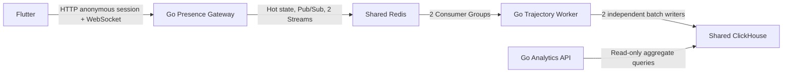
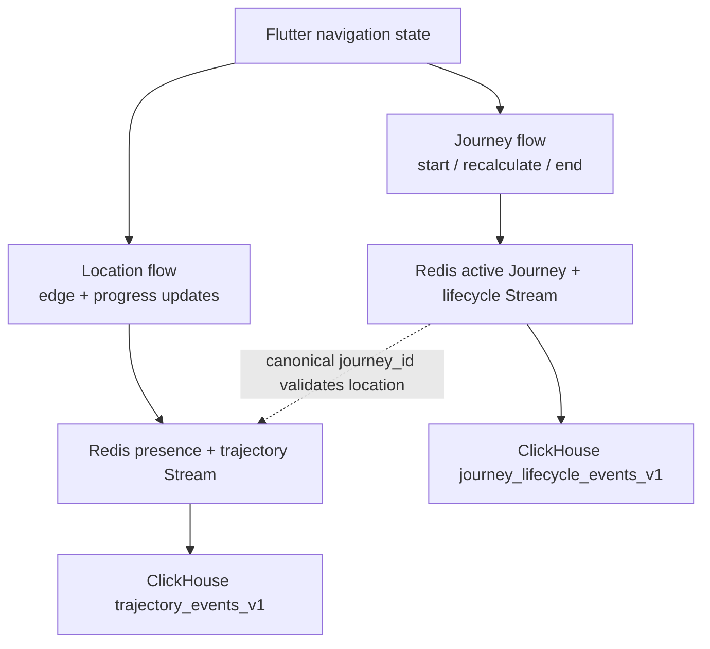

# Implemented schema flow and redesign context

## Purpose and status

This document describes the implemented Stage 6 data flow as of 2026-07-26.
It can be given to another engineer or LLM as architecture context. Sections
labelled **Future** are not implemented.

The central design is:

- Journey lifecycle carries low-frequency navigation intent and outcome.
- Location updates carry high-frequency route-relative observations.
- Both meet at the canonical Gateway `journey_id`.
- Flutter talks only to the Presence Gateway.
- Redis and ClickHouse remain private backend infrastructure.

## Runtime boundary

There are three Go deployables, not four:

1. Presence Gateway
2. Trajectory Worker
3. Analytics API

The Trajectory Worker binary contains two independent ingestion pipelines. That
does not make it two services.



## Two logical flows over one WebSocket

The new Journey flow does not replace or modify `LocationUpdateV1`. They are
separate command types transported through the same authenticated WebSocket.



The location flow answers, “Where is this active Journey now?” The lifecycle
flow answers, “What was planned, why did it change, and how did it end?”

## Flow A: anonymous identity and session

Flutter generates a random installation ID and stores it in
`SharedPreferencesAsync`. It never reads a hardware identifier.

```json
{
  "installation_id": "secure-random-installation-id"
}
```

Flutter sends it only to:

```text
POST /v1/anonymous-sessions
```

The Gateway derives:

```text
device_ref = HMAC-SHA256(server_secret, installation_id)
```

`device_ref` and `session_id` are operational identities. They are allowed in
short-lived Redis state but forbidden from both ClickHouse raw-event tables and
privacy-safe dead letters.

## Flow B: Flutter Journey lifecycle

### B1. Flutter source data

The Journey coordinator reads:

| Flutter value | Journey meaning |
| --- | --- |
| `navigationSessionId` | Local ownership of one navigation attempt |
| first route node | Origin |
| last route node | Destination |
| ordered adjacent route nodes | Input for ordered canonical edge IDs |
| bundled map ID/revision | Identifies the exact graph used for planning |
| navigation status | Determines arrived/cancelled lifecycle outcome |

Flutter maps each adjacent node pair to an edge in the bundled canonical graph.
If any pair cannot be mapped, it does not publish a Journey command.

### B2. Durable client outbox

Before network transmission, Flutter writes each command to
`SharedPreferencesAsync` under `journey.outbox.v1`.

The persisted state includes:

- stable `client_journey_key`
- stable `client_event_id` per command
- pending ordered commands
- Gateway `journey_id` after Start ACK
- current route and Gateway route revision
- an offline end intent when applicable

Reconnect retries the same command with the same `client_event_id`. Local map
navigation never waits for the network. Realtime location publication does wait
for the Journey Start ACK so positions cannot race ahead of canonical identity.

### B3. Journey Start

Conceptual payload:

```json
{
  "client_event_id": "stable-retry-id",
  "client_journey_key": "stable-local-journey-key",
  "map_id": "main-campus",
  "map_revision": "sha256:...",
  "planned_route": {
    "origin_node_id": "node-1",
    "destination_node_id": "node-21",
    "planned_edge_ids": ["edge-node-1-node-21"]
  }
}
```

Gateway responsibilities:

1. authenticate the anonymous session;
2. validate the map ID and content-hash revision;
3. validate origin, destination, edge existence, direction, and route
   continuity against its canonical map registry;
4. create the canonical `journey_id`;
5. atomically supersede any previous active Journey for the same `device_ref`;
6. store active state and append lifecycle events in one Redis Lua operation;
7. ACK with `journey_id`, `lifecycle_sequence`, and `route_revision`.

Only one active Journey may exist per `device_ref`.

### B4. Route recalculation

If the destination is unchanged but the edge sequence changes, Flutter sends
`route_recalculate` with a reason:

- `wrong_way`
- `congestion`
- `blocked_edge`
- `localization_correction`
- `user_requested`

Gateway validates the new route and atomically increments both lifecycle and
route revisions.

If the destination changes, Flutter sends a new Journey Start instead. The
Gateway ends the old Journey as `superseded`.

### B5. Journey end

Flutter declares:

- `arrived` when the navigation engine reaches its arrival state;
- `cancelled` when the user exits navigation.

The Gateway may declare:

- `superseded` when a new Journey replaces an active one;
- `expired` after 60 seconds without a first location or 45 seconds after the
  last accepted location.

Journey end atomically removes active Journey and presence/occupancy state and
appends `journey_ended`. Backgrounding the app is not an end: Flutter
disconnects presence and resumes the Journey/outbox on foreground.

## Flow C: Flutter location observations

The existing `LocationUpdateV1` shape remains compatible:

```json
{
  "version": 1,
  "type": "location_update",
  "request_id": "location-42",
  "sequence": 42,
  "timestamp": "client encode time",
  "payload": {
    "position": {
      "building_id": "main-campus",
      "floor_id": "floor-2",
      "from_node_id": "node-1",
      "to_node_id": "node-21",
      "edge_progress": 0.42,
      "heading": 90,
      "movement_state": "walking"
    }
  }
}
```

Flutter derives edge progress from the route marker and publishes at most once
every 500 ms when the edge, progress, or heading changes meaningfully.

For a canonical Journey, the Gateway checks that the position:

- belongs to the authenticated device's active Journey;
- matches the canonical active `journey_id`;
- is newer than the accepted position.

`LocationUpdateV1` still receives only its existing string/range validation.
The Gateway validates planned lifecycle routes against the canonical graph, but
does not yet reject an observed edge merely because it is outside that route.
That comparison belongs to the next planned-versus-observed derivation step.

Old clients without Journey commands continue through the legacy implicit
Journey path. This compatibility path can be measured and retired separately.

## Flow D: Redis operational and durable handoff state

Redis is shared by all Gateway and Worker replicas. Flutter never connects to
it.

### D1. Overwriteable realtime state

Redis hashes, sets, and sorted sets hold:

- latest presence per session;
- total/building/floor occupancy indexes;
- stable representative candidates;
- one active Journey per device;
- active Journey expiry schedule;
- 24-hour idempotency results and ended-Journey tombstones.

This state supports realtime correctness and horizontal Gateway replicas. It is
not the historical warehouse.

### D2. Realtime Pub/Sub

Transient membership and representative movement signals feed one shared floor
projection per Gateway/floor. The projection:

- renders at most ten stable representative actors;
- coalesces each representative's movement latest-wins over 200 ms;
- ignores non-representative movement;
- refreshes snapshots only for membership/resync changes, debounced by 50 ms.

The ten displayed actors are a UI sample and must never be used as the
congestion population.

### D3. Two append-only Streams

| Stream | Frequency | Meaning | Consumer group |
| --- | --- | --- | --- |
| trajectory | high | accepted position observations | trajectory workers |
| Journey lifecycle | low | start, route change, end | Journey lifecycle workers |

Each Stream entry contains `schema_version`, `event_id`, and a JSON `payload`.
Production Redis must add persistence, replication/failover, and lag/memory
alerts; the local test Compose is intentionally ephemeral.

## Flow E: ClickHouse raw schemas

### E1. TrajectoryEventV1

One accepted observation becomes:

```json
{
  "event_id": "gateway-event-id",
  "journey_id": "canonical-or-legacy-journey-id",
  "building_id": "main-campus",
  "floor_id": "floor-2",
  "from_node_id": "node-1",
  "to_node_id": "node-21",
  "edge_progress": 0.42,
  "heading": 90,
  "movement_state": "walking",
  "observed_at": "gateway acceptance time",
  "ingested_at": "gateway acceptance time"
}
```

`trajectory_events_v1` has a 30-day TTL. Current `observed_at` is still Gateway
time because Flutter's local observation time is not serialized.

### E2. JourneyLifecycleEventV1

The lifecycle Stream and `journey_lifecycle_events_v1` store:

```text
event_type
event_id
client_event_id
journey_id
client_journey_key
map_id
map_revision
lifecycle_sequence
route_revision
occurred_at
ingested_at
origin_node_id
destination_node_id
planned_edge_ids
reroute_reason
outcome
```

Start and recalculation rows have a planned route. End rows have an outcome.
Server-generated expiry/supersede events may omit `client_event_id`. This table
also has a 30-day raw-event TTL.

### E3. Worker delivery

The one Worker process runs two independent `XREADGROUP` loops. Each pipeline:

1. strictly validates its own versioned schema;
2. verifies Stream and payload event IDs match;
3. rejects unknown or identity-bearing fields;
4. micro-batches to its own size/time boundary;
5. inserts its own ClickHouse table;
6. sends `XACK` only after insert success;
7. uses `XAUTOCLAIM` for crash recovery;
8. atomically dead-letters poison messages without retaining raw payload.

Delivery is at least once. `ReplacingMergeTree` plus explicit event-ID
deduplication handles retry-visible duplicates.

## Current transformation matrix

| Producer/layer | Input | Output | Retention |
| --- | --- | --- | --- |
| Flutter Journey coordinator | route + navigation lifecycle | Journey commands | persistent client outbox until ACK |
| Flutter presence coordinator | route marker | `LocationUpdateV1` | none |
| Gateway Journey service | validated command + device | active Journey + lifecycle event | Redis hot state + bounded Stream |
| Gateway presence service | validated position + Journey | latest Presence + trajectory event | Redis TTL + bounded Stream |
| Live floor projection | membership + movement | counts + max 10 actors | memory only |
| Worker Journey pipeline | lifecycle Stream | lifecycle raw rows | ClickHouse 30 days |
| Worker trajectory pipeline | trajectory Stream | observation raw rows | ClickHouse 30 days |
| Analytics API | trajectory raw rows | privacy-safe aggregates | response only |

## Features enabled by the implemented schema

The new lifecycle data supports backend work for:

- current planned demand on future route edges;
- planned-route popularity by origin/destination;
- arrived, cancelled, superseded, and expired outcome rates;
- reroute frequency and reason;
- planned-versus-observed edge comparison;
- route-alternative experiments tied to map revision.

The schema enables these features; not all derived APIs are implemented yet.

## Future facts that should be backend-derived

Raw XY is not required for the next step. Position observations plus canonical
routes can be transformed into more meaningful facts:

### EdgeTraversalFact

```text
journey_id
edge_id
entered_at
exited_at
duration
confidence
was_on_planned_route
```

### JourneyOutcomeFact

```text
journey_id
origin
destination
planned_edge_ids
observed_edge_ids
outcome
reroute_count
deviation_count
actual_duration
```

These facts should be derived by backend workers, not trusted directly from
Flutter.

## Remaining limitations

1. Every accepted position is still durably retained for 30 days.
2. Client observation time, confidence, and localization source are absent.
3. Completed edge traversal is not yet derived.
4. Analytics API still reads trajectory observations and does not yet expose
   lifecycle or planned-demand reports.
5. The bundled graph currently contains one real floor; the schema and registry
   support multiple floors and inter-floor edges.
6. Legacy implicit Journeys remain until old-client usage can be measured.
7. Location observations are not yet graph/route-validated; only lifecycle
   planned routes are canonical-map validated.

## Source-of-truth files

- `contracts/maps/v1/map-graph-bundle.schema.json`
- `contracts/maps/main-campus/map-graph-bundle.v1.json`
- `contracts/journey/v1/journey-lifecycle-event.schema.json`
- `contracts/trajectory/v1/trajectory-event.schema.json`
- `flutter_app/lib/application/orchestration/journey/journey_lifecycle_coordinator.dart`
- `flutter_app/lib/application/orchestration/presence/realtime_presence_coordinator.dart`
- `services/presence-gateway/internal/application/journey_service.go`
- `services/presence-gateway/internal/infrastructure/redis/journey_lifecycle_store.go`
- `services/trajectory-worker/internal/application/journey_ingestion_service.go`
- `services/trajectory-worker/internal/application/ingestion_service.go`
- `services/trajectory-worker/migrations/003_journey_lifecycle_events.sql`
- `services/trajectory-worker/migrations/001_trajectory_events.sql`
