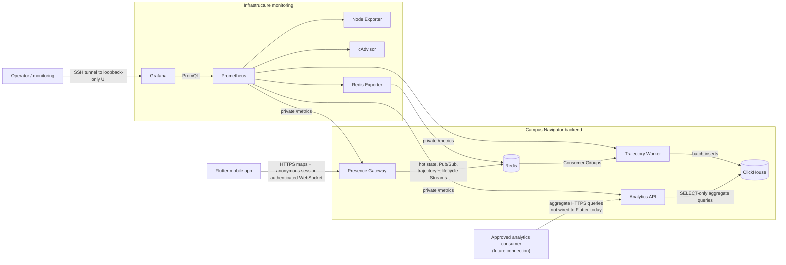
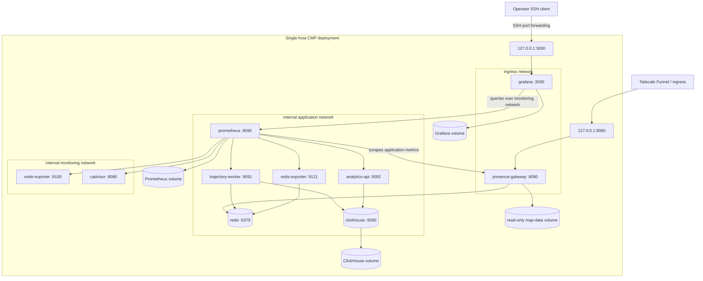
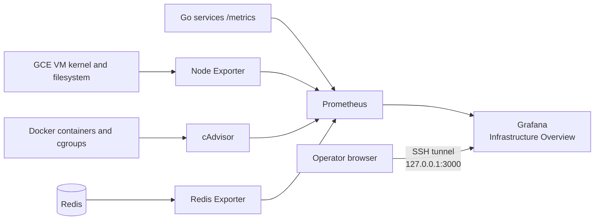
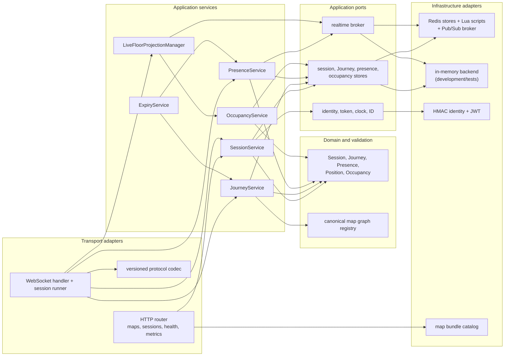
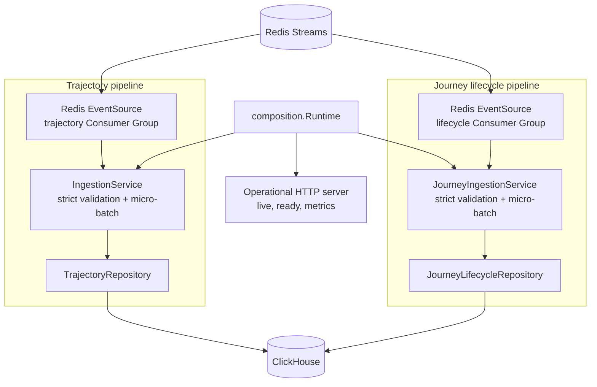
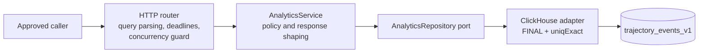

# Backend architecture

This view shows the current service boundaries, deployment topology, and
internal dependency direction. See [data flows](data-flow.md) for runtime
sequences and [schema flow](schema-flow.md) for storage details.

## System context

The solid mobile edge is deployed. The monitoring edge is implemented in the
production Compose model and becomes active when that revision is deployed.
The dashed analytics-client edge marks the intended caller boundary; exposing
it is a deployment decision, not part of the current Flutter integration.
Operators do not connect directly to exporter or Go-service metric endpoints.

## Deployable and network topology

The Gateway bridges the application and ingress networks. Prometheus bridges
the application and monitoring networks, while Grafana bridges monitoring and
ingress. Only the Gateway and Grafana have host-published ports, and both bind
to loopback. Tailscale Funnel exposes only the Gateway; Grafana requires an SSH
tunnel. Redis, ClickHouse, the Worker, the Analytics API, Prometheus, and all
exporters have no host-published port.

ClickHouse, Prometheus, and Grafana use named volumes. The current single-host
Compose configuration deliberately runs Redis without AOF or snapshots on
`tmpfs`, so its hot state and unconsumed Stream entries do not survive a Redis
container or host restart; the deployment runbook records this durability
limit.

## Production observability

Node Exporter owns VM-level CPU, memory, load, uptime, and filesystem signals.
cAdvisor owns per-container CPU, working-set memory, filesystem, network, start
time, and liveness signals. Prometheus also scrapes the three Go services and
Redis Exporter across the private application network. The provisioned Grafana
dashboard derives restart observations from changes in container start time.

Prometheus scrapes every 15 seconds and is bounded by both time and storage-size
retention settings. Prometheus and Grafana state survive container replacement
in named volumes. Monitoring cannot affect the Flutter request path: exporters
are read-only observers, and an unavailable monitoring container is not a
dependency of the Gateway, Worker, Analytics API, Redis, or ClickHouse.

## Presence Gateway modules

Application services depend on ports rather than Redis directly. Production
composition selects the Redis adapters; the memory backend supports isolated
development and tests. Redis Lua scripts own multi-key atomic transitions such
as Journey start/end and presence-plus-trajectory writes.

## Trajectory Worker modules

The two pipelines run concurrently inside one binary. They have separate
Stream keys, Consumer Groups, batch settings, repositories, dead-letter
Streams, and metrics. A failure returned by either pipeline or the operational
server cancels the shared runtime so the process can restart as one unit.

## Analytics API modules

Privacy controls exist at more than one layer: the transport rejects forbidden
identity filters, SQL suppresses cohorts below the server threshold, and the
application service repeats the threshold check before serialization. The
ClickHouse account used by this service is SELECT-only.

## Cross-cutting operational boundaries

| Concern | Presence Gateway | Trajectory Worker | Analytics API |
| --- | --- | --- | --- |
| Public application interface | maps, session HTTP, presence WebSocket | none | implemented aggregate HTTP; private in current deployment |
| Liveness | `/health/live` | `/health/live` | `/health/live` |
| Readiness dependency | Redis | Redis and both ClickHouse tables | ClickHouse trajectory table |
| Metrics | `/metrics` | `/metrics`, separate pipeline prefixes | `/metrics` |
| Scale unit | Gateway replica | Worker process; two internal pipelines | API replica |
| Primary failure isolation | realtime request path | asynchronous ingestion | read-only analytics |
