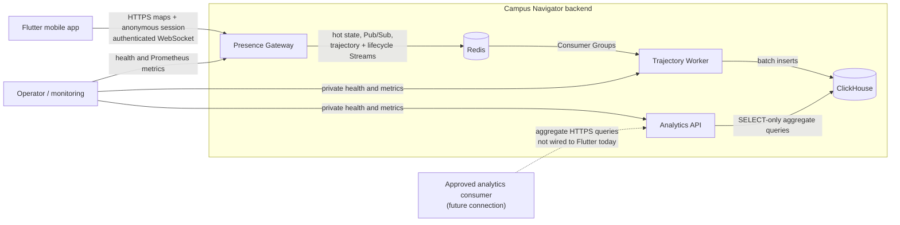
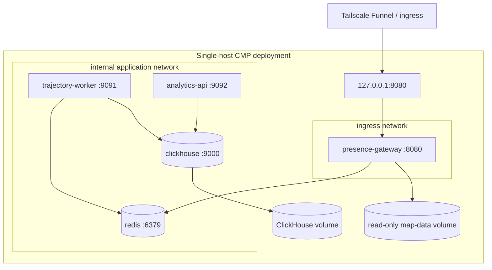
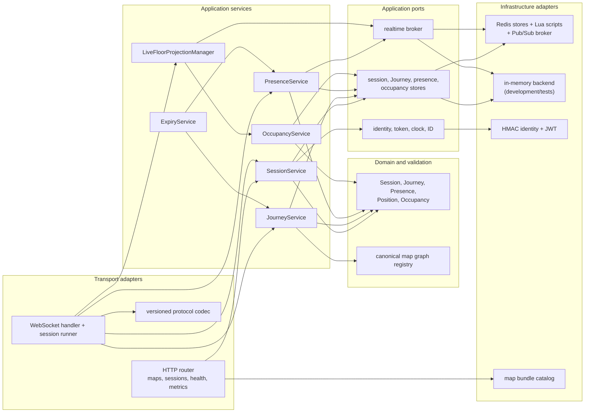
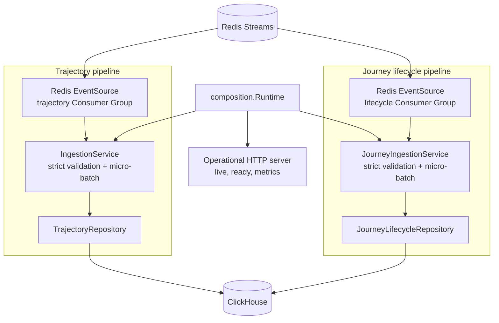
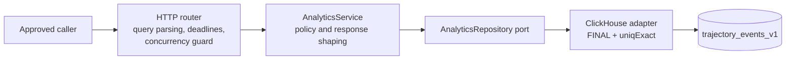

# Backend architecture

This view shows the current service boundaries, deployment topology, and
internal dependency direction. See [data flows](data-flow.md) for runtime
sequences and [schema flow](schema-flow.md) for storage details.

## System context

The solid client edge is implemented and deployed. The dashed analytics-client
edge marks the intended caller boundary; exposing it is a deployment decision,
not part of the current Flutter integration.

## Deployable and network topology

Only the Gateway joins both networks. Redis, ClickHouse, the Worker operational
server, and the Analytics API have no host-published port in the production
Compose file. ClickHouse uses a named volume. The current single-host Compose
configuration deliberately runs Redis without AOF or snapshots on `tmpfs`, so
its hot state and unconsumed Stream entries do not survive a Redis container or
host restart; the deployment runbook records this durability limit.

## Presence Gateway modules

Application services depend on ports rather than Redis directly. Production
composition selects the Redis adapters; the memory backend supports isolated
development and tests. Redis Lua scripts own multi-key atomic transitions such
as Journey start/end and presence-plus-trajectory writes.

## Trajectory Worker modules

The two pipelines run concurrently inside one binary. They have separate
Stream keys, Consumer Groups, batch settings, repositories, dead-letter
Streams, and metrics. A failure returned by either pipeline or the operational
server cancels the shared runtime so the process can restart as one unit.

## Analytics API modules

Privacy controls exist at more than one layer: the transport rejects forbidden
identity filters, SQL suppresses cohorts below the server threshold, and the
application service repeats the threshold check before serialization. The
ClickHouse account used by this service is SELECT-only.

## Cross-cutting operational boundaries

| Concern | Presence Gateway | Trajectory Worker | Analytics API |
| --- | --- | --- | --- |
| Public application interface | maps, session HTTP, presence WebSocket | none | implemented aggregate HTTP; private in current deployment |
| Liveness | `/health/live` | `/health/live` | `/health/live` |
| Readiness dependency | Redis | Redis and both ClickHouse tables | ClickHouse trajectory table |
| Metrics | `/metrics` | `/metrics`, separate pipeline prefixes | `/metrics` |
| Scale unit | Gateway replica | Worker process; two internal pipelines | API replica |
| Primary failure isolation | realtime request path | asynchronous ingestion | read-only analytics |
