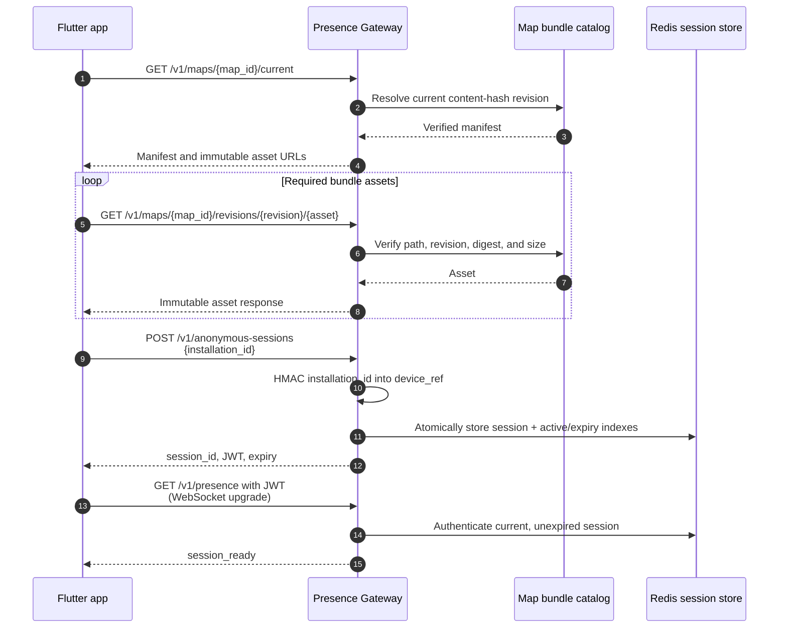
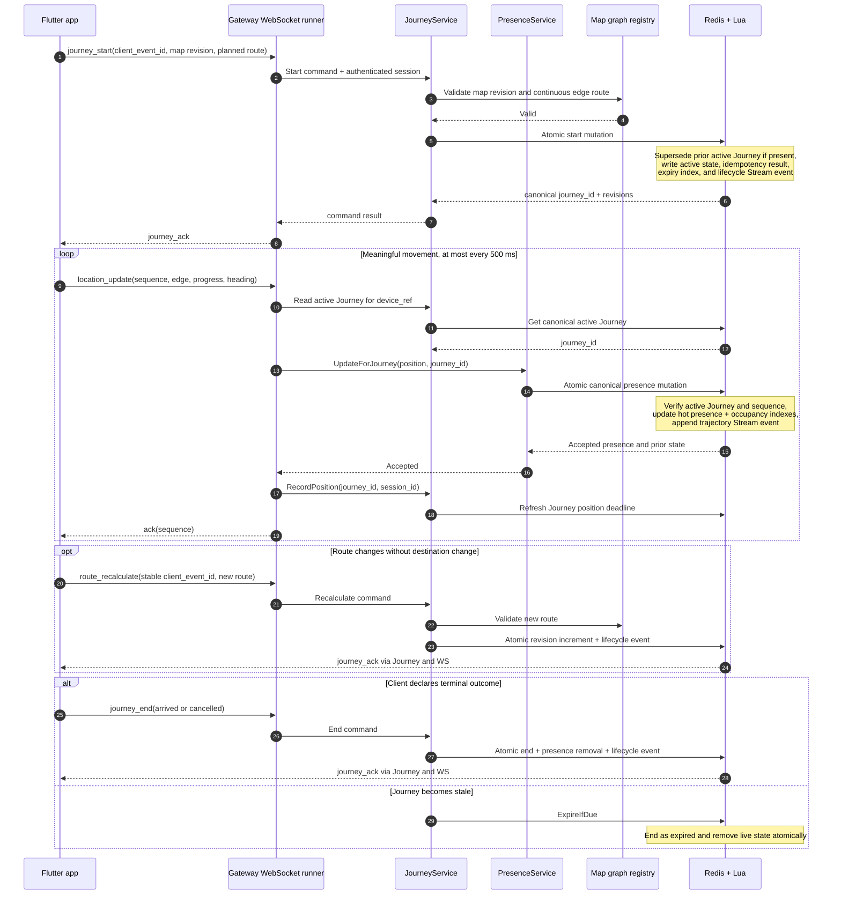
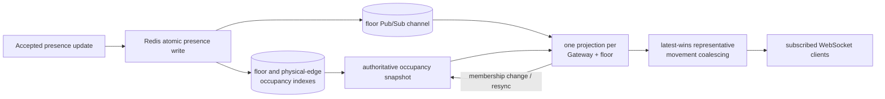
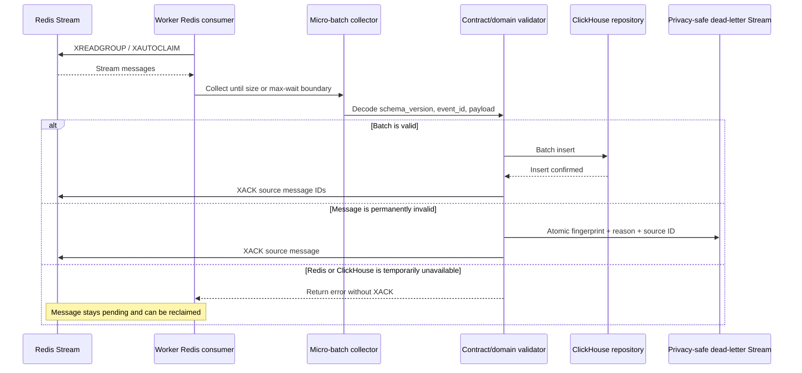
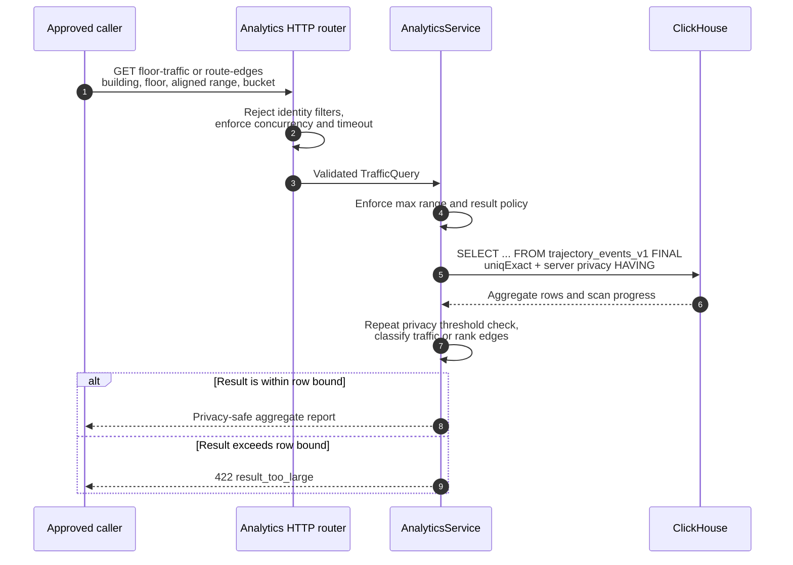
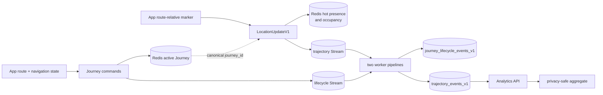

# Backend data flows

These diagrams trace data across the current backend. Storage shapes and
retention are detailed in [schema flow](schema-flow.md); component ownership is
shown in [backend architecture](architecture.md).

## 1. Map and anonymous-session bootstrap

The raw installation ID is used only to derive the private `device_ref`. It is
not written to Redis or ClickHouse. The Gateway's canonical map graph is also
used later to validate every planned Journey route.

## 2. Journey lifecycle and position observations

Journey commands and position updates are separate logical flows carried by
the same authenticated WebSocket.

Stable `client_event_id` values make lifecycle command retries idempotent.
Location sequences reject replayed or out-of-order observations. Old clients
that never start a canonical Journey still use the compatibility path, where
the Gateway creates an implicit Journey ID for each accepted update.

## 3. Live-floor projection

The projection sends total, building, floor, and physical-edge occupancy plus
at most ten stable representative actors. Representative movement is
coalesced over 200 ms, while membership refreshes are debounced over 50 ms.
The representative sample is visual only; congestion counts come from the
occupancy indexes. Redis Pub/Sub is transient, so reconnection triggers an
authoritative snapshot rather than event replay.

## 4. Durable event ingestion

This flow runs independently for `trajectory` and `journey lifecycle`.
Acknowledgement happens only after ClickHouse confirms the batch, producing
at-least-once delivery. Dead letters omit the raw payload and untrusted event
ID; they retain hashes and diagnostic metadata only. The current single-host
deployment keeps Redis on ephemeral `tmpfs`, so events not yet inserted into
ClickHouse can be lost across a Redis or host restart; production durability
requires persistent, replicated Redis as described by the operations docs.

## 5. Aggregate analytics query

The API never exposes an individual Journey or accepts `journey_id`,
`event_id`, `session_id`, or `device_ref` filters. Its current queries read
only `trajectory_events_v1`; lifecycle analytics and planned-demand reports
are not implemented.

## 6. End-to-end lineage

The canonical `journey_id` joins low-frequency intent/outcome with
high-frequency position observations. This is a logical relationship; the raw
ClickHouse tables do not declare a foreign-key constraint.
