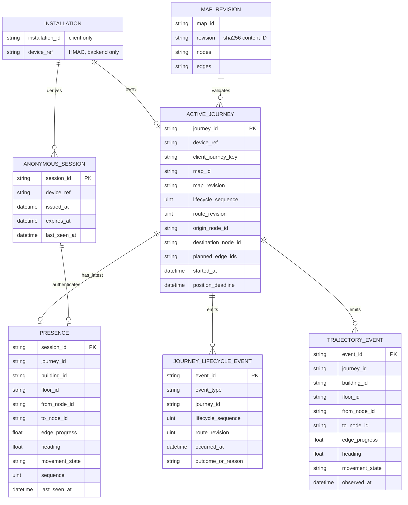
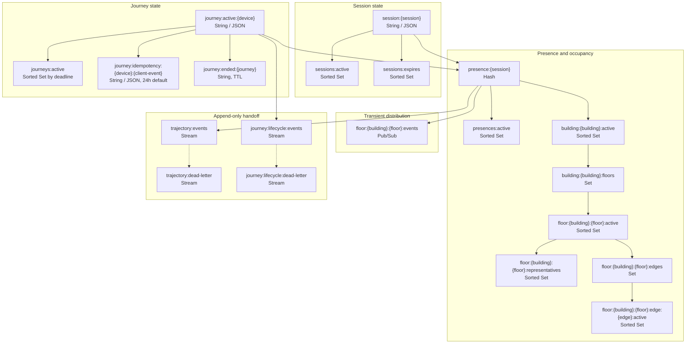
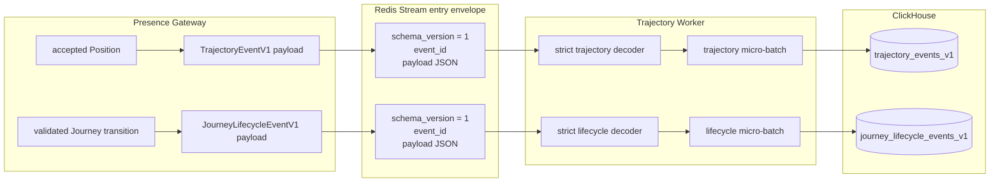
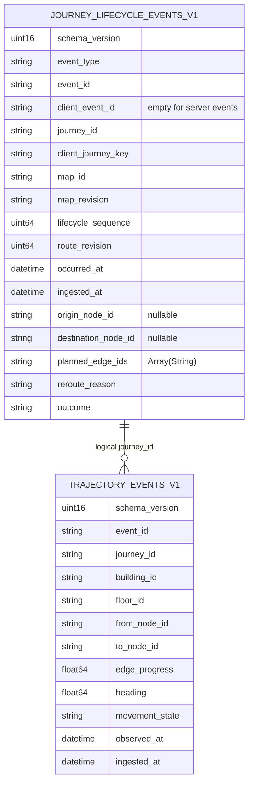
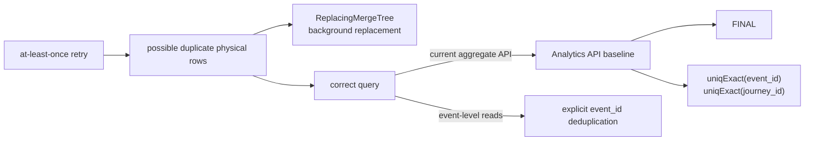
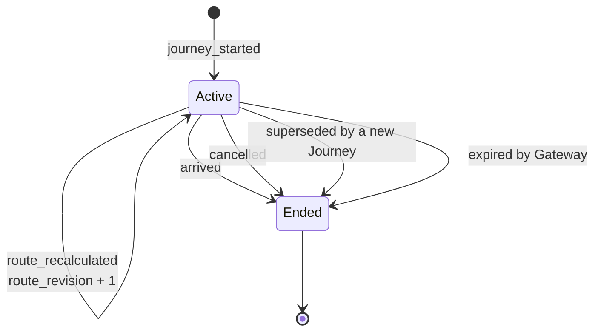

# Backend schema flow

This document connects domain records, Redis hot state, versioned Stream
contracts, and ClickHouse raw tables. It describes implemented storage only.
See [backend data flows](data-flow.md) for runtime ordering.

## Logical domain relationships

`INSTALLATION` is conceptual: the raw installation ID remains on the client,
and the Gateway derives `device_ref` with HMAC. Redis may hold `device_ref` and
`session_id` for short-lived operational correctness. Neither identifier is
allowed in the two warehouse event contracts.

## Redis hot-state and handoff schema

The default prefix is `campus:presence:v1`. Dynamic identifiers in key
segments are Base64URL-encoded.

The arrows show logical maintenance, not separate network calls. Lua scripts
atomically update related keys so a Journey transition, presence state, index
membership, and Stream append cannot partially succeed. Sorted-set scores
encode last-seen times or expiry deadlines and support bounded stale sweeps.

### Redis retention classes

| Class | Examples | Retention behavior |
| --- | --- | --- |
| Expiring operational state | session, presence, active Journey, idempotency result, tombstone | TTL and/or deadline index; repaired by sweepers |
| Rebuildable secondary index | active, building, floor, edge, representative sets | pruned by writes and reads; derived from current state |
| Transient signal | floor Pub/Sub | no replay; subscriber resyncs from a snapshot |
| Asynchronous handoff buffer | trajectory and lifecycle Streams | approximate configured max length; Consumer Group ACK after ClickHouse insert |
| Diagnostic isolation | dead-letter Streams | fingerprints and reasons only; no rejected raw payload |

The Stream protocol provides recovery while Redis is running, but the current
single-host deployment configures Redis without disk persistence. Uninserted
events therefore do not survive a Redis or host restart. Persistent,
replicated Redis is an operational requirement for a production durability
claim.

## Contract-to-table transformation

The worker rejects unknown schema versions, extra JSON fields, Stream/payload
event-ID mismatches, and forbidden identity fields. The Stream envelope is
transport metadata; its `schema_version` becomes a table column, while the JSON
payload supplies the remaining event columns.

## ClickHouse raw schemas

These are event tables, not current-state tables. Both have a 30-day TTL and
use `ReplacingMergeTree(ingested_at)`.

The relationship is analytical only: ClickHouse does not enforce a foreign
key, and lifecycle and trajectory ingestion can arrive independently.
Lifecycle start/recalculation rows carry planned route fields; end rows carry
an outcome. `reroute_reason`, `outcome`, and absent optional values are stored
as empty/default values according to the repository mapping.

### Physical behavior and query implications

Background merges are not an exactly-once guarantee. Queries must preserve
explicit event-ID deduplication. The current Analytics API uses `FINAL` and
`uniqExact`; it reads the trajectory table only.

## Field lineage

| Source | Gateway transformation | Redis / contract | ClickHouse |
| --- | --- | --- | --- |
| local installation ID | HMAC with server secret | `device_ref` in operational state only | forbidden |
| authenticated connection | resolves current session | `session_id` in operational state only | forbidden |
| Gateway ID generator | canonical identity | `journey_id` in both event payloads | logical join key in both tables |
| map bundle and app route | graph revision, direction, edge existence, and continuity validation | lifecycle `map_id`, `map_revision`, `planned_route` | lifecycle route columns |
| route-relative marker | normalize position; assign Gateway acceptance time | trajectory position fields | trajectory event columns |
| client lifecycle command | stable idempotency key; server sequence/revisions | lifecycle event variant | one row per start, recalculate, or end event |
| Gateway clock | acceptance/ingestion timestamps | `observed_at` / `ingested_at` or `occurred_at` / `ingested_at` | UTC `DateTime64(3)` |

Client observation time is not currently serialized for trajectory events, so
`observed_at` is the Gateway acceptance time. This is an explicit current
limitation, not a future-state field hidden by the diagram.

## Lifecycle state transitions

There is at most one Active Journey per `device_ref`. Starting another Journey
atomically records `superseded` for the old one before activating the new
Journey. Ended tombstones prevent an old Journey from being reopened.
