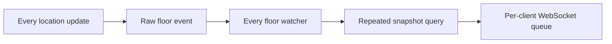
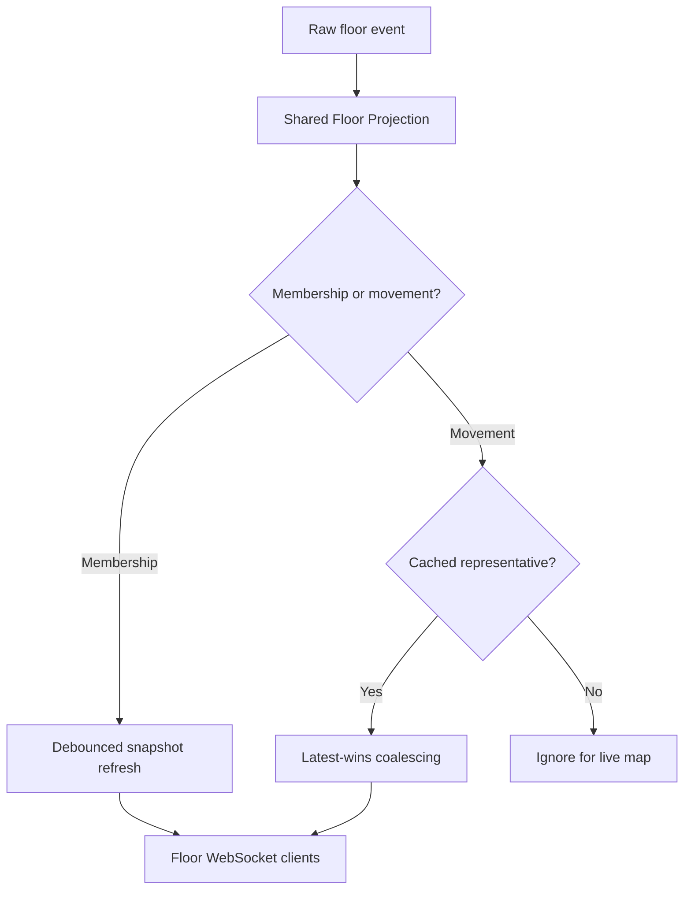
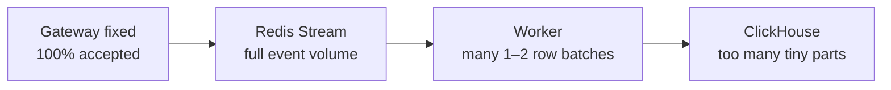

# Stage 5.6 realtime floor projection improvement

Recorded on 2026-07-23 using the same local Docker environment and the same
60-second `trajectory_stress` workload as the Stage 5.5 baseline. This report
separates the Presence Gateway result from the newly exposed downstream
ingestion limit. It is not a production capacity claim.

## Why the Gateway became the first observed bottleneck

Stage 5.5 accepted only 37,033 of 52,000 expected location acknowledgements.
The successful subset still had a 4 ms p95, but 1,954 socket errors and a 71.2%
completion rate showed that latency alone hid incomplete journeys.

Three design issues caused the realtime path to amplify work:

1. Every accepted movement was immediately eligible for realtime broadcast,
   even when the same actor had newer positions milliseconds later.
2. Every floor watcher processed raw events for every actor, although the
   product renders at most ten stable representative actors.
3. Each watcher could fetch an occupancy snapshot for ordinary movement even
   though movement changes neither membership nor counts.

## Changes applied

### 1. Latest-wins representative movement

Redis still atomically records every accepted trajectory event. Only the
realtime visual path is coalesced over a configurable 200 ms window. Multiple
positions for the same representative actor become one latest-position delta.
The trajectory worker and analytics history retain the original event stream.

### 2. One shared floor projection per Gateway

All local WebSockets watching the same floor share one application-level floor
projection, cached snapshot, representative set, raw broker subscription, and
movement buffer. Non-representative movement is ignored by the live-map path.
The existing Redis broker still owns one Pub/Sub subscription per active floor.

### 3. Snapshot refresh only for membership

Ordinary `presence_updated` events never query a snapshot. Join, leave, floor
transition, expiry, and resync mark membership dirty. Related events are
debounced for 50 ms and produce one authoritative snapshot refresh.

## Before and after

| Metric | Stage 5.5 before | Stage 5.6 after | Change |
| --- | ---: | ---: | ---: |
| Journeys started | 2,600 | 2,599 | Equivalent offered load |
| Expected location ACKs | 52,000 | 51,980 | Equivalent workload |
| Received location ACKs | 37,033 | 51,980 | 14,947 more completed |
| ACK completion | 71.2% | 100% | +28.8 percentage points |
| Client failure rate | 4.18% | 0% | Eliminated in this run |
| Socket errors | 1,954 | 0 | Eliminated in this run |
| ACK p95, successful samples | 4 ms | 2 ms | 50% lower |
| ACK throughput | 615.8/s | 854.2/s | 38.7% higher |
| Session-create HTTP p95 | 1.70 ms | 0.61 ms | 64% lower |
| WebSocket messages received by k6 | 451,347 | 98,280 | 78.2% lower |
| Data received by k6 | 309 MB | 129 MB | approximately 58% lower |

Gateway projection metrics from the after run, including the preceding smoke
test, recorded:

- 49,481 raw `presence_updated` events.
- 100 representative movement broadcasts and 262 superseded movements.
- 3,079 non-representative movements ignored.
- 43,196 movements suppressed while a membership refresh was pending; the
  subsequent authoritative snapshot carried the latest representative state.
- 10,596 raw membership signals compressed into 1,022 membership snapshot
  refreshes.
- One writer failure across smoke plus stress, compared with eleven in the
  original stress run.

The message and byte reductions are direct same-scenario observations. The
membership signal compression is a new metric and therefore has no
instrumented Stage 5.5 counterpart.

## Newly exposed downstream bottleneck

The Gateway improvement caused all 51,980 stress updates to reach Redis Stream.
This exposed a separate worker/ClickHouse problem that the lossy Gateway run had
partially hidden:

- The worker inserted 35,884 events before ClickHouse rejected new inserts.
- It produced 20,045 ClickHouse batches, only about 1.8 rows per insert.
- ClickHouse's 3.9 GiB temporary test filesystem filled with tiny data parts.
- Redis Stream remained at lag 16,186 and pending 60 after the drain timeout.
- ClickHouse returned `Cannot reserve 1.00 MiB, not enough space`.

The configured worker batch size is 500, but `XREADGROUP` returns as soon as
messages are available. Under continuous traffic, the worker therefore sends
many tiny inserts instead of accumulating an effective micro-batch.

This does not invalidate the Gateway improvement, but the complete pipeline
cannot be claimed to sustain the stress workload yet. The next separately
approved improvement should add bounded worker micro-batching and then rerun
the identical end-to-end scenario. Increasing test disk space alone would hide
the tiny-insert design problem.

## Decision

The realtime floor projection successfully addressed all three measured
Gateway amplification issues and materially improved completion, throughput,
latency, and network volume. Keep Redis Stream lossless and keep the existing
wire protocol. Do not claim full-system capacity at 100 new journeys per second
until worker batching and ClickHouse part creation are corrected and the Stream
drains with no failures.
