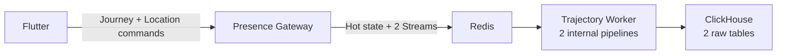

# Stage 6 Journey lifecycle delivery and performance report

## Status

Implemented and validated on 2026-07-26. This report combines the original
Gateway bottleneck evidence, the applied solutions, and a final 60-second
Journey-aware load test against the completed Stage 6 code. These are local
single-node engineering results, not a production capacity guarantee.

## Delivered architecture

Stage 6 adds no service:

- Flutter sends Journey intent and location observations only to Presence
  Gateway.
- Presence Gateway owns canonical Journey identity, map/route validation,
  lifecycle ordering, idempotency, presence, and realtime projection.
- Shared Redis holds hot state and two independent Streams.
- The existing Trajectory Worker process owns two independent consumer/batch
  pipelines.
- Shared ClickHouse holds trajectory and Journey lifecycle raw tables.
- Analytics API remains the third Go service and stays read-only.

## Original Gateway bottlenecks

The Stage 5.5 stress baseline offered 2,600 Journeys and expected 52,000
location ACKs. Only 37,033 completed, with 1,954 socket errors. Three forms of
realtime work amplification were identified.

### Issue 1: every movement immediately became a broadcast

One actor could send many positions inside one visual frame. All intermediate
positions entered the realtime fan-out path even though only the newest
position was useful to the UI.

### Issue 2: every watcher processed every actor

The product displays at most ten representative actors on one floor, but every
floor watcher still processed raw movement from actors it would never render.

### Issue 3: movement triggered snapshot work

Ordinary XY/edge-progress movement could cause an occupancy snapshot fetch even
though movement does not change total users, floor membership, or the
representative set.

## Gateway solutions

### Solution 1: latest-wins movement coalescing

The lossless trajectory Stream still receives every accepted observation.
Only the visual path coalesces each representative actor over 200 ms and sends
the newest position.

### Solution 2: one shared floor projection

All local WebSockets watching the same floor share one snapshot,
representative set, broker subscription, and movement buffer.
Non-representative movement is ignored by the visual path.

### Solution 3: membership-only snapshot refresh

Join, leave, floor change, expiry, and resync mark membership dirty and use a
50 ms debounce. Ordinary movement never requests an occupancy snapshot.

## Measured Gateway improvement

The controlled Stage 5.5-to-5.6 comparison used the same 60-second arrival
shape:

| Signal | Before | After | Improvement |
| --- | ---: | ---: | ---: |
| Location ACK completion | 37,033 / 52,000 (71.2%) | 51,980 / 51,980 (100%) | +28.8 percentage points |
| Socket errors | 1,954 | 0 | eliminated in that run |
| Successful ACK p95 | 4 ms | 2 ms | 50% lower |
| ACK throughput | 615.8/s | 854.2/s | 38.7% higher |
| WebSocket messages received | 451,347 | 98,280 | 78.2% fewer |
| Client bytes received | 309 MB | 129 MB | about 58% fewer |

This is why the Gateway was called the bottleneck: the evidence showed
incomplete client work and excessive Gateway-to-client fan-out while Redis
Stream/Worker lag was not yet the first limiting signal.

## Downstream bottleneck exposed and solved

Once the Gateway accepted 100% of updates, the worker exposed a second limit.
Redis `XREADGROUP COUNT 500` returned immediately with small batches, causing
20,045 ClickHouse inserts at about 1.8 rows per insert. The local ClickHouse
filesystem filled and the Stream stopped draining.

The worker now accumulates delivered messages until 500 rows or 100 ms and
ACKs only after ClickHouse succeeds.

| Signal | Before worker fix | Stage 6 final run |
| --- | ---: | ---: |
| Trajectory rows | 35,884 before saturation | 52,000 |
| ClickHouse insert batches | 20,045 | 574 (-97.1%) |
| Effective rows/insert | about 1.8 | 90.6 (about 50.3×) |
| Final lag / pending | 16,186 / 60 | 0 / 0 |
| Space error | present | none |

## Stage 6 semantic-data solution

Stage 6 does not pretend that raw position observations are route intent.
It adds a separate, low-frequency Journey lifecycle flow:

- `journey_started` records origin, destination, ordered edge IDs, and
  content-hashed map revision.
- `route_recalculated` records the replacement route and reason.
- `journey_ended` records arrived, cancelled, superseded, or expired.
- high-frequency `LocationUpdateV1` remains unchanged and joins the lifecycle
  through the canonical Gateway `journey_id`.

This adds meaningful data without forcing the existing location schema to
identify its source or changing old-client behavior.

Flutter persists commands before sending, retries the same `client_event_id`,
and does not publish realtime location until Start returns the canonical
`journey_id`. Gateway Redis Lua operations provide one-active-Journey,
idempotency, lifecycle revisions, expiry, and atomic presence cleanup.

The worker consumes lifecycle events through a separate Stream, consumer group,
micro-batch, dead letter, metrics namespace, repository, and ClickHouse table
inside the same Go process. High-frequency trajectory traffic cannot claim or
ACK lifecycle messages.

## Final Journey-aware load test

### Workload

- Same 60-second ramp used by the earlier stress comparison:
  10/s start, then targets of 25/s, 50/s, and 100/s.
- 2,600 complete canonical Journeys.
- Each Journey: session create, WebSocket, floor subscribe, Journey Start,
  20 valid canonical edge observations, Journey End as arrived.
- One local container each for Gateway, Worker, Analytics API, Redis, and
  ClickHouse.

### Client-visible result

| Signal | Result |
| --- | ---: |
| Completed iterations | 2,600 / 2,600 |
| Journey Start ACKs | 2,600 / 2,600 |
| Location ACKs | 52,000 / 52,000 |
| Journey End ACKs | 2,600 / 2,600 |
| Check pass rate | 7,800 / 7,800 (100%) |
| Client failure rate | 0% |
| Socket/protocol errors | 0 |
| Location ACK p95 | 2 ms |
| Journey Start ACK p95 | 1 ms |
| Journey End ACK p95 | 1 ms |
| Session-create HTTP p95 | 0.643 ms |

The final Gateway metrics independently recorded 2,600 accepted
`journey_start`, 52,000 accepted `location_update`, and 2,600 accepted
`journey_end` commands. Stage 6.6 added the Journey-specific metric labels
after the first validation run revealed that they were being grouped as
`unknown`.

### Storage and delivery correctness

| Pipeline signal | Trajectory | Journey lifecycle |
| --- | ---: | ---: |
| Stream events inserted/ACKed | 52,000 / 52,000 | 5,200 / 5,200 |
| ClickHouse unique events | 52,000 | 5,200 |
| ClickHouse unique Journeys | 2,600 | 2,600 |
| Successful batches | 574 | 229 |
| Average rows/batch | 90.6 | 22.7 |
| Final lag / pending | 0 / 0 | 0 / 0 |
| Dead letters / trimmed | 0 / 0 | 0 / 0 |
| Visible duplicates after `FINAL` | 0 | 0 |

The lifecycle table contained exactly 2,600 starts and 2,600 ends. The
trajectory table contained exactly twenty observations per Journey. Both raw
tables use a 30-day TTL.

## What the result proves

Within this repeatable local workload:

1. Adding canonical Journey semantics did not regress the previously improved
   location path: location completion remained 100% and p95 remained 2 ms.
2. Journey Start and End added two durable semantic events per Journey with
   1 ms p95 ACK latency.
3. Both independent ingestion pipelines fully drained with no loss, poison
   events, Stream trimming, or visible duplicates.
4. The original Gateway fan-out solutions still handle the same peak arrival
   shape while the backend gains origin, destination, route, revision, reroute,
   and outcome data.

It does not prove multi-node production capacity, Redis durability, regional
failover, or long-term ClickHouse retention behavior.

## Next evidence-driven improvements

Do not add Kafka, PostgreSQL, another worker, or another Go service merely for
resume complexity. Add them only when metrics show a requirement.

The next useful product step is to derive:

- current planned edge demand from active Journeys;
- observed edge traversals from position transitions;
- planned-versus-observed deviation;
- route/outcome aggregates.

Potential infrastructure triggers remain:

- sustained Stream lag after batch tuning and safe ClickHouse capacity;
- trimming while a consumer group has lag or pending entries;
- replay/retention needs that exceed Redis limits;
- independent consumers requiring separate replay lifecycles;
- query rows/bytes scanned growing faster than result size;
- production requirements for Redis persistence, replication, and failover.
