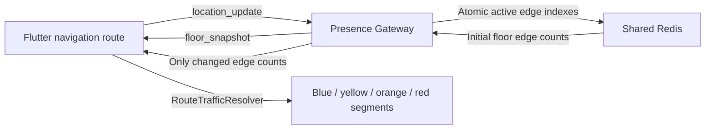

# Stage 7 current-route traffic visualization

## Status

Implemented and validated on 2026-07-26. Stage 7 adds no new service and no
durable analytics schema. It uses current anonymous Presence state to color the
route already displayed by Flutter.

## Product behavior

Each physical route edge is colored from its current active-user count:

| Active users | Route color |
| ---: | --- |
| 0–2 | Blue |
| 3–5 | Yellow |
| 6–9 | Orange |
| 10+ | Red |

Edges are direction-independent. `A -> B` and `B -> A` count as the same
physical corridor.

## Data flow

Redis remains private to the Go Gateway. Flutter never reads Redis directly.
The Trajectory Worker, ClickHouse, and Analytics API are not involved because
this feature needs current operational state, not historical analytics.

## Earlier Gateway bottlenecks

The Stage 5.5 baseline found three realtime amplification problems:

1. every position update immediately became a floor broadcast;
2. every watcher processed movement for actors it did not render;
3. movement triggered repeated authoritative snapshot fetches.

The Stage 5.6 shared projection fixed those issues with latest-wins movement
coalescing, representative filtering, and membership-only snapshot refresh.
Under the same 60-second workload, location completion increased from 71.2% to
100%, socket errors dropped from 1,954 to zero, ACK p95 fell from 4 ms to 2 ms,
and client WebSocket messages fell by 78.2%.

Those numbers measure the original Gateway optimization, not a claim that
route coloring itself created another equivalent throughput gain.

## How Stage 7 preserves the improvement

Stage 7 does not turn every location update into a new traffic snapshot:

- Progress or heading changes on the same edge update Redis freshness but emit
  no traffic message.
- A same-floor edge transition changes exactly two counts: the old edge and
  the new edge.
- The shared floor projection applies those two deltas to its cached snapshot
  and sends one `edge_occupancy_updated` message.
- Join, leave, floor change, expiry, and resync continue to use the existing
  debounced authoritative snapshot path.
- Redis edge membership is a sorted set scored by last-seen time, so stale
  sessions can be pruned without trusting an eventually stale integer counter.
- Journey supersede, end, expiry, ordinary leave, and stale cleanup remove the
  edge membership in the same Lua atomic boundary as the other Presence
  indexes.

The key performance invariant is therefore: ordinary same-edge movement causes
zero snapshot queries and zero traffic broadcasts.

## Validation evidence

- Gateway unit and integration suite: passed.
- Redis container integration suite: passed, including reverse-direction
  canonicalization, edge transition, removal, and ghost-count checks.
- Projection test: an edge transition changes cached counts while the snapshot
  provider remains at one initial call.
- Flutter analyzer: passed with no issues.
- Flutter focused protocol, reducer, resolver, coordinator, map, navigation,
  and app-shell tests: 29 passed.
- A 20-VU, 15-second containerized smoke completed 200/200 iterations and
  ACKed 600/600 location updates. Checks passed 600/600, client failure rate
  and HTTP failure rate were both 0%, location ACK p95 was 7 ms, and both
  Redis Stream pipelines finished at lag 0 / pending 0 with no DLQ, trim, or
  visible duplicate.
- The repository-wide Flutter run reached 497 passing tests and one skipped
  test, but two pre-existing asset-fixture tests failed because they resolve
  files outside `flutter_app` / compare an already non-identical bundled TMJ.
  These failures are unrelated to Stage 7 source files.

## Remaining capacity work

Stage 7 needs a controlled before/after load comparison only if production
traffic shows edge-transition fan-out becoming material. Metrics to watch are
Gateway WebSocket output, floor snapshot refresh count, Redis command latency,
slow-subscriber drops, and the ratio of location updates to
`edge_occupancy_updated` messages. A rising snapshot-per-location ratio would
indicate a regression of the protected boundary.
