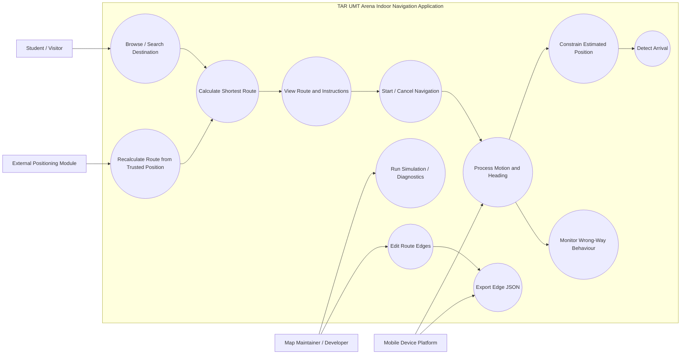

# CHAPTER 3: METHODOLOGY AND REQUIREMENTS ANALYSIS

This chapter explains the development methodology used for the indoor navigation modules covered by this report and translates the collected evidence into system requirements. The discussion is aligned with the current implementation: an editable Floor 2 tiled map, structured room and graph data, weighted shortest-path routing, visual route guidance, smartphone Pedestrian Dead Reckoning (PDR), planned-route snapping, wrong-way monitoring, automatic route recalculation from an accepted external position correction, and the Edge Editor. The internal Wi-Fi positioning algorithm, Augmented Reality (AR), realtime presence, and the separate backend analytics services are outside the personal module scope. However, the navigation-side integration that accepts a trusted node from the Wi-Fi module and recalculates the route is included because it uses this report's graph and route-guidance logic.

The chapter first describes the iterative and incremental development process. It then explains how requirements were gathered and validated through document analysis, site observation, an informal social-media poll, technical discussion, prototype evaluation, automated tests, and partial physical-device testing. The identified requirements are subsequently organised into stakeholders, functional requirements, functions not included, non-functional requirements, and a use case model.

## 3.1 Methodology

### 3.1.1 Methodology Used: Agile-Inspired Iterative and Incremental Development

The project adopted an Agile-inspired iterative and incremental development methodology. The term "Agile-inspired" is used because development was performed through small implementation and evaluation cycles, but the project did not operate as a formal Scrum organisation with documented sprint ceremonies, a product owner, or a maintained Scrum backlog.

This methodology was suitable because the project began with incomplete building references and several uncertain technical decisions. The team did not initially have a complete machine-readable representation of TAR UMT Arena, and it was necessary to determine whether a simplified 2D map, a node-and-edge graph, smartphone motion sensors, and map constraints could provide a practical prototype. Developing the complete application in one stage would have increased the risk of building an unsuitable map model or positioning workflow.

Each increment produced a testable result. Early work focused on the map and graph schema. Later increments introduced route calculation, navigation presentation, motion processing, route constraints, data-editing tools, and Flutter integration. Problems discovered through tests or device sessions were corrected in later iterations without requiring the entire application to be redesigned.

The methodology therefore followed a repeated cycle:

1. Identify a user, data, or technical problem.
2. Define a limited requirement for the next increment.
3. Design and implement the smallest usable solution.
4. Verify the result through data validation, automated testing, simulation, or device observation.
5. Record limitations and refine the next increment.

### 3.1.2 Development Phases

The development process for the modules covered by this report can be organised into the following phases.

| Phase | Main Activity | Main Outcome |
| :---- | :---- | :---- |
| **Phase 1: Problem and Source Review** | Review available floor-plan material, observe indoor wayfinding problems, and collect informal user evidence. | Confirmed the need for clearer indoor guidance and identified the limitations of static references. |
| **Phase 2: Map and Data Modelling** | Digitise the available Floor 2 information and define room, node, edge, distance, and map schemas. | Produced an editable tiled map, room catalogue, node document, edge document, and canonical graph. |
| **Phase 3: Route Computation and Presentation** | Implement destination selection, graph validation, weighted shortest-path calculation, route rendering, instructions, progress, and arrival handling. | Converted the map data into an operational route-guidance workflow. |
| **Phase 4: PDR and Route Constraints** | Process smartphone motion and heading data, estimate movement, project the estimate onto the planned route, and monitor wrong-way heading. | Added relative movement estimation and lightweight map-based constraints. |
| **Phase 5: Data Maintenance Tools** | Implement node selection, edge creation or replacement, distance editing, edge removal, and JSON export. | Produced an Edge Editor that supports continued graph maintenance. |
| **Phase 6: Flutter Migration and Architecture** | Migrate the earlier Expo prototype to Flutter, separate domain, application, infrastructure, and presentation responsibilities, and integrate platform sensor adapters. | Produced a layered MVVM application with independently testable navigation logic. |
| **Phase 7: Automated Verification** | Run static analysis, unit tests, widget tests, integration tests, parity checks, and native adapter tests. | Verified deterministic algorithms, view-model behaviour, UI interactions, and platform boundaries. |
| **Phase 8: Physical-Device Evaluation** | Install the application on a physical iPhone and observe permission, Core Motion, heading, batching, start, and stop behaviour. | Confirmed basic sensor operation while leaving formal controlled-walk and complete-route scenarios pending. |

These phases were not strictly isolated. For example, graph data were revised while route rendering was being tested, and sensor behaviour affected later UI and lifecycle decisions. The phases instead describe the main emphasis of each development increment.

The project also evolved from an iOS-first Flutter migration to a codebase that contains both iOS and Android motion bridges. Nevertheless, the formal physical-device evidence available for this report remains iPhone-based. Android source support must not be treated as equivalent to completed Android physical-device validation.

### 3.1.3 Justification for the Methodology

The selected methodology was appropriate for five main reasons.

First, the building data were incomplete. The project could implement and verify Floor 2 before claiming or attempting complete multi-floor coverage. Second, map accuracy and graph connectivity required repeated correction. A node or edge error could make a destination unreachable even if the visual map appeared correct. Third, motion processing required experimentation because phone pose, step detection, heading changes, shaking, and sensor availability could influence the estimated movement. Fourth, the application contained separable modules that could be tested independently before integration. Finally, the migration from Expo to Flutter required behavioural parity checks so that the tested navigation rules were not unintentionally changed.

The iterative approach also supported honest scope control. Features that could not be sufficiently implemented or validated, including magnetic fingerprint localisation, probabilistic map matching, complete multi-floor routing, and formal route-accuracy evaluation, remained future work instead of being reported as completed outcomes.

## 3.2 Requirements Gathering and Validation

### 3.2.1 Document Analysis

The first requirement-gathering technique was document analysis. Available floor-plan and project reference material was reviewed to understand the building layout and determine whether it could be used directly by a navigation application.

The review showed that a static plan could provide visual geometry but could not independently encode searchable rooms, navigation nodes, edge weights, valid corridor connections, route state, or sensor-aligned movement. The available project material also did not provide a complete structured representation for all five floors. This created the requirement for an editable visual map and a separate machine-readable graph.

Document analysis produced the following requirements:

1. Building information should be separated into visual map data and structured navigation data.
2. Rooms and facilities should contain stable identifiers and navigation-node references.
3. Graph edges should represent only valid walking connections and contain positive distance values.
4. The data should remain editable when corrections or additional floors become available.

### 3.2.2 Site Observation

Site observation was used to understand the relationship between the available floor reference and the physical environment. Attention was given to room entrances, corridor directions, junctions, facilities, and practical decision points that a user would encounter while walking.

This technique was necessary because a route graph cannot be constructed safely from visual appearance alone. Two areas that appear close on a plan may be separated by a wall, while a long corridor may require intermediate junction nodes for instructions and movement tracking. Observation therefore informed the placement of room and junction nodes and the selection of valid edge connections.

The current report does not claim that every coordinate or edge has undergone a formal professional building survey. Site observation supported prototype construction and checking, while complete spatial-accuracy validation remains a limitation.

### 3.2.3 Informal Xiaohongshu Poll

An informal public poll was posted on Xiaohongshu to obtain lightweight evidence about the wayfinding problem. The post explained that a campus navigation application was being developed as a final year project and asked TAR UMT students whether they had felt confused or become lost when first entering the campus.

The poll received 34 responses. Twenty-six respondents selected the affirmative option, while eight selected the option indicating that their experience was acceptable. The results are summarised below.

| Response | Number of Respondents | Percentage |
| :---- | ----: | ----: |
| Experienced confusion or getting lost | 26 | 76.5% |
| Experience was acceptable | 8 | 23.5% |
| **Total** | **34** | **100.0%** |

The original public post is available at http://xhslink.com/o/2tzQin7RgYm.

**Figure 3.1: Informal Xiaohongshu poll on first-time campus wayfinding experience.**

The result supports the existence of a practical wayfinding concern among the respondents and strengthens the motivation for a campus navigation prototype. However, the poll must not be interpreted as a representative survey of all TAR UMT students. Participation was voluntary, the sample size was 34, respondent identities and first-visit conditions were not independently verified, and no probability-sampling method was applied. The poll is therefore used as informal requirement evidence rather than proof of population-wide prevalence.

### 3.2.4 Team Discussion and Technical Review

Informal team discussion was used to define module responsibility and integration boundaries. The team separated the editable map, graph, route guidance, PDR, and map-constraint work from the internal Wi-Fi positioning and AR components. The Wi-Fi module is responsible for producing an accepted mapped location, while the navigation integration uses its trusted node as a new route origin and recalculates the route to the user's active destination. This allowed each member to develop and evaluate their own algorithms while integrating them into the same application.

Technical review also helped control the project scope. Alternative techniques such as magnetic fingerprinting and particle filtering were considered, but they would have required additional datasets, calibration, implementation effort, and evaluation. The project therefore prioritised deterministic graph routing, smartphone PDR, and planned-route snapping for the current prototype.

### 3.2.5 Prototype and Test-Based Validation

Requirements were refined after observing the behaviour of successive prototypes. Route simulation exposed graph or rendering problems without requiring a physical walk for every change. Automated tests verified shortest-path selection, instruction generation, route interpolation, snapping, PDR gates, wrong-way conditions, navigation-side handling of accepted Wi-Fi corrections, route recalculation from a trusted node, Edge Editor operations, loading errors, lifecycle transitions, and responsive UI behaviour.

A focused run of the relevant non-Wi-Fi test files completed 60 tests successfully. This evidence supports deterministic software correctness within the tested cases. It does not establish real-world positioning accuracy.

Physical-iPhone sessions provided additional but incomplete validation. Motion permission, sensor availability, finite heading updates, bounded sample batches, and start-stop behaviour were observed. Formal stationary, shake, controlled-walk, complete-route, lifecycle, wrong-way, orientation, and Edge Editor device scenarios remain pending. These limitations affected the wording of the requirements: the system may be required to constrain and monitor movement, but the report must not claim proven drift elimination or validated route accuracy.

## 3.3 Requirements Analysis

### 3.3.1 Stakeholders

The stakeholders relevant to the modules covered by this report are described below.

1. **Students and Visitors:** These are the primary users. They need to locate rooms or facilities, understand the selected route, receive clear instructions, and recognise arrival without manually interpreting a static architectural plan.

2. **Map Maintainer or Developer:** This stakeholder prepares and corrects the tiled map, room catalogue, node data, and graph edges. The maintainer also validates structured resources and exports revised edge documents.

3. **Project Development Team:** The project team integrates independently owned modules, reviews technical constraints, performs tests, and determines which results can be reported as implemented or validated.

4. **Mobile Device Platform:** The iOS or Android platform supplies motion and heading measurements, permission state, lifecycle events, and export capabilities. It is a supporting external system rather than a human stakeholder.

The project has no external client organisation. Requirements are based on the building problem, collected evidence, technical constraints, and prototype evaluation rather than a formal client contract.

### 3.3.2 Identified User and System Problems

The collected evidence was translated into the following problems.

| Identified Problem | Required System Response |
| :---- | :---- |
| First-time users may be unfamiliar with the campus or Arena layout. | Provide searchable destinations and a readable indoor route. |
| Static plans require users to interpret and memorise a path manually. | Highlight a calculated route and provide turn, progress, and arrival information. |
| A visual map alone cannot determine valid connectivity. | Maintain a validated node-and-edge graph with positive distance values. |
| Incomplete building references make full-building implementation unreliable. | Limit the verified prototype to Floor 2 and preserve an extensible data schema. |
| Smartphone PDR accumulates step and heading errors. | Apply movement gates and project the estimate onto the planned route. |
| A user may face or move in a direction inconsistent with the route. | Monitor heading consistency and display a wrong-way warning when the configured conditions are met. |
| An accepted external position correction may show that the user is at a different route node. | Retain the active destination and automatically recalculate the route from the trusted node supplied by the positioning module. |
| Map and graph data may require correction. | Provide structured resources and an Edge Editor with JSON export. |
| Sensor, map, or lifecycle failures may interrupt navigation. | Provide explicit loading, error, pause, resume, stop, and arrival behaviour. |

### 3.3.3 Functional Requirements

Functional requirements describe what the system must do. They are limited to the implemented and testable modules covered by this report.

| ID | Requirement Category | Requirement Description |
| :---- | :---- | :---- |
| **FR1** | **Structured Resource Loading** | The system shall load and validate the Floor 2 map, room, node, edge, and canonical graph resources before navigation begins. |
| **FR2** | **Destination Discovery** | The system shall allow users to browse, filter, and search enabled rooms and facilities. |
| **FR3** | **Route Calculation** | The system shall calculate a weighted shortest route from the configured start node to a connected destination node using positive edge distances. |
| **FR4** | **Route Visualisation** | The system shall display the tiled indoor map, selected destination, route nodes, and highlighted route path. |
| **FR5** | **Navigation Guidance** | The system shall generate basic left, right, straight, and arrived instructions and display route progress and remaining distance. |
| **FR6** | **Navigation Lifecycle** | The system shall support navigation start, pause, resume, cancellation, arrival, and safe runtime shutdown. |
| **FR7** | **PDR Processing** | The system shall process available smartphone motion and heading samples to detect steps and produce relative movement estimates. |
| **FR8** | **Planned-Route Constraint** | The system shall project the estimated point onto the active planned route and report its distance from that route. |
| **FR9** | **Wrong-Way Monitoring** | The system shall compare observed and accepted route headings and display a warning when the configured wrong-way conditions are satisfied. |
| **FR10** | **Edge Editing** | The system shall allow a maintainer to select two valid nodes, create or replace an edge, edit its distance and fields, and remove an edge. |
| **FR11** | **Data Export** | The system shall serialise the current Edge Editor document as UTF-8 JSON and request export through the platform share interface. |
| **FR12** | **Simulation and Diagnostics** | The system shall provide route simulation and derived or raw-motion diagnostic controls for development and prototype evaluation. |
| **FR13** | **Failure Handling** | The system shall show explicit loading or error states for invalid or unavailable map and sensor resources and provide retry or recovery where supported. |
| **FR14** | **Map Resource Fallback** | The system shall use a verified map bundle when available and fall back to a last-known-good or bundled resource set when remote delivery is unavailable. |
| **FR15** | **Position-Correction Route Recalculation** | When the integrated positioning module supplies an accepted trusted node during active navigation, the system shall preserve the selected destination and recalculate the route from that node. If the trusted node is the destination, the system shall complete arrival handling without an unnecessary reroute. |

The requirements distinguish between navigation guidance and positioning. FR3 to FR6 concern route computation and presentation. FR7 to FR9 concern relative movement, constraints, and warnings. FR15 defines only the navigation system's response to an accepted trusted node; it does not claim ownership of the Wi-Fi localisation algorithm or independently prove the accuracy of that position.

### 3.3.4 Functions Not Included

The following functions are not completed within the module scope and must not be presented as implemented requirements.

1. **Complete Multi-Floor Navigation:** The current graph contains one Floor 2 dataset and no inter-floor edge. The schema permits future floors, but cross-floor routing is not implemented in the current graph.

2. **Absolute Indoor Positioning:** PDR produces a relative estimate from an initial state. Planned-route snapping does not create an independent absolute position fix.

3. **Proven Drift Elimination:** The route constraint can reduce visually implausible off-route movement, but it does not remove the underlying sensor error or prove physical accuracy.

4. **Rerouting Triggered Solely by a Wrong-Way Warning:** The wrong-way module can suggest rerouting and display a warning, but the warning alone does not replace the route. Automatic route recalculation is implemented when the integrated Wi-Fi positioning flow supplies an accepted trusted node. The navigation system then retains the active destination and calculates a new route from that node.

5. **Magnetic Fingerprint Localisation:** Magnetometer-assisted heading is implemented, but no location-labelled magnetic fingerprint database or matching process is included.

6. **Kalman or Particle-Filter Positioning:** These techniques were reviewed as alternatives but are not part of the current Flutter positioning pipeline.

7. **Complete Cross-Platform Physical Validation:** Platform adapter code exists for iOS and Android, but the recorded physical-device evaluation in this report is partial and iPhone-based.

8. **Internal Wi-Fi Positioning and AR Algorithms:** These algorithms belong to the other project member and are not analysed as part of this report's implementation contribution. The downstream navigation integration for an accepted Wi-Fi fix, including route recalculation, remains within the system interaction described in this report.

### 3.3.5 Non-Functional Requirements

Non-functional requirements describe the expected quality and operational constraints of the system. Where complete human or physical-device evidence is unavailable, the requirement is written as a target rather than a proven result.

| ID | Quality Attribute | Requirement Description |
| :---- | :---- | :---- |
| **NFR1** | **Usability** | Destination labels, route guidance, instructions, progress, and primary controls shall remain readable and usable within the supported phone layouts. |
| **NFR2** | **Data Integrity** | Parsers shall reject unsupported schema versions, duplicate identifiers, unknown node references, invalid inter-floor connections, and non-positive edge distances. |
| **NFR3** | **Routing Correctness** | The route engine shall reject unknown or unreachable destinations and return a deterministic lowest-weight connected path for the tested graph. |
| **NFR4** | **Performance Efficiency** | Deterministic PDR batch processing shall remain within the current automated target of 100 milliseconds for the approved test fixture. |
| **NFR5** | **Lifecycle Reliability** | Sensor, simulation, and monitoring resources shall have controlled start, stop, pause, resume, arrival, and disposal behaviour without duplicated ownership. |
| **NFR6** | **Maintainability** | Domain logic, orchestration, infrastructure adapters, and widgets shall remain separated through the layered Flutter MVVM architecture. |
| **NFR7** | **Testability** | Graph, routing, PDR, snapping, wrong-way, and editor rules shall remain executable through deterministic tests without requiring a physical sensor or widget. |
| **NFR8** | **Resilience** | Core map and route rendering shall remain available from bundled or previously verified resources when remote map delivery is unavailable. |
| **NFR9** | **Privacy** | Raw sensor sample arrays shall not be persisted by the optional diagnostic process; only the aggregate diagnostic information required for evaluation may be recorded. |
| **NFR10** | **Extensibility** | The structured map and graph format shall permit additional floors, nodes, edges, and room records without replacing the core route model. |
| **NFR11** | **Validation Honesty** | Uncompleted physical-device scenarios shall remain marked as pending and shall not be reported as passed. |

The usability requirement does not claim that a formal usability study has already proven the map easy to use. Automated widget tests provide evidence for rendering and interaction boundaries, while a future user evaluation is still required to measure comprehension, task completion, and satisfaction.

Similarly, NFR4 measures deterministic processing time for a test fixture. It is not a positioning-accuracy threshold and does not guarantee identical timing on every device.

## 3.4 Use Case Model

### 3.4.1 Use Case Actors

The use case model contains four external actors.

1. **Student or Visitor:** Searches for a destination, starts navigation, views the route, follows instructions, receives warnings, and completes or cancels the navigation session.

2. **Map Maintainer or Developer:** Loads the navigation resources, inspects route nodes, edits graph edges, runs simulation or diagnostics, and exports the edge document.

3. **Mobile Device Platform:** Supplies permission, motion, heading, lifecycle, and sharing services to the Flutter application.

4. **External Positioning Module:** Supplies an accepted mapped Wi-Fi node to the navigation workflow. Its internal localisation algorithm is outside this report, while the navigation response to its output is included.

### 3.4.2 Main Use Cases

1. **Browse or Search Destination:** The user browses Floor 2 rooms, applies a filter, or enters search terms. Only enabled navigable destinations are offered for route selection.

2. **Calculate Shortest Route:** After a destination is selected, the system validates its node and calculates the lowest-weight connected route from the configured start node.

3. **View Route and Instructions:** The application displays the map, route, destination, current instruction, route progress, and remaining distance.

4. **Start Navigation:** The application creates a navigation session, activates the wrong-way monitor, and starts motion processing when the lifecycle state permits it.

5. **Process Motion and Heading:** The mobile platform provides normalised motion and heading events. The PDR pipeline detects valid steps and estimates relative movement.

6. **Constrain Estimated Position:** The application projects each usable estimate onto the current planned route and updates the displayed marker and progress.

7. **Monitor Wrong-Way Behaviour:** The application compares observed heading with accepted route headings and displays a warning when the configured duration and deviation rules are met.

8. **Recalculate Route from Trusted Position:** When the external positioning module supplies an accepted trusted node, the application preserves the active destination and recalculates the route from that node. If the node is already the destination, the application proceeds directly to arrival handling.

9. **Detect Arrival:** When the remaining route distance reaches the arrival condition, the application changes the session state, reports arrival, and stops active runtime processing safely.

10. **Cancel Navigation:** The user may leave the active route. The application requests confirmation, stops navigation resources, and returns to destination selection.

11. **Edit and Export Edges:** The maintainer selects nodes, edits the edge document, validates the input, and exports the current JSON representation.

### 3.4.3 Use Case Diagram

**Figure 3.2: Use case diagram for the indoor navigation modules covered by this report.**

The diagram separates normal navigation actions from maintenance and diagnostic actions. The mobile device platform is shown as an external technical actor because Flutter receives sensor, lifecycle, and sharing capabilities through platform boundaries. The external positioning module is also shown only at its integration boundary: it supplies a trusted node, after which the navigation application recalculates the route using the existing graph while preserving the destination.

## 3.5 Chapter Summary and Evaluation

This chapter explained the Agile-inspired iterative and incremental methodology used to develop the indoor navigation modules. The methodology was suitable because the project started with incomplete building references, required repeated map and graph correction, and contained separable functions that could be implemented and tested in stages. The development progressed from source review and Floor 2 data modelling to routing, PDR, route constraints, Edge Editor support, Flutter migration, automated verification, and partial physical-device evaluation.

Requirements were gathered through document analysis, site observation, informal team discussion, prototype review, and an informal Xiaohongshu poll. In the poll, 26 of 34 respondents, or approximately 76.5%, reported experiencing confusion or getting lost during their first campus experience. The result supports the project motivation but is treated cautiously because the voluntary social-media sample is not representative of the complete student population.

The requirements analysis identified students and visitors as primary users, the map maintainer or developer as a maintenance actor, and the mobile platform and external positioning module as supporting external systems. The resulting functional requirements cover structured resource loading, destination search, weighted shortest-path calculation, route visualisation, instructions, progress, arrival, PDR, planned-route snapping, wrong-way monitoring, accepted-position route recalculation, lifecycle handling, Edge Editor operations, diagnostics, and resource fallback.

The analysis also established explicit boundaries. The current prototype covers Floor 2 with 22 nodes, 24 edges, 14 enabled navigable destinations, and no inter-floor edge. It does not provide independently proven absolute positioning, complete drift elimination, rerouting triggered solely by a wrong-way warning, magnetic fingerprint localisation, or completed cross-platform physical validation. Automatic route recalculation is available when the integrated Wi-Fi positioning flow supplies an accepted trusted node; the internal Wi-Fi localisation and AR algorithms remain outside this report's personal implementation scope.

From an evaluation perspective, automated tests provide evidence for deterministic software behaviour, while the recorded physical-device evaluation remains partial. This distinction ensures that the next design chapter can explain the implemented architecture and algorithms without overstating the real-world accuracy or completeness of the prototype.
