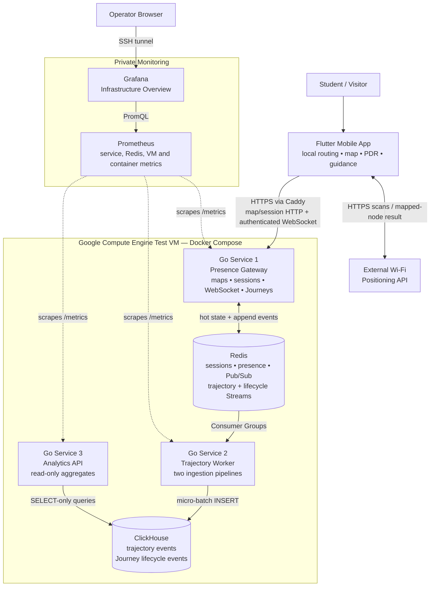
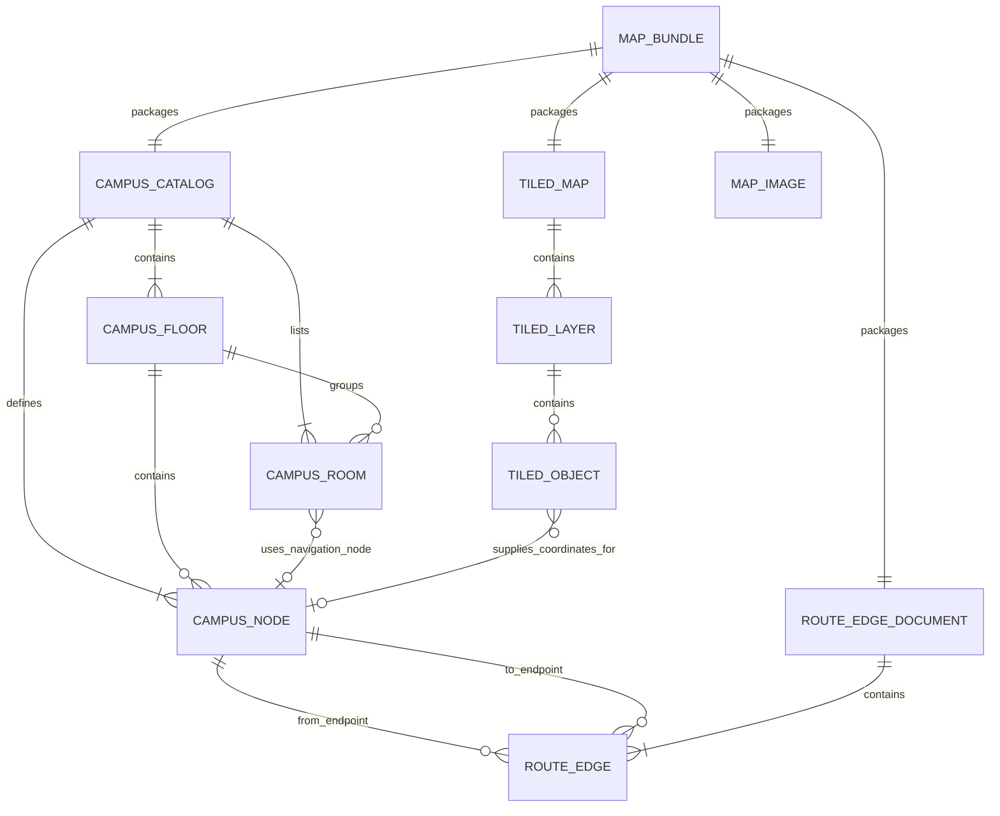
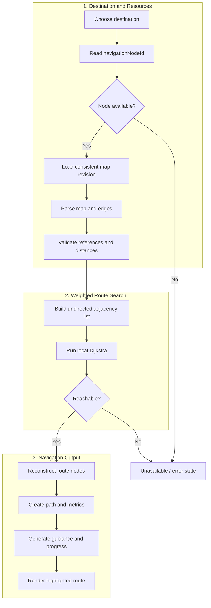
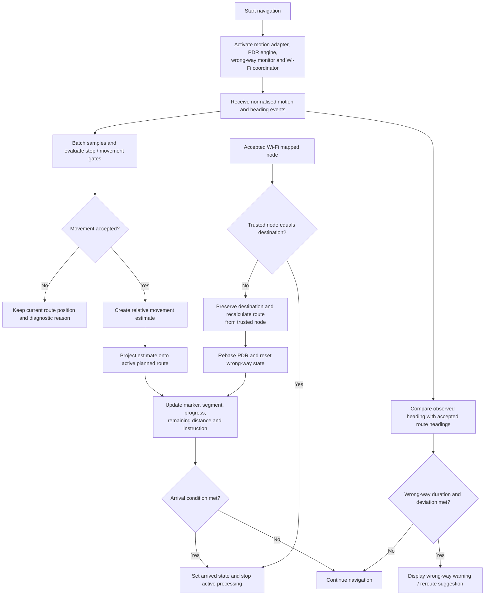
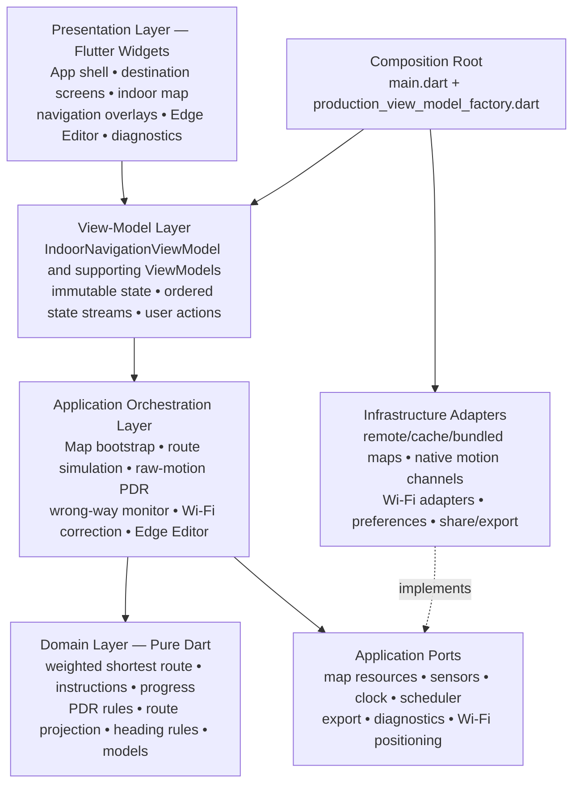
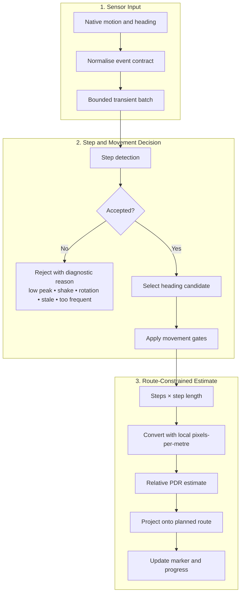

# CHAPTER 4: DESIGN

This chapter presents the design of the indoor navigation modules based on the current Flutter implementation. It replaces the earlier backend-centred design, in which an Expo client sent route requests to an Express `node_system`, with the architecture that is now present in the codebase. Weighted route calculation, route visualisation, guidance, PDR processing, planned-route projection, wrong-way monitoring, and navigation-side route recalculation are performed within the Flutter application. Network access is not required for the core route algorithm once a valid map resource set is available.

The chapter covers the system context, user-interface structure, logical data relationships, navigation processes, layered MVVM architecture, and implemented algorithms. The internal Wi-Fi positioning algorithm remains outside this report's personal contribution. Its output is nevertheless included at the integration boundary because an accepted mapped Wi-Fi node can cause the navigation module to preserve the destination and calculate a new route from the corrected position.

## 4.1 System Design

### 4.1.1 Current System Context

The current system combines an on-device Flutter navigation application with three independently deployable Go backend services and a private infrastructure-monitoring stack. The Flutter application still performs map rendering, weighted route calculation, PDR, route constraints, guidance, and Wi-Fi-triggered route recalculation locally. The backend provides verified map delivery, anonymous sessions, realtime presence, Journey lifecycle handling, asynchronous event ingestion, and privacy-safe aggregate analytics.

The Google Cloud deployment target is a Compute Engine virtual machine running Docker Compose. The documented setup uses Caddy for HTTPS: mobile routes reach the Presence Gateway, while the admin website accesses Gateway live snapshots and the Analytics Dashboard route. Only selected application routes are public. Redis, ClickHouse, the Trajectory Worker, Prometheus, and exporters remain private. Grafana is loopback-only and reached through an IAP SSH tunnel. This revised cloud deployment is planned; local implementation is not evidence of a completed cloud release.

The main system components are as follows.

1. **Flutter Mobile Application:** The mobile client loads a verified Map Bundle, creates an anonymous session, and uses an authenticated WebSocket for presence updates and Journey commands. Local route rendering never waits for the backend. The client does not connect directly to Redis, the Trajectory Worker, the Analytics API, ClickHouse, Prometheus, or Grafana.

2. **External Wi-Fi Positioning API:** The separately owned Wi-Fi module receives scan readings and returns a mapped node. The Flutter navigation integration uses an accepted node to preserve the destination, recalculate the route locally, and rebase PDR. This service is separate from the three Go backend deployables described below.

3. **Presence Gateway:** This public Go service serves immutable Map Bundle revisions, creates privacy-preserving anonymous sessions, authenticates WebSocket connections, processes Journey lifecycle commands, accepts route-relative position updates, and publishes live floor projections. It uses Redis for temporary sessions, current presence, occupancy, active Journeys, idempotency results, Pub/Sub, and two event Streams.

4. **Trajectory Worker:** This private Go service consumes the trajectory and Journey lifecycle Redis Streams using separate Consumer Groups. It validates events, collects bounded micro-batches, inserts them into ClickHouse, and acknowledges Redis entries only after ClickHouse confirms the write. The two pipelines run concurrently in one process but retain separate stream keys, batch settings, dead-letter handling, and metrics.

5. **Analytics API:** This private, read-only Go service queries ClickHouse for privacy-safe floor-traffic and route-edge aggregates. Its ClickHouse account has `SELECT` permission only, and the query and application layers suppress cohorts below the configured privacy threshold. The admin website now queries Dashboard summaries through this service; Flutter still does not query it. The documented public proxy exposes the Dashboard route without exposing ClickHouse credentials.

6. **Redis and ClickHouse:** Redis supports low-latency operational state, Pub/Sub, and bounded event Streams. ClickHouse stores the longer-lived `trajectory_events_v1` and `journey_lifecycle_events_v1` analytical records written by the Trajectory Worker. ClickHouse is queried through the Analytics API instead of directly by Flutter.

7. **Prometheus and Grafana Monitoring:** Prometheus scrapes `/metrics` from all three Go services and collects Redis, VM, and container signals through Redis Exporter, Node Exporter, and cAdvisor. Grafana queries Prometheus using PromQL and presents the Infrastructure Overview dashboard. Grafana does not currently query ClickHouse directly. ClickHouse container CPU, memory, filesystem, network, and liveness information can be observed indirectly through cAdvisor and Prometheus.

**Figure 4.1: Current end-to-end system and deployment architecture.**

Figure 4.1 presents the target system at service level rather than repeating the Flutter internal classes shown later in Section 4.5. The main synchronous mobile path ends at the Presence Gateway. Trajectory persistence is asynchronous: the Gateway appends accepted events to Redis Streams, and the Worker later writes them to ClickHouse. Analytics queries follow a separate read-only path through the Analytics API. Monitoring is also isolated from the user request path, so a Prometheus or Grafana failure does not stop Flutter navigation, Gateway realtime handling, event ingestion, or ClickHouse storage.

### 4.1.2 Design Rationale

Local route calculation was selected for four reasons. First, the Floor 2 graph is sufficiently small for deterministic on-device processing. Second, route selection and route rendering use the same validated edge data, reducing the risk of a server and client using different graph revisions. Third, navigation can continue when network connectivity is weak or unavailable. Fourth, pure Dart routing logic can be verified without starting a server, a device sensor, or a Flutter widget.

The architecture still permits controlled external integration. Resource repositories can obtain and cache a verified map bundle, platform adapters supply device capabilities, and the positioning module supplies trusted fixes. These external capabilities are introduced through interfaces rather than being constructed by domain algorithms. This keeps the route model independent from HTTP, native channels, storage, and user-interface code.

## 4.2 UI Design

### 4.2.1 Navigation Structure

The Flutter application uses a mobile app shell rather than a single prototype screen. The bottom-navigation structure separates primary user activities while allowing the navigation flow to move through floor selection, destination selection, and the active indoor map. The major user-interface surfaces are shown below.

| Interface Surface | Main Purpose | Important Design Elements |
| :---- | :---- | :---- |
| Username onboarding | Obtain a display name before the main app shell opens | Focused dialog, validation, and persisted user choice |
| Home screen | Introduce relevant places and provide navigation entry points | Campus-oriented cards and direct navigation actions |
| Floor selection | Let the user select an available building floor | Floor name, code, summary, tags, and suggested-floor indication |
| Floor rooms screen | Browse and filter destinations on the selected floor | Room code, name, category, navigability state, and search access |
| Destination search | Find a destination without manually scanning the room list | Text query, filtering, and enabled-destination results |
| Indoor navigation screen | Display the current route and guide the user | Scaled map, highlighted path, marker, instruction, progress, remaining distance, warnings, recalculation banner, arrival state, and cancel control |
| Edge Editor | Maintain connections between map nodes | Node selection, distance and custom-field editing, validation, removal, and JSON export |
| Settings and diagnostics | Support controlled prototype testing | Wi-Fi test controls where enabled, diagnostic status, and export behaviour |

The main user path is intentionally progressive. A user first chooses a floor, then a destination, and only then enters the map-based navigation view. This reduces the number of controls displayed at one time and prevents development-only controls from dominating the normal route-selection experience.

### 4.2.2 Active Navigation Screen

The active navigation interface follows a map-first design. The indoor map occupies the main visual area so that the route, user marker, corridor direction, and destination remain visible. Guidance information is layered around the map instead of replacing it.

The top instruction area communicates the current navigation action. Route statistics expose progress and remaining distance. A wrong-way banner is displayed only when the configured heading and duration conditions are satisfied. A separate Wi-Fi recalculation banner communicates the transition from an accepted position correction to a ready route. This distinction is important: the wrong-way warning advises the user, while an accepted Wi-Fi node changes the logical route origin and initiates actual route recalculation.

The navigation UI is driven by immutable `IndoorNavigationViewState`. Widgets do not calculate paths or process sensor samples. They observe fields such as load status, route position, remaining path segments, instruction state, raw-motion status, wrong-way state, Wi-Fi correction phase, lifecycle status, and zoom. User actions are forwarded to the view model, which changes application state through ordered orchestration.

For the final Word report, the following screenshots should be inserted from the current build rather than copied from the old Expo prototype:

1. Floor or destination selection screen.
2. Active navigation screen with the highlighted route and instruction bar.
3. Wrong-way warning state.
4. Wi-Fi route recalculation state.
5. Edge Editor screen.

### 4.2.3 Usability and Responsive Design

The interface uses responsive Flutter layouts so map controls and information panels remain usable on supported phone widths. Primary actions are separated from diagnostic features, confirmation is required before leaving active navigation, and loading or error states are explicit. The zoom range is bounded so the user cannot scale the map to an unusable level. Arrival is presented as a distinct session state and causes active navigation processing to shut down safely.

The UI design should be evaluated separately from algorithm correctness. Widget tests can prove that states and controls render and respond as designed, but a formal user study is still required to measure whether first-time users understand instructions, complete route tasks efficiently, and prefer the interface over a static plan.

## 4.3 Data Design

### 4.3.1 Structured Resource Model

The current data design is not a two-table relational database. It is a versioned collection of structured JSON and image resources converted into immutable Dart models. Separating the resources allows visual-map editing, room maintenance, graph validation, routing, and runtime rendering to evolve without embedding all information in one unstructured image.

| Resource | Main Contents | Design Role |
| :---- | :---- | :---- |
| Campus catalogue | Building name, floors, rooms, map assets, navigation availability, and room-to-node references | Supports floor and destination discovery |
| Tiled map document | Layers, objects, coordinates, dimensions, room labels, route nodes, and map metadata | Defines visual and spatial map information |
| PNG map image | Renderable Floor 2 background | Provides efficient visual presentation |
| Edge document | Edge identifier, `from`, `to`, positive distance, and optional fields | Provides the weighted route network and Edge Editor source |
| Canonical map graph | Map identity, revision, floor nodes, floor edges, and possible inter-floor edges | Supports graph validation and revision consistency |
| Map-bundle manifest | Map ID, bundle revision, graph revision, file names, sizes, and digests | Ensures a compatible set of resources is resolved together |
| Wi-Fi node mapping | External server-node identifier to local route-node identifier | Connects the external positioning output to the navigation graph |

The current verified Floor 2 dataset contains 22 navigation nodes and 24 edges. Fourteen destinations are enabled for navigation. Every enabled room must reference a valid navigation node. Each route edge must connect known node identifiers and have a positive distance because the local Dijkstra implementation uses distance as its traversal cost.

**Figure 4.2: Logical relationship among the current map, room, node, edge, and bundle resources.**

### 4.3.2 Runtime Navigation Model

During bootstrap, `MapBootstrapEngine` requests one `MapRuntimeResources` object from `MapRuntimeResourceRepository`. The returned object contains a Tiled-map document, edge document, image location, floor and map identifiers, and optional bundle and graph revisions. The engine parses and validates these sources, creates a `PngMapModel`, generates route nodes and room labels, and builds route metrics.

After a destination is chosen, the ordered node identifiers returned by the shortest-path algorithm are used to create a new active route path. Each route segment records both pixel length and metre length. The resulting `RouteMetricModel` provides local pixels-per-metre values, total route distance, and cumulative segment boundaries. These values support PDR conversion, route interpolation, progress, remaining distance, and arrival handling.

The Edge Editor operates on a `RouteGraphEdgeDocument` rather than directly changing the Tiled map. A maintainer selects two known nodes, creates or replaces an edge, changes its distance or custom scalar fields, removes an edge, and serialises the updated document as JSON. This separation prevents a visual map edit from silently creating an invalid navigation connection.

### 4.3.3 Data Integrity Rules

The parsers and application logic enforce the following important constraints:

1. Schema versions must be supported.
2. Map, graph, floor, room, node, and edge identifiers must be consistent.
3. Duplicate identifiers are rejected.
4. Enabled destinations must reference known navigation nodes.
5. Edge endpoints must reference known nodes.
6. Route distance must be positive.
7. Unsupported inter-floor relationships are rejected for the current data.
8. A resolved remote map bundle must pass revision, size, and digest checks before it becomes the current resource set.
9. If a remote revision is unavailable, the application falls back to a complete known resource set instead of mixing files from different revisions.

## 4.4 Process Design

### 4.4.1 Route Planning Flow

Route planning begins after the user selects an enabled destination. The selected `CampusRoom` provides its navigation-node identifier, while the configured or corrected start node supplies the route origin. The application loads and validates the current map resources before running Dijkstra locally.

**Figure 4.3: Local route-planning process.**

The graph is treated as undirected by the current edge-based route calculation. Duplicate endpoint pairs are ignored after the first valid pair, and nodes are chosen using cumulative distance. If equal costs occur, identifier ordering supplies deterministic tie-breaking. If the destination is disconnected or unknown, the application produces an explicit error instead of drawing an invalid path.

### 4.4.2 Live Navigation and Position-Correction Flow

When navigation starts, the view model activates the relevant engines according to application lifecycle state. Motion and heading events are normalised by the platform adapter, grouped into bounded transient batches, and processed by the PDR pipeline. An accepted relative estimate is projected onto the planned route before it updates the visible marker.

Wrong-way monitoring runs alongside movement estimation. It evaluates the observed heading against the expected and accepted route headings, current junction context, duration, and configured deviation thresholds. Meeting the wrong-way conditions produces a warning and reroute suggestion, but the warning alone does not replace the current route.

The Wi-Fi integration follows a different path. When the external positioning module provides an accepted mapped fix, the navigation code locates its trusted route node. If the node is not the destination, the application displays the recalculation phase, preserves the existing destination, changes the route origin to the trusted node, and runs the same local shortest-path process again. The PDR state is then rebased to the trusted position and the wrong-way state is reset. If the trusted node already equals the destination, the application skips unnecessary rerouting and proceeds to arrival.

**Figure 4.4: Live navigation, wrong-way monitoring, and accepted-position route recalculation.**

### 4.4.3 Lifecycle and Failure Flow

The view model serialises navigation and lifecycle operations so concurrent start, pause, resume, correction, cancellation, and arrival actions do not change the engines in an unsafe order. Backgrounding pauses active motion and monitoring work without corrupting the route state. Foregrounding resumes only the activities that were active before suspension. Cancellation and arrival stop sensor processing, scheduled checks, and positioning coordination safely.

Failure handling is also state-driven. Invalid map resources produce a load error with a retry boundary. Missing motion capability produces an unavailable state. Denied permission produces a permission-denied state. Wi-Fi positioning failure does not prevent the map and PDR navigation from starting because the positioning engine is treated as an optional correction source rather than a mandatory dependency for local route guidance.

## 4.5 Software Architecture Design

### 4.5.1 Flutter MVVM and Layered Boundaries

The current application uses MVVM together with layered domain, application, infrastructure, presentation, and composition responsibilities. The architecture is organised around dependency direction rather than around a frontend/backend pathfinding split.

**Figure 4.5: Current Flutter MVVM and layered software architecture.**

The responsibilities of each layer are as follows.

| Layer | Responsibility | Current Examples |
| :---- | :---- | :---- |
| Domain | Immutable models and deterministic rules with no Flutter, repository, platform-channel, or widget dependency | Shortest route, PDR pipeline, route snapping, progress, geometry, instructions, and wrong-way rules |
| Application orchestration | Coordinate domain rules, engine state, lifecycle, timing, and external capabilities | `MapBootstrapEngine`, `RawMotionPdrEngine`, `WrongWayRerouteMonitor`, `WifiPositioningCoordinator`, and `EdgeEditorEngine` |
| View models | Expose immutable screen state and receive user actions | `IndoorNavigationViewModel`, `FloorRoomsViewModel`, `FloorSelectionViewModel`, and `AppShellViewModel` |
| Ports | Define capabilities required by application orchestration | Map repository, sensor manager, clock, scheduler, exporter, diagnostic sink, and positioning interfaces |
| Infrastructure | Implement ports using Flutter assets, local files, HTTP, preferences, share services, or native channels | Map bundle repositories, Core Motion and Android adapters, Wi-Fi adapters, and exporters |
| Presentation | Render state and forward interactions without owning navigation algorithms | App shell, map widgets, destination screens, navigation overlays, banners, and Edge Editor widgets |
| Composition | Construct production objects and inject implementations | `main.dart` and `production_view_model_factory.dart` |

This separation improves testability because pure algorithms can be run with ordinary Dart values, orchestration engines can use deterministic clocks and fake ports, and widgets can receive controlled view-model state. It also prevents UI code from creating repositories or native sensor clients directly.

### 4.5.2 Main Navigation Class Relationships

`IndoorNavigationViewModel` owns the navigation session and coordinates its child engines. `MapBootstrapEngine` produces the parsed map and route metrics. `RawMotionPdrEngine` receives normalised sensor events and produces relative estimates. `DerivedEstimateBridgeEngine` and the route-snap functions align estimates with the active route. `WrongWayRerouteMonitor` evaluates heading consistency. `WifiPositioningCoordinator` supplies accepted corrections, while the view model applies them by recalculating the route and rebasing PDR. `EdgeEditorEngine` maintains an editable edge document independently from normal navigation mode.

The state exposed to widgets is consolidated in `IndoorNavigationViewState`. This object includes load status, map bootstrap data, current marker position, navigation instruction and progress, route simulation, raw-motion status, snapped estimate, wrong-way state, Wi-Fi positioning state, recalculation visual state, lifecycle state, and Edge Editor state. A single immutable view state reduces the chance that separate widgets observe incompatible fragments of the same navigation update.

### 4.5.3 Security, Privacy, and Resilience Considerations

Release-mode remote resource access requires HTTPS. A remote map revision is verified before use and can fall back to cached or bundled resources. Native sensor events are normalised at the platform boundary, and raw sample arrays are transient rather than permanently stored by the normal navigation workflow. Optional diagnostic output records only the information intentionally passed to its port. External Wi-Fi positioning is isolated behind an application interface so a failure does not prevent local map and PDR operation.

These controls do not constitute a complete production security audit. They are design measures appropriate to the prototype and should be supplemented by broader penetration, privacy, retention, and server-authentication review before institution-wide deployment.

## 4.6 Algorithm Design

### 4.6.1 Weighted Shortest-Path Calculation

The implemented route algorithm is Dijkstra's weighted shortest-path method. BFS is not used by the current Flutter route workflow. Each valid edge contributes its positive distance to the candidate path cost. The algorithm builds an adjacency list, sets the start-node distance to zero, repeatedly selects the unvisited node with the smallest known cumulative distance, relaxes its neighbours, and reconstructs the destination path using predecessor links.

The design can be summarised as follows:

1. Return the start node immediately if the start and destination are identical.
2. Reject zero or negative edge distances.
3. Add both directions of each valid edge to the adjacency list.
4. Reject an unknown or disconnected start or destination.
5. Initialise all costs to infinity except the start cost of zero.
6. Select the lowest-cost unvisited node.
7. Update a neighbour when the new cumulative distance is lower.
8. Use stable identifier ordering when two candidates have the same cost.
9. Follow predecessor links backwards and reverse the result to obtain the ordered route.

For the current 22-node graph, the simple deterministic implementation is sufficient and easily testable. A priority queue could improve asymptotic performance for a much larger multi-building graph, but it is not necessary for the present dataset.

### 4.6.2 Route Geometry, Instructions, and Progress

The route-node list is converted into screen-space path segments using the coordinates parsed from the Tiled map. Segment geometry supplies length and heading. Edge distances provide real-world metres, while pixel lengths provide visual interpolation. Their ratio produces local pixels-per-metre values instead of assuming one scale for every segment.

The guidance logic determines left, right, straight, or arrived states from consecutive route headings. Progress is calculated from the current distance along the route, and remaining distance is derived from the route total. Arrival handling is based on the resulting route state, after which active runtime processing is stopped.

### 4.6.3 PDR and Planned-Route Projection

The PDR pipeline does not maintain a cloud of particles. It processes bounded batches of acceleration and heading samples through deterministic checks. Step detection considers acceleration peak, quiet samples, minimum step interval, phone rotation, shake magnitude, and sample freshness. Movement rules also handle startup lock, turning in place, heading tolerance, backward confirmation, and shake cooldown.

An accepted step count is multiplied by the configured step length. The movement distance in metres is converted into pixels using the local route metric, then combined with the selected heading to form a relative position estimate. This unconstrained estimate is not displayed as proof of physical location. It is projected onto the current planned-route segments, producing a route position and a drift distance. The route position drives the visible marker and progress state.

**Figure 4.6: Implemented PDR and planned-route projection pipeline.**

### 4.6.4 Wrong-Way Monitoring and Wi-Fi-Triggered Recalculation

Wrong-way monitoring and route recalculation are related but separate responsibilities. The monitor periodically compares the observed heading with the current route heading and any accepted expected headings. It also considers whether the user is near a junction, whether the graph movement is legal, and how long the opposite-heading condition persists. Only after the configured rules are satisfied does the UI show the warning and reroute suggestion.

Automatic route replacement is instead triggered by an accepted Wi-Fi correction. The mapped fix is evaluated against the current route context. When a correction is applied, the navigation view model identifies the trusted local node, temporarily displays recalculation state, preserves the destination, and invokes the same weighted shortest-path calculation using the trusted node as the new start. It then replaces the displayed route, resets route simulation and derived estimates, rebases raw-motion PDR, applies a heading correction when enough trusted-node information is available, and resets the wrong-way monitor.

This design avoids claiming that a heading warning identifies a precise physical node. It requires an accepted external position fix before changing the route origin automatically.

## 4.7 Chapter Summary and Evaluation

This chapter replaced the outdated backend-centred design with the current Flutter architecture. The application now performs weighted Dijkstra routing, route rendering, guidance, PDR processing, planned-route projection, wrong-way monitoring, and navigation-side route recalculation locally. Express controller/service/repository pathfinding, BFS route selection, particle filtering, and Supabase graph storage are not part of the current implementation and therefore should not appear in the final system or software-architecture diagrams.

The design uses a layered MVVM structure. Flutter widgets observe immutable view state; view models coordinate user flows; application engines manage navigation and lifecycle behaviour; pure Dart domain functions implement deterministic rules; ports define external capabilities; infrastructure adapters provide maps, sensors, persistence, networking, and export; and the composition root injects the production implementations.

The data design is broader than the earlier Node-and-Edge ERD. It uses a campus catalogue, floors, rooms, route nodes, weighted edges, Tiled map content, a PNG image, revisioned map bundles, and an external Wi-Fi node mapping. These resources are validated and resolved as a consistent set before they are used for route calculation.

From an evaluation perspective, the architecture improves offline capability, test isolation, lifecycle safety, and separation of concerns. Automated tests support the deterministic behaviour of routing, geometry, PDR rules, snapping, wrong-way evaluation, view-model orchestration, Wi-Fi correction integration, and UI boundaries. However, design correctness does not prove real-world positioning accuracy or user effectiveness. Formal controlled-walk, complete-route, cross-platform physical-device, and usability evaluation remain necessary before making stronger performance claims.
