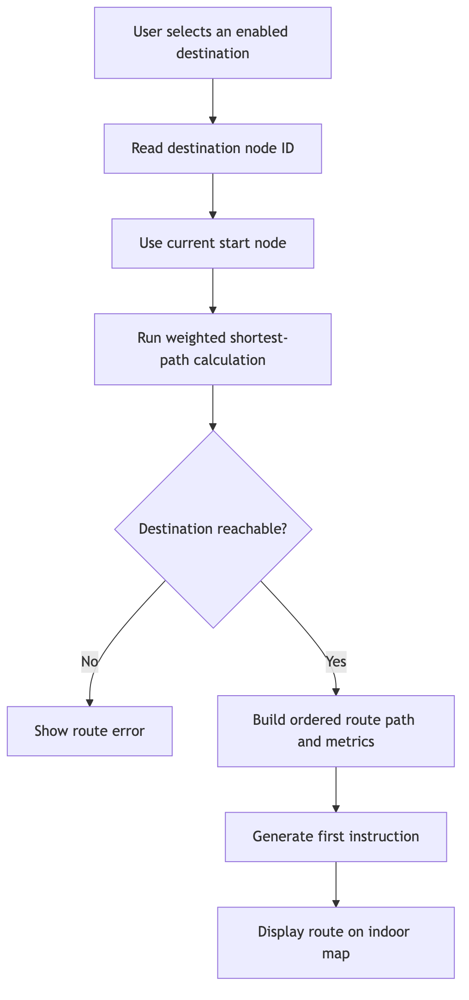
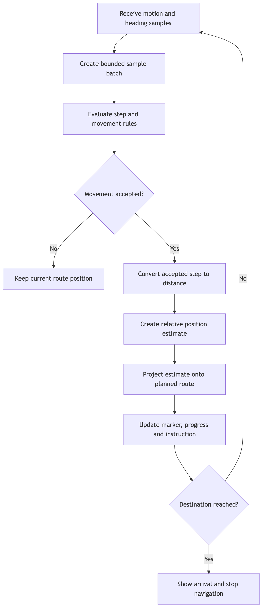
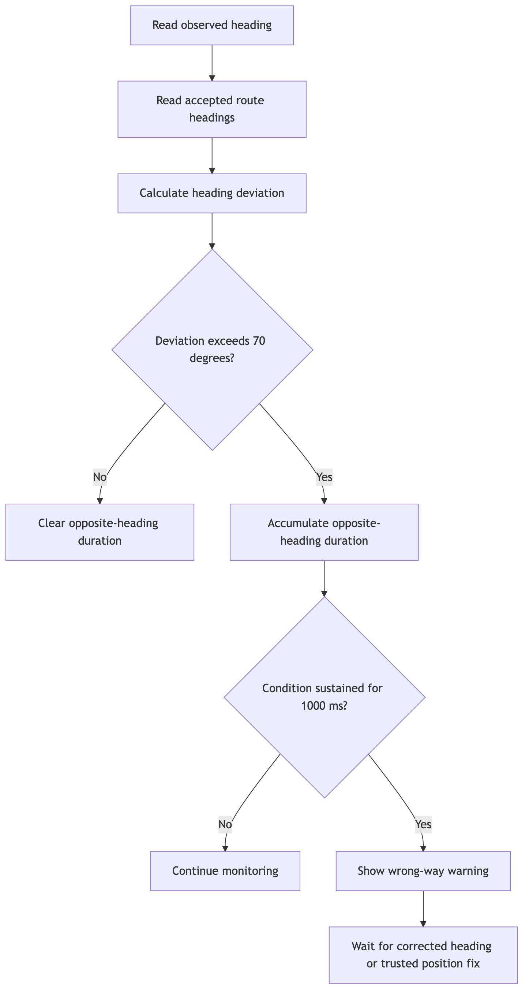
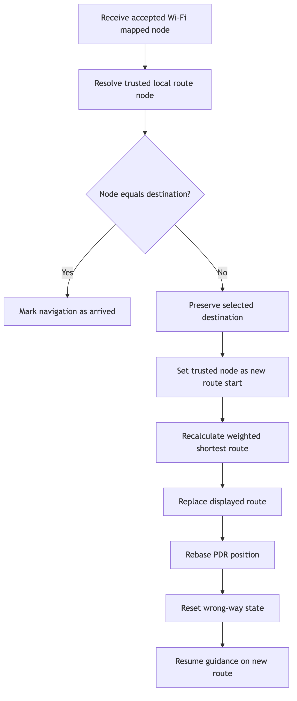
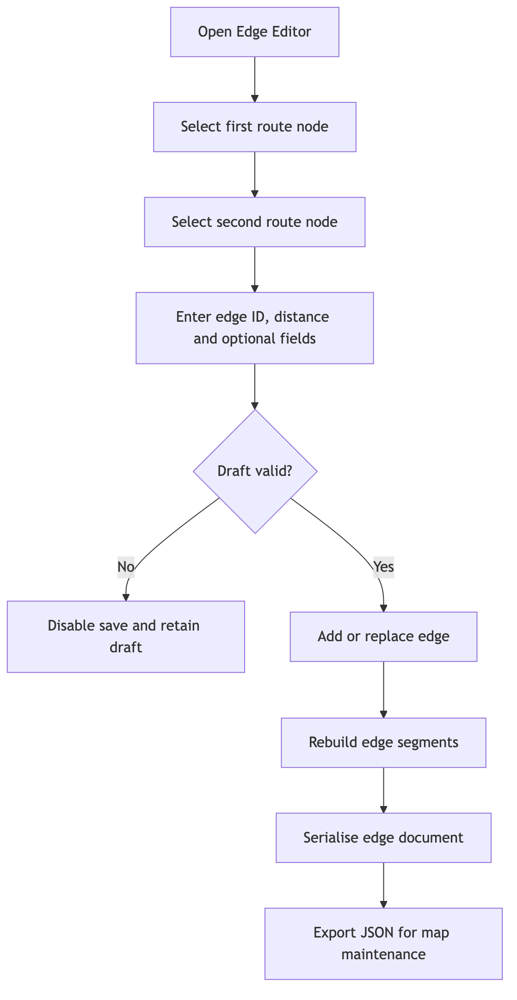

# CHAPTER 5: IMPLEMENTATION AND TESTING

This chapter describes the implementation and verification of the current Flutter indoor-navigation module and the non-functional behaviour of its supporting backend pipeline. The implementation discussion focuses on map-resource handling, destination routing, route-constrained PDR, guidance, wrong-way monitoring, navigation-side Wi-Fi correction integration, and graph maintenance. Testing additionally covers backend performance, bounded scalability, and worker recovery because realtime presence and Journey delivery support the deployed application. The internal method used by the separately owned Wi-Fi positioning module to infer a location is outside the scope of this report. Its accepted mapped-node output is included because it directly affects route recalculation.

The diagrams in Section 5.1 deliberately show one feature flow at a time. They exclude backend services, deployment infrastructure, monitoring, and class-level architecture because those subjects were already covered in Chapter 4 and would obscure the behaviour being implemented.

## 5.1 System Implementation

### 5.1.1 Map Resource Loading and Validation

The application uses a structured resource set instead of treating the floor-plan image as navigation data. The Floor 2 implementation combines the campus catalogue, room-to-node references, Tiled map information, PNG map image, weighted edge document, canonical map graph, and Wi-Fi node mapping. `MapBootstrapEngine` requests a complete `MapRuntimeResources` object, parses the map and edge documents, validates their relationships, and creates the route nodes, room labels, map model, and route metrics required by the navigation screen.

Remote resources are accepted only as a consistent verified bundle. When a remote revision is unavailable or invalid, the repository can use a complete cached or bundled resource set. It does not intentionally combine files from unrelated revisions. Invalid schema versions, duplicate identifiers, missing node references, unsupported floor relationships, and non-positive edge distances are rejected before routing begins.

The current canonical dataset represents `main-campus`, Floor 2. It contains 22 nodes, 24 weighted edges, and 14 enabled destinations. This small graph is suitable for deterministic local route calculation and allows navigation to continue without a route request to a server.

### 5.1.2 Destination Selection and Route Planning

A route begins when the user chooses an enabled room or facility. The selected `CampusRoom` supplies the destination node ID, while the navigation state supplies the current start node. The application applies Dijkstra's weighted shortest-path algorithm to the validated undirected edge graph. Edge distance in metres is the route cost; therefore, the selected route minimises total stored distance rather than merely minimising the number of nodes.

After a route is found, the ordered node IDs are converted into map coordinates and segment metrics. The system calculates cumulative distance, creates the first instruction, and displays the highlighted path. An unknown or disconnected destination produces an explicit error instead of an incomplete route.

**Figure 5.1: Destination selection and local route-planning feature flow.**

### 5.1.3 Route-Constrained PDR and Guidance

The application receives motion and heading events through platform-specific sensor adapters. These adapters normalise native events into a common Dart contract. `RawMotionPdrEngine` holds only a bounded transient set of samples and sends a batch to the pure PDR pipeline. The configured pipeline filters stale or future samples, detects an acceleration peak, requires a quiet sample, enforces the minimum step interval, and rejects excessive shake or phone-rotation patterns.

For an accepted step, the configured step length of 0.5 m is converted into pixels using the current route segment's scale. Heading candidates and movement gates determine whether forward or confirmed backward movement is valid. The resulting free PDR estimate is then projected onto the active planned route. The constrained route position, rather than the unconstrained estimate, updates the marker, current segment, progress, remaining distance, and guidance instruction. When the route state reaches the destination, the application displays the arrival state and shuts down active navigation processing.

**Figure 5.2: Route-constrained PDR and guidance feature flow.**

### 5.1.4 Wrong-Way Monitoring

Wrong-way monitoring is implemented as a timed heading-consistency check. `WrongWayRerouteMonitor` compares the observed heading with the current and accepted route headings. The current configuration permits 70 degrees of heading deviation and checks at 1,000 ms intervals. An opposite condition must be sustained for at least 1,000 ms before a warning is suggested. Junction context, graph movement, and confidence also form part of the final domain decision.

The warning does not claim to know the user's exact physical node and does not automatically replace the route by itself. It informs the user that the observed movement is inconsistent with the planned direction. Automatic route recalculation occurs only after the navigation module receives an accepted trusted position fix.

**Figure 5.3: Wrong-way warning feature flow.**

### 5.1.5 Wi-Fi Position Correction and Route Recalculation

The Wi-Fi integration begins after the external positioning module returns an accepted server-node result. The Flutter navigation code maps that identifier to a trusted local route node and evaluates it against the active route. A nearby correction may be presented smoothly, while a larger correction may use a teleport-style visual update. This classification affects presentation; both are trusted corrections when accepted by the integration rules.

If the trusted node is already the selected destination, the application enters the arrival state without calculating an unnecessary route. Otherwise, the current destination is preserved, the trusted node becomes the new start node, and the same local weighted shortest-path algorithm calculates a replacement route. The application then replaces the route, rebases PDR, resets wrong-way state, and continues guidance from the corrected position. Thus, the current implementation supports automatic route recalculation after a trusted Wi-Fi allocation even though the internal Wi-Fi positioning algorithm is not part of this report.

**Figure 5.4: Accepted Wi-Fi correction and automatic route-recalculation feature flow.**

### 5.1.6 Edge Editor and Graph Maintenance

The Edge Editor supports controlled maintenance of the route graph. In developer mode, a maintainer selects two known route nodes, reviews the generated endpoint pair, and enters an edge ID, distance, and optional scalar fields. Saving either adds a new edge or replaces an edge with the same identifier. The editor can also remove an edge, rebuild its displayed segments, serialise the complete edge document, and export valid JSON.

The editor is separated from normal production navigation by UI configuration. Production mode hides the editor and diagnostic panels. This prevents ordinary users from accidentally changing prototype graph data while retaining a practical workflow for correcting route connections and distances during development.

**Figure 5.5: Edge creation, validation, and export feature flow.**

## 5.2 Testing Strategy

Testing was organised by responsibility so that deterministic navigation rules could be verified without depending on a physical device, while device-dependent behaviour remained visible as a separate validation requirement.

1. **Static analysis:** `flutter analyze` was used to detect compile-time, type, style, and lint issues. On 12 August 2026, the analysis completed with no error-level findings and two information-level `avoid_redundant_argument_values` notices in an unrelated live-presence marker test.
2. **Domain unit testing:** Pure Dart tests supplied controlled graphs, coordinates, headings, acceleration samples, and timestamps to the routing, guidance, PDR, snapping, progress, and wrong-way functions. These tests verify exact outputs and boundary conditions without widgets, networks, or hardware.
3. **Application orchestration testing:** Engines and the navigation view model were tested with fake clocks, schedulers, sensors, exporters, and positioning ports. This verifies ordered state changes, pause/resume behaviour, arrival shutdown, trusted-fix handling, route replacement, and failure isolation.
4. **Widget testing:** Flutter widget tests rendered the navigation screen, warnings, positioning banners, arrival dialog, and Edge Editor at controlled screen sizes. Interactions were triggered programmatically and the resulting state, labels, and layout constraints were checked.
5. **Integration-boundary testing:** The Wi-Fi module was represented by accepted or rejected mapped-node results. The tests verify only the navigation response to that output, not the external Wi-Fi inference algorithm. Similarly, platform motion events are checked at the adapter boundary while real sensor quality requires a physical device.
6. **Physical-device and on-site testing:** Controlled walking on Floor 2 is required to measure step response, drift, route adherence, wrong-way warning behaviour, Wi-Fi correction timing, arrival, and user comprehension. These cases remain pending until measured evidence is recorded.
7. **Non-functional performance testing:** A containerised k6 harness generated steady concurrency, rapid session churn, trajectory bursts, analytics reads, and increasing Journey arrival rates. Client-visible acknowledgements, HTTP latency, failures, socket errors, completed work, and dropped iterations were correlated with Prometheus metrics for Gateway processing, Redis Stream lag and pending entries, worker batches, ClickHouse inserts, and analytics queries. A scenario was accepted only when latency and error thresholds passed together with end-to-end delivery checks; a low latency value alone was not treated as success when work was incomplete.
8. **Scalability and capacity-boundary testing:** Increasing-arrival-rate tests were used to locate saturation rather than to claim unlimited scalability. The same 60-second workload was repeated after controlled Gateway and worker improvements so that completion, throughput, network amplification, batching, Stream backlog, and storage results could be compared under equivalent local conditions.
9. **Recovery and availability testing:** A bounded worker-outage test stopped the Trajectory Worker while the Gateway continued accepting events, then restarted it and measured Consumer Group recovery. This provides resilience evidence for one process outage while Redis remains available. It is not a full availability test because the project has not yet completed long-duration soak testing, VM failure, Redis loss, multi-instance failover, or multi-zone recovery testing.

The functional evidence reported in this chapter is a scoped navigation regression suite. On 12 August 2026, 183 selected tests covering the implemented navigation contribution passed. The non-functional evidence was recorded separately on 23 and 26 July 2026 using a local single-node Docker environment. Neither result must be interpreted as proof that every repository test passes, that laboratory simulation proves real-world navigation accuracy, or that a local load result guarantees Google Cloud production capacity.

## 5.3 Test Plan

The test plan defines what is tested, the required conditions, and the acceptance basis. Deterministic logic is evaluated automatically, backend non-functional behaviour is evaluated through named k6 scenarios and service metrics, while environmental and usability claims require controlled physical execution.

| Plan ID | Feature or Quality | Test Level | Conditions | Acceptance Criterion |
| :---- | :---- | :---- | :---- | :---- |
| TP-01 | Map resource parsing and validation | Unit and orchestration | Valid canonical Floor 2 bundle; invalid schema, reference, distance, and revision variants | Valid resources load completely; invalid or mixed resources are rejected or replaced by one complete fallback set |
| TP-02 | Destination availability and room-to-node mapping | Unit and widget | Fourteen catalogue destinations; enabled, disabled, known, and unknown references | Only enabled destinations with known node IDs can start navigation |
| TP-03 | Weighted route calculation | Unit | Connected, disconnected, same-node, reverse-direction, and equal-cost graphs | Minimum-distance route is deterministic; unreachable routes return a controlled error |
| TP-04 | Route metrics, instructions, and progress | Unit | Straight segments, left/right turns, shared boundaries, route start, and route end | Distance, instruction, progress, and arrival state match the supplied geometry and edge distances |
| TP-05 | PDR sample filtering and step detection | Unit | Quiet samples, accepted peak, low peak, repeated peak, stale sample, shake, and rotation patterns | Only valid walking input produces a step; rejected input retains an explicit diagnostic reason |
| TP-06 | Route constraint and turn gate | Unit | Estimates on, beside, beyond, and near turns in the planned path | Estimate is projected to a valid route segment and illegal corner-cutting is prevented |
| TP-07 | Wrong-way warning | Unit and orchestration | Headings inside/outside tolerance; duration below/at threshold; junction context; pause/resume | Warning appears only after the configured sustained condition and clears or pauses safely |
| TP-08 | Wi-Fi correction integration | Unit and orchestration | Nearby node, far node, earlier route node, destination node, unmapped node, and positioning failure | Accepted fix is applied according to route context; destination is preserved; recalculation starts from the trusted node; local navigation survives positioning failure |
| TP-09 | Navigation lifecycle | Orchestration and widget | Initialisation, start, background, foreground, cancellation, destination replacement, and arrival | Engines start, pause, resume, reset, and stop once in the correct order without stale updates |
| TP-10 | Edge Editor | Unit, orchestration, and widget | Valid/invalid distance, add, replace, remove, custom fields, export success/failure, and narrow screen | Invalid draft cannot be saved; valid document remains serialisable; export state and errors are visible |
| TP-11 | Mobile layout and interaction | Widget and physical device | Portrait and landscape; 320 px test width; supported Android and iOS devices | Required controls remain visible or scrollable, and no layout overflow prevents use |
| TP-12 | On-site route completion and usability | Physical and user evaluation | Floor 2 controlled routes, normal walking, wrong turn, Wi-Fi correction point, and first-time participant | Route can be completed; observations, timing, deviations, corrections, and participant feedback are recorded |
| TP-13 | Steady backend performance | k6 load test and service metrics | Ramp to 100 concurrent virtual users; 20 updates per approximately 22-second Journey | More than 99% checks pass, failure rate remains below 1%, ACK p95 remains below 1,000 ms, and the ingestion pipelines drain correctly |
| TP-14 | Session churn, burst, and analytics performance | k6 arrival-rate tests and Prometheus | 20 new Journeys/s; 20 updates per burst Journey; 20 aggregate queries/s | No dropped iterations; failure rate remains below 1%; ACK and query p95 remain below 1,000 ms; Stream backlog drains to zero |
| TP-15 | Scalability and capacity boundary | k6 increasing-arrival-rate stress test | 60-second ramp from 10 new Journeys/s towards 25, 50, and 100/s; 20 updates per Journey | Record completed Journeys, ACK completion, failures, p95, Stream delivery, ClickHouse rows, and the first saturation signal; do not infer capacity from latency alone |
| TP-16 | Worker recovery | Controlled component interruption | Stop the Trajectory Worker, send 2,020 accepted trajectory updates, restart the same Consumer Group | Gateway continues accepting events while the worker is stopped; after restart, lag and pending return to zero without DLQ, trim, or visible duplicates |
| TP-17 | Availability and long-duration stability | Soak, restart, and failover testing | Extended representative traffic; Gateway, Redis, VM, and network interruption; repeated health checks | Availability percentage, recovery time, data loss, and error budget are measured over a defined duration |

## 5.4 Test Data

The test data were selected from the current assets and deterministic fixtures. Synthetic inputs are used where exact expected outputs are required; real Floor 2 data are used to verify the implemented resource relationships and representative route flows.

| Data ID | Category | Data Used | Purpose |
| :---- | :---- | :---- | :---- |
| TD-01 | Canonical graph | `main-campus`, schema version 1, `floor-2`, 22 nodes, 24 weighted edges, 0 inter-floor edges | Resource parsing, graph validation, routing, and edge maintenance |
| TD-02 | Destinations | 14 rooms/facilities: Elevator; TA239-TA245 where present; TA254-TA257; Restroom 1; Restroom 2 | Destination list, search, room-to-node mapping, and navigation start |
| TD-03 | Representative real routes | `node-21 -> node-20` for TA257; `node-21 -> node-20 -> node-19` for TA256; long fixture `node-21 -> node-20 -> node-19 -> node-18 -> node-17 -> node-16 -> node-12 -> node-13 -> node-14 -> node-15 -> node-2 -> node-1` for Elevator | Short route, destination replacement, progress, turns, and full route geometry |
| TD-04 | Weighted synthetic graph | `a-b=2`, `b-d=5`, `a-c=3`, `c-d=1`; start `a`, destination `d` | Prove that the selected route is `a-c-d` with total cost 4 rather than the higher-cost alternative |
| TD-05 | Route-snap coordinates | Estimate `(500,700)` against the real route fixture; expected projection `(500,648)` on segment 1 with 52 px drift | Projection, segment selection, and drift calculation |
| TD-06 | Accepted step samples | Timestamp 920 ms with acceleration magnitude 0.2, followed by 960 ms with magnitude 1.9; step threshold 1.7; step length 0.5 m | Valid step detection and movement-distance conversion |
| TD-07 | Rejected motion samples | Low peak 0.2; no-quiet sequence 2.4 and 2.6; shake peak 6.0; repeated step after 160 ms; empty, stale, future, and rotation-only batches | Verify false-step prevention and diagnostic reasons |
| TD-08 | Heading and wrong-way inputs | Expected heading 0 degrees; observed headings 45, 90, and 180 degrees; allowed deviation 70 degrees; check interval and sustained duration both 1,000 ms | Forward, blocked/opposite, warning timing, and wrap-around behaviour |
| TD-09 | Wi-Fi correction fixtures | Current route position `(0,0)`; trusted fix at 1.5 m for smooth correction; trusted fix at 8 m for teleport correction; route nodes A `(0,0)`, B `(100,0)`, C `(200,0)`; destination-node fix | Navigation-side correction classification, backward deferral, rerouting, and direct arrival |
| TD-10 | Wi-Fi mapping boundary | 11 server-to-local node mappings; validation file of 130 scans from 13 labelled locations, 10,778 AP readings, RSSI from -90 to -33 dBm | Validate input structure and mapping coverage at the navigation boundary; not used to claim ownership or accuracy of the Wi-Fi algorithm |
| TD-11 | Lifecycle and failure data | Fake clock and periodic scheduler; permission denied; unavailable sensor; Wi-Fi failure; export failure; background/foreground events | Deterministic orchestration, recovery, and cleanup testing |
| TD-12 | Physical route data to collect | Device model and OS, start/destination, expected node route, walked path, start/end time, detected steps, warning time, Wi-Fi correction node/time, arrival status, observer notes | Provide reproducible evidence for later on-site test execution |
| TD-13 | Local performance environment | Apple M4 MacBook Air with 10 CPU cores and 24 GB RAM; macOS 26.5.2; Docker Engine 29.5.3 with approximately 7.75 GiB available; one container per backend component | Make the performance results reproducible and prevent local results from being presented as Google Cloud capacity |
| TD-14 | Steady and burst workload | 100 concurrent VUs; 20 new Journeys/s; 20 route-relative updates per Journey; durations from 15 to 120 seconds according to scenario | Measure bounded concurrency, rapid connect/disconnect behaviour, WebSocket ACKs, and ingestion backlog |
| TD-15 | Journey stress workload | 60-second ramp with arrival targets of 25, 50, and 100 Journeys/s after a 10/s start; up to 500 VUs; 2,600 Journeys and 52,000 location observations | Locate the useful capacity boundary and compare controlled Gateway and worker improvements |
| TD-16 | Performance thresholds and signals | Checks above 95% or 99% by scenario; failures below 5% or 1%; ACK p95 below 1,000 ms and p99 below 2,000 ms; no dropped iterations where specified; final lag/pending, DLQ, trim, duplicates, rows per insert, and bytes/messages | Avoid judging performance from one latency metric and preserve delivery correctness |
| TD-17 | Recovery workload | Worker stopped while 2,020 trajectory events are accepted, then restarted; Redis `XINFO GROUPS` and `XPENDING` used as authoritative backlog evidence | Evaluate bounded process recovery without falsely treating restarted in-memory gauges as proof of drainage |

## 5.5 Test Cases and Results

### 5.5.1 Automated Execution Summary

The scoped regression command covered routing, navigation instructions, PDR, route snapping and progress, reroute rules, bootstrap, navigation orchestration, sensor orchestration, Wi-Fi/PDR fusion, the indoor-navigation view model, navigation widgets, and the Edge Editor. It completed with 183 passed tests and no failure on 12 August 2026.

| Verification | Actual Result | Status |
| :---- | :---- | :---- |
| Scoped Flutter navigation regression suite | 183 passed, 0 failed | Pass |
| Flutter static analysis | 0 error-level findings; 2 information-level redundant-argument notices | Pass with observations |
| Local k6 performance baseline | Smoke, steady, churn, burst, analytics, stress, and worker-recovery results recorded with pipeline correctness checks | Completed with one capacity limit identified |
| Final Journey-aware k6 stress test | 2,600/2,600 Journeys, 52,000/52,000 location ACKs, 0% client failure, and both Streams drained to lag/pending 0/0 | Pass in the recorded local environment |
| Long-duration availability and infrastructure-failover evaluation | No controlled soak, VM failure, Redis-loss, or multi-zone failover evidence | Pending |
| Physical-device sensor and on-site route evaluation | Not executed as part of this first version | Pending |

### 5.5.2 Detailed Test Cases

| Test Case ID | Test and Condition | Expected Result | Actual Result | Result |
| :---- | :---- | :---- | :---- | :---- |
| TC-01 | Load the canonical Floor 2 map and graph | Resources resolve to one floor with 22 nodes and 24 valid edges | Parser and bootstrap tests produced the expected complete map model and route data | Pass |
| TC-02 | Supply an invalid or disconnected planned route | Invalid references or disconnected node sequences are rejected | Validation tests raised the controlled error instead of creating a partial route | Pass |
| TC-03 | Route from `a` to `d` using TD-04 | Route `a-c-d` is selected because its total cost is 4 | Returned node order was `a-c-d`; reverse direction also returned the correct reversed route | Pass |
| TC-04 | Use identical start and destination; then an unreachable destination | Identical nodes return a one-node route; unreachable destination raises an error | Both boundary behaviours matched the expected results | Pass |
| TC-05 | Generate guidance from straight and turning route geometry | Correct straight, left, right, and arrived instructions are produced | Navigation-instruction tests returned the expected instruction for each geometry and terminal state | Pass |
| TC-06 | Project estimate `(500,700)` onto TD-03 route | Position becomes `(500,648)` on segment 1 and drift is 52 px | Projection matched the expected coordinates, segment, and drift | Pass |
| TC-07 | Process accepted step samples from TD-06 | One step is detected and converted using 0.5 m per step | PDR tests detected one step and applied the configured distance when movement gates allowed it | Pass |
| TC-08 | Process low peak, shake, rapid repeat, stale, and rotation-only data | No false movement occurs and a rejection reason is recorded | Each input was rejected with the expected diagnostic condition; route position did not advance | Pass |
| TC-09 | Face 45, 90, and 180 degrees relative to a 0-degree route | 45 degrees is forward, 90 degrees is blocked, and 180 degrees is treated as opposite/backward context | Heading classification matched all three expected cases | Pass |
| TC-10 | Maintain a 180-degree opposite heading for the configured duration | No immediate warning at start; warning becomes true at exactly 1,000 ms | Fake-clock monitor produced the warning on the 1,000 ms check and not at 999 ms | Pass |
| TC-11 | Pause, resume, reset, and dispose the wrong-way monitor | Timers do not duplicate; paused/disposed monitors emit no stale updates | Orchestration tests confirmed one active timer, immediate safe resume, reset, and disposal | Pass |
| TC-12 | Apply trusted fixes 1.5 m and 8 m away | Nearby fix is classified smooth; far fix is classified teleport | Wi-Fi/PDR fusion returned smooth at 1.5 m and teleport at 8 m | Pass |
| TC-13 | Apply a trusted node behind current progress, with and without wrong-way state | Backward fix is deferred normally but may be applied when wrong-way is detected | Fusion tests returned `deferBackward` without wrong-way and `apply` with wrong-way | Pass |
| TC-14 | Apply a trusted destination node during active navigation | Rerouting is skipped and the session enters arrival | View-model test completed the destination directly and stopped the active runtime once | Pass |
| TC-15 | Apply an accepted non-destination Wi-Fi node | Destination remains unchanged; route is recalculated from the trusted node; PDR and warning state reset | View-model integration tests replaced the route and resumed navigation from the corrected node | Pass |
| TC-16 | Background and foreground the navigation screen | Active work pauses in background and resumes safely in foreground | Lifecycle and widget tests forwarded transitions without duplicate or stale processing | Pass |
| TC-17 | Create, replace, remove, and export an edge | Only a valid draft is saved; JSON is serialised; success/failure state is visible | Edge Editor engine and widget tests completed all operations and handled export failure | Pass |
| TC-18 | Render navigation and editor at a 320 px mobile width | Required content remains bounded or scrollable without blocking interaction | Widget tests completed without overflow and preserved required actions | Pass |
| TC-19 | Walk from the selected Floor 2 start to TA257 and TA256 on a physical device | Marker follows the corridor, instructions progress in sequence, and arrival occurs at the selected destination | Not yet executed; device, timing, path, and observations must be recorded using TD-12 | Pending |
| TC-20 | Deliberately walk in the opposite direction on site | Warning appears after a sustained incorrect heading and clears after correction | Not yet executed; physical heading quality and warning latency remain to be measured | Pending |
| TC-21 | Receive a real Wi-Fi correction while walking a route | New route begins at the mapped node, retains the destination, and guides the user to arrival | Not yet executed as an end-to-end campus walk; navigation-side simulated integration has passed | Pending |
| TC-22 | Ask first-time participants to complete a route | Participants can select a destination, follow instructions, and report understandable guidance | Not yet executed; participant consent, task completion time, errors, and feedback must be collected | Pending |

The automated results establish that the implemented rules behave consistently for their specified inputs. They do not yet establish physical positioning accuracy, campus-wide coverage, real-device energy use, or usability. After on-site execution, TC-19 to TC-22 should be updated with the actual device, route, observations, measurements, and Pass/Fail decision rather than replacing the pending entries with unsupported claims.

### 5.5.3 Non-Functional Test Cases and Results

The performance tests were run against the complete local backend pipeline rather than against an isolated handler. k6 created anonymous sessions and WebSocket Journeys, while Redis, the Trajectory Worker, ClickHouse, the Analytics API, Prometheus, and Grafana ran in containers. The baseline environment was an Apple M4 MacBook Air with 24 GB RAM and approximately 7.75 GiB available to Docker. The following results are repeatable engineering evidence for that environment, not a production service-level agreement.

| Test Case ID | Non-Functional Test and Condition | Expected Result | Actual Result | Result |
| :---- | :---- | :---- | :---- | :---- |
| NFTC-01 | Protocol smoke with 5 VUs for 15 seconds and 3 updates per Journey | All Journeys and updates are acknowledged with no client failure | 50/50 Journeys and 150/150 updates completed; ACK p95 was 4 ms, session-create HTTP p95 was 3.11 ms, and failure rate was 0% | Pass |
| NFTC-02 | Steady presence ramp to 100 concurrent VUs; 20 updates per approximately 22-second Journey | Bounded concurrent sessions complete with less than 1% failure and ACK p95 below 1,000 ms | 272/272 Journeys and 5,440/5,440 updates completed; ACK p95 was 10 ms, session-create HTTP p95 was 2.96 ms, and failure rate was 0% | Pass |
| NFTC-03 | Session churn at 20 new Journeys/s for 30 seconds | Session creation, WebSocket connection, leave, and cleanup remain stable with no dropped work | 600/600 Journeys completed; ACK p95 was 3 ms, session-create HTTP p95 was 1.00 ms, and failure rate was 0% | Pass |
| NFTC-04 | Trajectory burst at 20 new Journeys/s, 20 updates each, for 30 seconds | No dropped iterations; accepted events are persisted and any short backlog drains to zero | 601 Journeys and 12,020/12,020 updates completed at approximately 390 ACKs/s; ACK p95 was 3 ms; lag peaked at 5 and pending at 3 before both drained to 0 | Pass |
| NFTC-05 | Analytics load at 20 aggregate queries/s for 30 seconds | More than 99% checks pass, no concurrency rejection occurs, and p95 remains below 1,000 ms | 601/601 queries completed; HTTP p95 was 15.05 ms, maximum was 47.72 ms, and there were no failures or concurrency rejections | Pass |
| NFTC-06 | Original increasing stress ramp from 10 towards 100 new Journeys/s for 60 seconds, 20 updates each | Locate the first saturation signal and retain delivery correctness; the purpose is boundary discovery rather than an automatic pass | 2,600 sessions started, but only 37,033/52,000 expected location ACKs completed (71.2%); 1,954 socket errors occurred despite a 4 ms p95 for successful ACKs | Capacity limit found |
| NFTC-07 | Repeat the identical stress shape after shared-floor projection and movement-coalescing improvements | Increase completion without changing offered workload and reduce realtime fan-out amplification | Location completion increased to 51,980/51,980, socket errors became 0, ACK p95 fell from 4 to 2 ms, throughput increased from 615.8 to 854.2 ACKs/s, WebSocket messages fell by 78.2%, and received bytes fell by approximately 58% | Pass; Gateway limit removed for this workload |
| NFTC-08 | Repeat stress after worker micro-batching; accumulate up to 500 messages or 100 ms before ClickHouse insert | Preserve 100% accepted events, reduce tiny inserts, store all valid rows, and drain Stream backlog | Insert batches fell from 20,045 to 571 (-97.2%); rows per insert rose from about 1.8 to 91.0; 51,980 valid rows were stored; final lag/pending was 0/0; no space error, DLQ, trim, or visible duplicate occurred | Pass; downstream limit removed for this workload |
| NFTC-09 | Final Journey-aware 60-second stress test with 2,600 canonical Journeys and 52,000 locations | Journey Start, all locations, and Journey End complete; both independent ingestion pipelines drain without loss or duplicates | 2,600/2,600 iterations, Start ACKs, and End ACKs completed; 52,000/52,000 location ACKs completed; checks were 7,800/7,800; client failure and socket/protocol errors were 0; location ACK p95 was 2 ms; Start and End ACK p95 were 1 ms; both pipelines ended at lag/pending 0/0 | Pass in local single-node environment |
| NFTC-10 | Stop worker, accept 2,020 trajectory updates, then restart it | Gateway continues accepting work and the Consumer Group drains after worker recovery without lost or duplicated visible data | Lag grew to 2,020 with pending 0; after restart, lag and pending returned to 0 in approximately 1 second; verification found no DLQ, trim, or visible duplicate | Pass for bounded worker outage |
| NFTC-11 | Long-duration availability, VM restart, Redis loss, network interruption, and multi-zone failover | Defined availability percentage and recovery objectives are satisfied without unacceptable loss | Not executed. The current Redis configuration is volatile and the deployment is single-host, so high availability cannot be claimed | Pending |

The scalability result is therefore bounded but meaningful. The original test identified a Gateway fan-out limit, and the equivalent rerun demonstrated that shared floor projection and movement coalescing removed that limit for the measured workload. The higher accepted volume then revealed small ClickHouse insert batches as the next bottleneck; bounded worker accumulation removed that downstream limit for the same experiment. This sequence demonstrates evidence-driven scalability improvement, but it does not prove horizontal scaling, unlimited capacity, or production behaviour on Google Cloud.

The worker-recovery result provides resilience evidence, not full availability evidence. The test assumes Redis remained operational and retained the Stream backlog. Because the friend-testing deployment uses non-persistent Redis and one VM, a Redis or host loss can remove active state and unconsumed events. A future availability test must define duration and recovery objectives, run representative traffic for an extended period, interrupt the Gateway, Redis, network, and VM separately, and record uptime, error rate, recovery time, backlog, and data loss.

## 5.6 Chapter Summary

The current implementation provides a structured Floor 2 map, enabled destination selection, local weighted routing, route geometry and guidance, route-constrained PDR, wrong-way monitoring, accepted Wi-Fi correction with automatic route recalculation, lifecycle-safe navigation, and an Edge Editor for graph maintenance. Each implementation diagram isolates one feature flow so that its behaviour can be understood without repeating the architecture from Chapter 4.

Testing separates deterministic software correctness, backend non-functional behaviour, and physical navigation performance. A scoped set of 183 automated navigation tests passed on 12 August 2026, and static analysis reported no error-level finding. The k6 evidence demonstrates bounded steady-load, churn, burst, analytics, stress, scalability-improvement, and worker-recovery results in a recorded local single-node environment. The final Journey-aware run completed 2,600 Journeys and 52,000 location acknowledgements with 0% client failure and fully drained both ingestion pipelines.

These results do not establish real-world positioning accuracy or high availability. On-site walking, real sensor performance, end-to-end Wi-Fi correction, user evaluation, long-duration soak testing, host or Redis failure, and multi-zone recovery remain explicitly pending. Keeping these boundaries visible prevents successful local performance tests from being presented as broader production guarantees.
