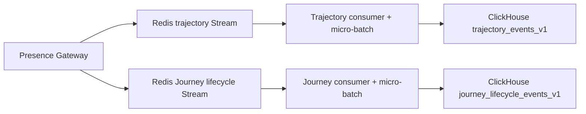

# Trajectory Worker

The Trajectory Worker is a private background Go service. It consumes the
privacy-safe trajectory contract from the Presence Gateway's Redis Stream and
persists batches to ClickHouse. The same binary consumes the lower-volume
Journey lifecycle contract through an independent pipeline. Flutter never
connects to this process, Redis, or ClickHouse.

## Runtime boundary



The worker is independently deployable so realtime request handling and
analytics ingestion can scale and fail separately. Its application layer
depends on `EventSource`, `TrajectoryRepository`, and
`JourneyLifecycleRepository` ports; Redis and ClickHouse are replaceable
infrastructure adapters. Both pipelines run in one Go process, but have
different Stream keys, consumer groups, batches, repositories, dead letters,
and metrics.

The shared wire contracts are
`../../contracts/trajectory/v1/trajectory-event.schema.json` and
`../../contracts/journey/v1/journey-lifecycle-event.schema.json`. Stream
entries carry `schema_version`, `event_id`, and the JSON `payload`. The worker
rejects unknown versions, unexpected JSON fields, mismatched event IDs, and
identity fields such as `session_id` or `device_ref`.

The selection and evidence-based Kafka upgrade criteria are recorded in
`docs/adr/001-redis-stream-clickhouse-pipeline.md`.

## Delivery semantics

The worker provides at-least-once delivery:

1. `XREADGROUP` assigns messages to one worker instance.
2. The application collector accumulates up to the configured batch size or
   maximum wait, whichever comes first.
3. The worker validates every message and batch-inserts valid events.
4. It sends `XACK` only after ClickHouse confirms the batch.
5. `XAUTOCLAIM` recovers messages left pending by a crashed worker.
6. An atomic Lua operation moves permanently invalid messages to the
   dead-letter Stream and acknowledges the source message.

Redis `XREADGROUP COUNT` is a maximum, not a minimum. The bounded application
collector therefore prevents continuous traffic from producing one- or
two-row ClickHouse inserts. Under high traffic the size limit closes a batch
early; under low traffic the time limit bounds analytical ingestion latency.
This wait is not on the Flutter acknowledgement path.

Dead-letter entries never retain the rejected raw payload or untrusted event
ID. They store SHA-256 fingerprints, the source Stream message ID, schema
version, and failure reason so poison messages remain diagnosable without
creating a second store for possible identity data.

Both ClickHouse tables use `ReplacingMergeTree` with `event_id` in the sorting identity.
Duplicates may exist physically until background merges run. Queries and
future aggregate jobs must retain explicit event-ID deduplication instead of
claiming exactly-once delivery.

## Local verification

The regular suite does not require external services:

```sh
make verify
```

Run the real Redis and ClickHouse pipeline tests with Docker Desktop running:

```sh
make analytics-up
make integration-test
make analytics-down
```

The integration suite verifies successful persistence, ACK ordering, pending
message recovery by another worker, duplicate event handling, schema rejection,
and dead-letter delivery. It also starts the real Presence Gateway and follows
a Journey start from WebSocket through Redis to ClickHouse.

The isolated analytics test Redis binds to host port `26379`, so it can run at
the same time as the Presence Gateway Redis test service on `16379`.

The Compose file is intentionally ephemeral: Redis persistence is disabled and
both data directories use temporary memory. It is for tests, not production.

## Configuration

| Variable | Default | Purpose |
| --- | --- | --- |
| `TRAJECTORY_WORKER_ADDRESS` | `:9091` | Health and metrics listener |
| `TRAJECTORY_WORKER_SHUTDOWN_TIMEOUT` | `10s` | Graceful HTTP shutdown limit |
| `TRAJECTORY_REDIS_URL` | `redis://localhost:6379/0` | Private Redis connection |
| `TRAJECTORY_REDIS_STREAM` | `campus:presence:v1:trajectory:events` | Source Stream |
| `TRAJECTORY_REDIS_DEAD_LETTER_STREAM` | `campus:presence:v1:trajectory:dead-letter` | Invalid-event Stream |
| `TRAJECTORY_REDIS_CONSUMER_GROUP` | `trajectory-workers-v1` | Shared worker group |
| `TRAJECTORY_REDIS_CONSUMER_NAME` | hostname and PID | Unique worker identity |
| `TRAJECTORY_BATCH_SIZE` | `500` | Maximum messages per batch |
| `TRAJECTORY_BATCH_MAX_WAIT` | `100ms` | Maximum accumulation time after the first message |
| `JOURNEY_LIFECYCLE_REDIS_STREAM` | `campus:presence:v1:journey:lifecycle:events` | Journey lifecycle source Stream |
| `JOURNEY_LIFECYCLE_REDIS_DEAD_LETTER_STREAM` | `campus:presence:v1:journey:lifecycle:dead-letter` | Invalid Journey-event Stream |
| `JOURNEY_LIFECYCLE_REDIS_CONSUMER_GROUP` | `journey-lifecycle-workers-v1` | Shared Journey worker group |
| `JOURNEY_LIFECYCLE_REDIS_CONSUMER_NAME` | hostname, PID, and `-journey` | Unique Journey consumer identity |
| `JOURNEY_LIFECYCLE_BATCH_SIZE` | `100` | Maximum Journey messages per batch |
| `JOURNEY_LIFECYCLE_BATCH_MAX_WAIT` | `250ms` | Maximum Journey batch accumulation time |
| `TRAJECTORY_READ_BLOCK` | `2s` | Blocking Stream read duration |
| `TRAJECTORY_RECLAIM_INTERVAL` | `10s` | Pending recovery cadence |
| `TRAJECTORY_RECLAIM_MIN_IDLE` | `30s` | Minimum age before reclaim |
| `TRAJECTORY_STATS_INTERVAL` | `5s` | Consumer lag sampling cadence |
| `TRAJECTORY_ERROR_BACKOFF` | `1s` | Delay after transient failures |
| `TRAJECTORY_CLICKHOUSE_ADDRESS` | `localhost:9000` | Native ClickHouse endpoint |
| `TRAJECTORY_CLICKHOUSE_DATABASE` | `campus_analytics` | Warehouse database |
| `TRAJECTORY_CLICKHOUSE_USERNAME` | `default` | Warehouse user |
| `TRAJECTORY_CLICKHOUSE_PASSWORD` | empty | Warehouse password |
| `TRAJECTORY_CLICKHOUSE_TABLE` | `campus_analytics.trajectory_events_v1` | Raw event table |
| `JOURNEY_LIFECYCLE_CLICKHOUSE_TABLE` | `campus_analytics.journey_lifecycle_events_v1` | Raw Journey lifecycle table with a 30-day TTL |

Redis and ClickHouse timeout/pool variables are defined in
`internal/config/config.go`. Invalid numeric or duration values fail startup
instead of silently falling back.

## Operational endpoints

- `GET /health/live` reports that the process is running.
- `GET /health/ready` verifies Redis and the configured ClickHouse table.
- `GET /metrics` exposes Prometheus-format counters and gauges.

The initial bottleneck evidence is:

- `trajectory_worker_stream_lag`
- `trajectory_worker_stream_pending`
- Stream length, total entries added, and total entries trimmed
- ClickHouse insert batch count and duration
- collected batch size, collection duration, and size/timeout flush reason
- read, inserted, acknowledged, reclaimed, and dead-letter event totals
- failures grouped by operation

The same signals are independently exposed with the
`journey_lifecycle_worker_` prefix. This makes it possible to identify which
pipeline is falling behind instead of hiding two workloads inside one lag
gauge.

Sustained Stream lag is the primary scale signal. First tune the bounded batch
size and accumulation window, then measure ClickHouse insert latency and Redis
memory before adding worker replicas. Kafka is considered only when measured
throughput, retention, replay, or independent consumer requirements exceed
Redis Streams—not simply to add another tool.

The Gateway's approximate Stream maximum length is a safety bound, not a
durability promise. It must exceed the expected event volume during the longest
credible worker or ClickHouse outage. Any increase in the trimmed counter while
lag or pending work exists is a data-loss alert and a reason to expand capacity,
retention, or the transport architecture.

## Production requirements

- Persistent Redis AOF and disk storage
- Redis replication/failover and Stream memory alerts
- ClickHouse replicated storage, backups, and migration control
- Secrets supplied by a secret manager
- Alerts for sustained lag, pending growth, dead letters, and insert failures
- Network policies that keep Redis, ClickHouse, and worker health endpoints
  private
